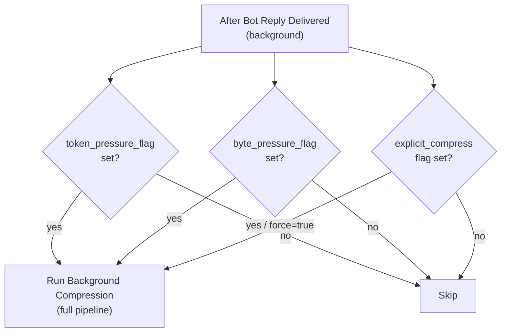
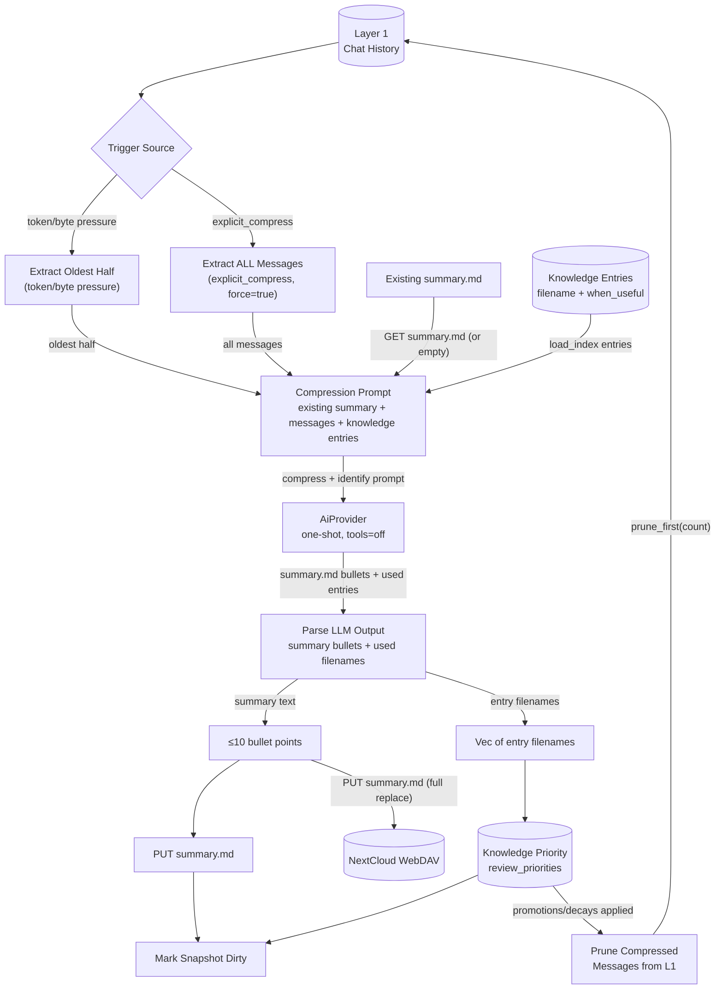
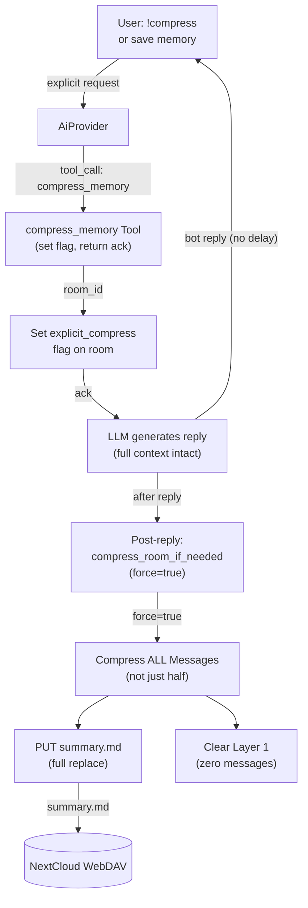
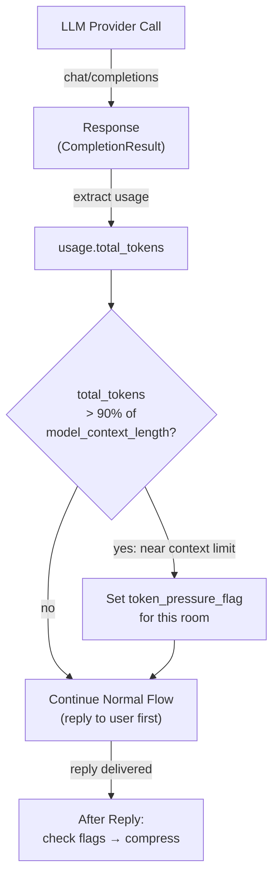
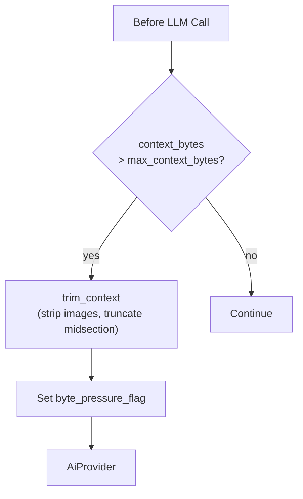
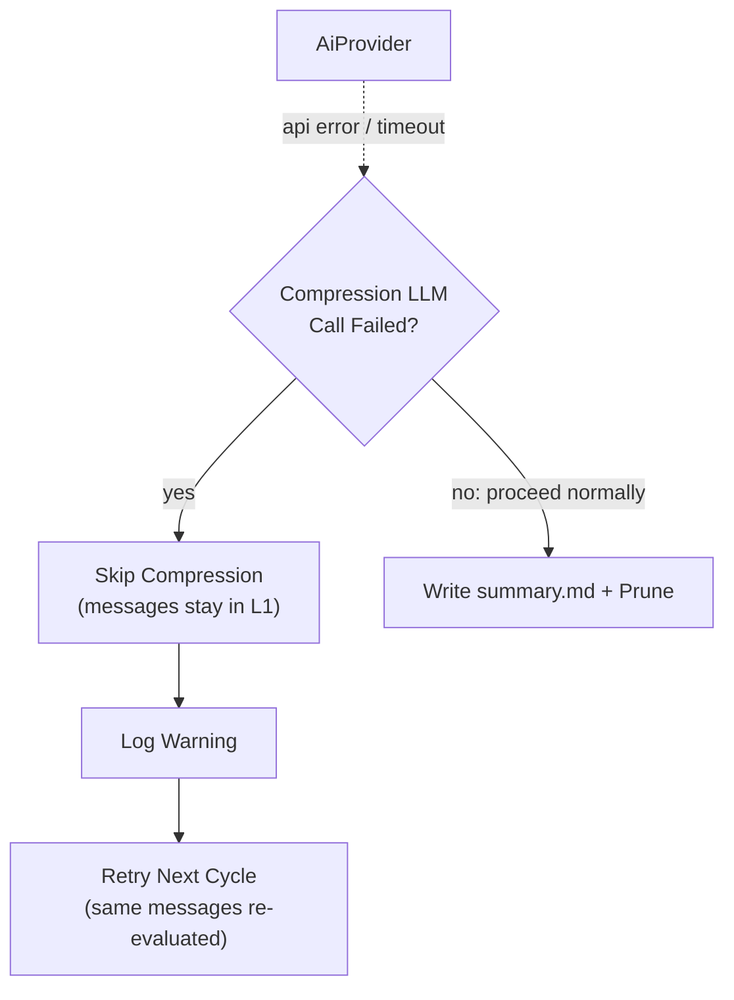

# Memory Compression

## 1. Purpose

Single dedicated DFD for the Layer 1 → Layer 2 compression pipeline.
Compression has two modes:

1. **Background** — triggered by token or byte pressure flags after reply
   delivery. Compresses oldest half of Layer 1 messages. Zero user delay.
2. **Explicit** — user says `!compress` or asks to save memory. The
   `compress_memory` tool sets the `explicit_compress` flag; after the bot
   replies, `compress_room_if_needed()` compresses ALL messages into `summary.md`
   and clears Layer 1 entirely. Zero user delay — flag-driven, post-reply.

- Upstream: [Memory Management](memory.md) — provides `ConversationHistory`
  (Layer 1) and stores `summary.md` (Layer 2)
- Upstream: [AI Provider](ai-provider.md) — executes the compression prompt
  and returns token usage counts for the post-call token trigger
- Upstream: [Knowledge Management](knowledge.md) — provides knowledge entry
  list for the LLM to evaluate relevance
- Upstream: [Configuration Management](config.md) — provides trigger
  thresholds (`max_context_bytes`, `model_context_length`)
- Downstream: WebDAV crate — persists `summary.md`
- Downstream: [Knowledge Priority Algorithm](knowledge-priority.md) —
  consumes LLM-identified used entry filenames

## 2. Diagram

### 2a. Two-Trigger Compression Decision

Both compression triggers are evaluated **after the bot reply has been
delivered to the user** — zero delay between user request and bot response.
The token and byte pressure flags are set during the LLM call and context
assembly respectively, then checked asynchronously after reply delivery.



| Flag | Set During | Condition | Force | Reset |
|------|-----------|-----------|-------|-------|
| `token_pressure_flag` | Each LLM provider response | `usage.total_tokens > model_context_length * 0.9` | No (oldest half) | Cleared after compression completes |
| `byte_pressure_flag` | Context assembly (`build_context`) | Serialized context bytes > `max_context_bytes` | No (oldest half) | Cleared after compression completes |
| `explicit_compress` | `compress_memory` tool call (in `process_message`) | User says !compress / save memory | **Yes** (all messages) | Cleared after compression completes |

All three flags trigger the same background compression function via
`compress_room_if_needed()` after the reply is sent. `explicit_compress`
uses `force=true` for full compression (all Layer 1 messages, not just
the oldest half). None of the flags block the user-facing response path.

### 2b. Compression Deep Dive

When triggered by token/byte pressure, the **oldest half** of Layer 1 messages
is extracted, combined with the existing `summary.md` (if any) and the list of
knowledge entries, then sent to the LLM. When triggered by `explicit_compress`
(user-requested), **all** Layer 1 messages are extracted (`force=true`).



Compression is a **replace** operation: the LLM receives the existing
`summary.md` plus the overflowed messages, and produces a fresh `summary.md`
that merges old and new into at most 10 bullet points. No per-date files, no
accumulation.

### 2b2. Explicit Compression — compress_memory Tool

When the user says `!compress` or explicitly asks to save memory, the LLM
invokes the `compress_memory` tool. The tool sets the `explicit_compress` flag
on the room and returns an acknowledgment. The LLM then generates a natural
reply using the **full conversation context** (no history cleared mid-conversation).
After the reply is delivered, `compress_room_if_needed()` picks up the flag and
runs full compression (`force=true`) — **all** Layer 1 messages are compressed
into a replacement `summary.md`, then Layer 1 is cleared to zero.



The user receives the bot's reply immediately. Compression runs asynchronously
after the reply is delivered to RocketChat. See
[compress-memory.md](../tools/compress-memory.md) for the full tool flow.

### 2c. Token-Based Trigger (Post-LLM Call → Checked After Reply)

The token trigger is the most reliable mechanism because it uses the provider's
actual token count, not byte or character estimates. During each LLM call, the
harness inspects `response.usage.total_tokens`. If it exceeds 90% of the
configured `model_context_length`, a `token_pressure_flag` is set for that room.
The flag is checked **after the reply is delivered**, triggering background
compression — the user never waits.



**Token counting**: the provider response includes `usage.total_tokens` which
is the total tokens consumed by the request (prompt + completion). This is
compared against `model_context_length * 0.9`. The 90% threshold provides
safety margin — by the time the next request is built, additional system
messages (soul, knowledge, summary) will push it closer to the limit.

**Provider support**: all major providers (OpenRouter, DeepSeek, OpenAI)
return `usage` in responses. If `usage` is absent or `total_tokens` is 0,
the flag is not set (graceful degradation).

### 2d. Safety Net — Inline Context Truncation (Pre-LLM)

**Not a compression trigger.** This is a lightweight in-memory safety mechanism
that runs immediately before each LLM call to prevent provider rejection. If the
serialized context exceeds `max_context_bytes`, older messages are trimmed
inline — no WebDAV write, no LLM summarization call. The actual compression
(writing `summary.md`) always happens after the reply.

When inline truncation fires, it also sets the `byte_pressure_flag` so the
room will receive full background compression after the reply is delivered.



**This is fast** — no additional LLM call, no WebDAV I/O. Just in-memory
message array manipulation (strip images from oldest messages, keep system
prefix + last 2 conversation messages). Flag is set so the room gets proper
LLM compression after the user gets their reply.

### 2e. Fallback — Compression Failure

If the compression LLM call fails (API error, timeout), compression is
skipped for this cycle. Messages remain in Layer 1 — they will be re-evaluated
next cycle. No data is lost.



## 3. Data Structures

### `CompressedMemory` (Layer 2)

A single file stored at `{root}/{webdav_dir}/memory/summary.md`. Defined in
[Memory Management](memory.md §3).

```rust
struct CompressedMemory {
    room_id: NonEmptyString,
    content: String,        // Markdown bullet list, ≤10 items
    archive_seq: u64,       // Compression sequence number
    updated_at: String,     // ISO 8601
}
```

### Compression Prompt Payload

The LLM receives a structured prompt containing:

| Component | Source | Notes |
|-----------|--------|-------|
| Existing summary | `GET summary.md` from WebDAV | Empty string if none exists |
| Overflowed messages | Oldest half of Layer 1 | Up to 20 user+assistant messages, each trimmed to 300 chars |
| Knowledge entries | `load_index(webdav_dir)` | `filename` + `when_useful`, up to 30 entries |

### Compression Output

The LLM response is parsed via `parse_compression_output()`:

| Output | Format | Example |
|--------|--------|---------|
| Summary bullets | Lines starting with `- ` after `# Memory Summary` header | `- User prefers short answers` |
| Used entries | Lines under `## Used Knowledge` header, each ending with `.md` | `- note_build.md` |

## 4. Configuration

Fields from `ModelConfig` in [Configuration Management](config.md):

| Field                  | Type    | Default | Notes |
| ---------------------- | ------- | ------- | ----- |
| `max_context_bytes`    | `usize` | 4_000_000 | byte-size overflow trigger (pre-LLM inline trim, flag for background compression) |
| `model_context_length` | `u32`   | 1_000_000 | Model's max context tokens. 90% threshold (`* 0.9`) triggers post-LLM compression. Default 1M (Qwen3.7-Plus). |

The `model_context_length` is a per-model default — different models have
different context windows (e.g., 8K, 32K, 128K, 200K). The value should be
set to match the configured `default_model`'s context window.

## 5. Trigger Summary

All compression triggers are evaluated **after reply delivery**.
The safety net (inline truncation) runs pre-LLM but is not a compression trigger.

| Trigger | Evaluation Point | Condition | Force | Action |
|---------|-----------------|-----------|-------|--------|
| **Token near-limit** | Flag set during LLM call, checked after reply | `usage.total_tokens > model_context_length * 0.9` | No | Background compression (oldest half) |
| **Byte pressure** | Flag set during context assembly, checked after reply | `context_bytes > max_context_bytes` | No | Background compression (oldest half) |
| **User request** | Flag set by `compress_memory` tool, checked after reply | Tool called by LLM | **Yes** | Full compression (all messages) |
| **Safety net** | Before each LLM call | `context_bytes > max_context_bytes` | — | Inline trim only (strip images, truncate); sets byte_pressure_flag |

## 6. Integration

### With Agent Harness

| Method | When | Action |
|--------|------|--------|
| `compress_room_if_needed()` | After reply delivery (background) | Checks flags; force=true if explicit, false otherwise |
| `compress_room_full()` | On user request (delegates to flag) | Sets `explicit_compress` flag for post-reply compression |
| `check_token_pressure()` | During LLM response processing | Sets `token_pressure_flag` — does NOT block reply |
| `trim_context()` | Before each LLM call (safety net) | Fast in-memory trim; sets `byte_pressure_flag` |

### With Memory Manager

| Method | Purpose |
|--------|---------|
| `check_and_archive()` | Returns oldest half of L1 if overflowed |
| `prune_archived()` | Removes compressed messages from L1 buffer |
| `summary_path()` | Returns WebDAV path for `summary.md` |
| `set_summary()` | Updates in-memory summary cache |
| `get_summary()` | Returns current summary for existing-content block |

### With Knowledge Manager

| Method | Purpose |
|--------|---------|
| `load_index()` | Provides `Vec<IndexEntry>` for LLM relevance identification |
| `review_priorities()` | Promotes/decays entries based on used filenames |

## 7. Compression Procedures

There are two compression procedures — one automatic, one manual. Both are
LLM summarization + WebDAV write + history prune. Detailed flows are in §2b
and §2b2 above.

| Procedure | Trigger | Scope | History Effect |
|-----------|---------|-------|----------------|
| **Auto** | Token/byte pressure flags (post-reply) | Oldest half of L1 | Summarizes oldest half → writes `summary.md` → prunes compressed messages |
| **Manual** | User `!compress` / explicit (post-reply) | ALL of L1 | Summarizes all messages → writes `summary.md` → prunes all → history at zero |

Both call `compress_for_summary()`, which uses `text_content()` to extract
messages for the LLM prompt.

### Design Note: Images Are Silently Dropped

Compression builds its input via `text_content()` (`harness.rs:948`), which
returns `None` for multipart (image-bearing) messages. Image data URIs are
too large to include in a summarization prompt whose sole goal is ≤10 text
bullet points. This is intentional.

After compression, image-bearing messages are pruned from Layer 1, and the
next snapshot overwrite removes them from WebDAV. Information conveyed solely
through images (not also described in text) is permanently lost.
