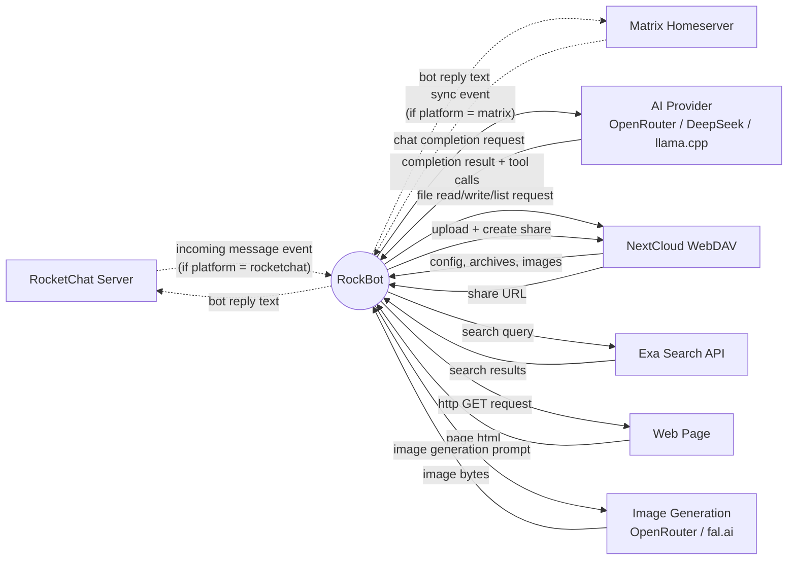

# RockBot — Context Diagram (Level 0)

## 1. Purpose

Single-process view of RockBot: a Rust-based AI agent that connects to a
messaging platform (RocketChat **or** Matrix), answers DMs and @mentions via
configurable AI providers (cloud or local llama.cpp), executes agentic tools
(web search, URL fetch, vision, image generation), and persists all state to a
NextCloud WebDAV server — never touching local disk.

The messaging platform is selected at startup via `[platform]` config. Only
one platform is active per process — RocketChat (DDP over WebSocket) or Matrix
(via matrix-rust-sdk sync). Both produce the same `IncomingMessage` type.

## 2. Diagram

Only one of RocketChat / Matrix is connected per process. The inactive
platform's edges are dashed to indicate they are configuration-selected,
not simultaneously active.
