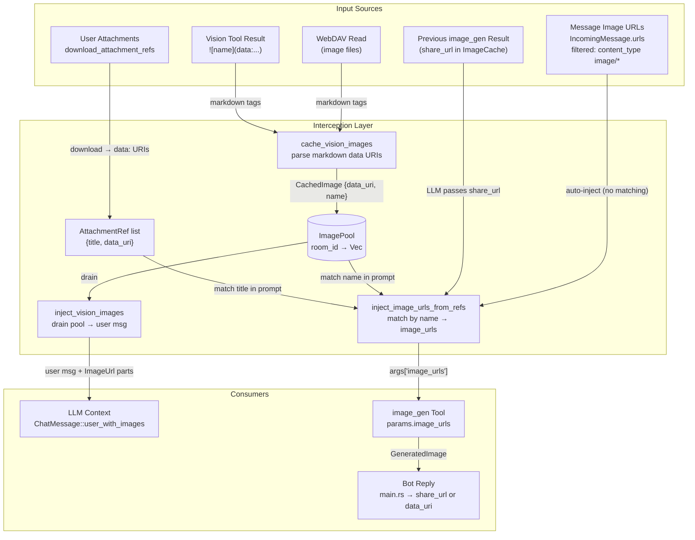
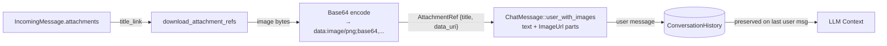
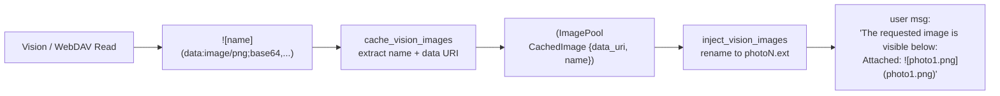
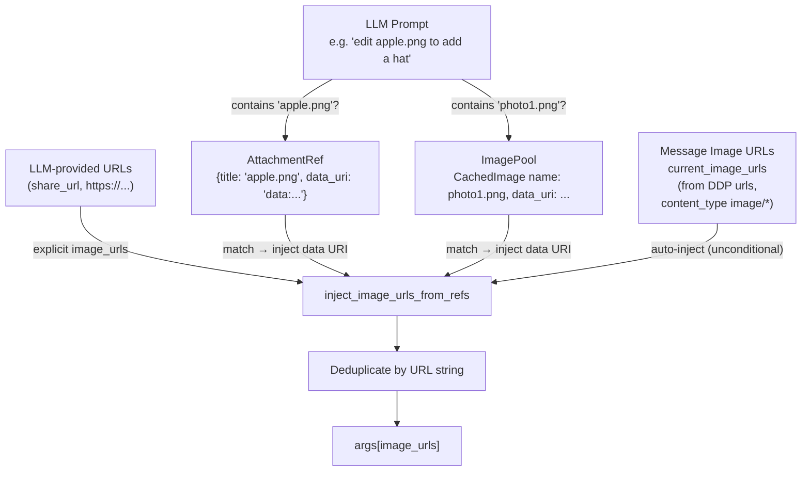
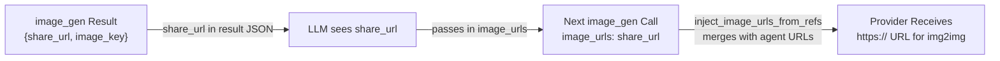

# Image Interception

## 1. Purpose

The harness transparently intercepts image data at multiple points in the agent
loop, bridging the gap between text-only tool results and multimodal AI
providers. Five interception points enable the LLM to see, generate, edit, and
share images without handling raw bytes directly.

- Upstream: [Configuration Management](base/config.md) provides RocketChat
  server URL for attachment downloads
- Upstream: [Agent Harness](agent-harness.md) runs the interception logic
  inside `process_message()` — image injection happens before the first LLM
  call and after each tool-execution iteration
- Downstream: [AI Provider](base/ai-provider.md) receives `ChatMessage` with
  `ContentPart::ImageUrl` parts containing `data:` URIs
- Downstream: [Vision Tool](tools/vision.md) produces markdown ``
  tags that the harness parses into the `image_pool`
- Downstream: [Image Gen Tool](tools/image-gen.md) receives `image_urls` in
  its parameters, injected by the harness from attachments + image_pool + agent
  URLs
- Downstream: [WebDAV Tool](tools/webdav.md) — reading image files triggers
  the same `cache_vision_images` pipeline as vision results
- Downstream: [WebDAV Directory](tools/webdav.md#1a-transparent-path-isolation)
  stores generated images and provides share URLs

## 2. Diagram

### 2a. Complete Interception Pipeline

### 2b. Attachment → Context Flow

When a user sends an image in RocketChat, the harness downloads it, encodes it
as a `data:` URI, and embeds it directly in the user's `ChatMessage`:

The message text contains a reference label like `Attached: `.
The actual pixels are embedded as `ContentPart::ImageUrl { url: "data:..." }` in
the same message.

**Provider-level handling** (see [ai-provider.md §2c](../base/ai-provider.md#2c-vision-payload-deep-dive)):
- **Vision-capable providers** (OpenRouter): multipart messages with `ImageUrl`
  parts pass through unchanged — the LLM sees the actual image pixels.
- **Text-only providers** (DeepSeek): `ImageUrl` parts are stripped from every
  message and replaced with `[image]` text placeholders via
  `strip_message_images()`. The LLM cannot see image content but can still call
  `image_gen` to edit images via `current_image_urls` auto-injection.

### 2c. Vision/WebDAV → ImagePool → Context Flow

When the LLM fetches an image from a public URL or WebDAV, the harness parses
the markdown result and caches the data URI for injection into the next LLM call:

The pool is drained on each injection — images are ephemeral, used for a single
LLM cycle. Injection happens before the first LLM call and after each
tool-execution iteration.

### 2d. Image Editing — inject_image_urls_from_refs

When the LLM calls `image_gen` with an edit prompt, the harness intercepts the
arguments and injects real image data from four converging sources:

**How matching works**: the prompt is lowercased and checked for substring
matches against:
1. `AttachmentRef.title` — original user attachment filenames
2. `CachedImage.name` and `![name]` label — vision/webdav-fetched images
3. Explicit `image_urls` from the LLM (deduplicated against injected URIs)
4. `current_image_urls` — image URLs from the DDP message `urls` field (filtered
   by `content_type: image/*`). These are **always injected unconditionally**
   — no prompt matching required — because the harness knows the user shared them
   for editing.

**After injection**: `image_gen` receives the `image_urls` array. `data:` URIs
are uploaded to the provider's CDN (Fal) via `upload_data_uri` → returns an
`https://` URL. Existing `https://` URLs (e.g. from a previous `image_gen`
`share_url`) pass through directly.

### 2e. Generated Image Loopback

Generated images can be reused for editing — the `image_gen` tool exposes the
NextCloud `share_url` in its result JSON, which the LLM can pass back in
`image_urls` on a subsequent call:

The loopback path: `image_gen` → `ImageCache` + tool result → LLM includes
`share_url` in next call → `inject_image_urls_from_refs` merges it →
provider receives `https://` URL (no re-upload needed).

## 3. Data Structures

### `AttachmentRef`
| Field     | Type   | Notes                                          |
| --------- | ------ | ---------------------------------------------- |
| `title`   | String | Original filename (e.g. `"apple.png"`)          |
| `data_uri`| String | `"data:image/png;base64,..."`                   |

### `CachedImage` (image_pool entry)
| Field     | Type   | Notes                                          |
| --------- | ------ | ---------------------------------------------- |
| `name`    | String | Filename from markdown alt-text                 |
| `data_uri`| String | `"data:image/png;base64,..."`                   |

### `ImagePool`
`HashMap<String, Vec<CachedImage>>` keyed by `room_id`. Drained on each
`inject_vision_images` call. Populated by `cache_vision_images` from vision
and webdav tool results.

### `ImageCache`
`Arc<Mutex<HashMap<String, GeneratedImage>>>` keyed by tool `call_id`. Stores
generated images for the reply pipeline. Entries are consumed by `take_image()`.

### `GeneratedImage`
| Field         | Type           | Notes                                   |
| ------------- | -------------- | --------------------------------------- |
| `webdav_path` | String         | WebDAV path where image was persisted   |
| `image_bytes` | `Vec<u8>`      | Raw bytes for fallback data URI         |
| `mime_type`   | String         | `"image/png"`, `"image/jpeg"`, etc.     |
| `share_url`   | Option\<String\>| NextCloud public share link (7-day expiry) |

## 4. Key Functions

| Function | Location | Role |
|----------|----------|------|
| `download_attachment_refs` | `harness.rs` | Downloads RocketChat attachments → `AttachmentRef` list |
| `download_and_encode_single` | `harness.rs` | Single attachment → `data:` URI |
| `inject_image_urls_from_refs` | `harness.rs` | Injects image URLs from attachments + image_pool + agent URLs |
| `current_image_urls injection` | `harness.rs` (inline in `process_message`) | Auto-injects message image URLs into image_gen args (no prompt matching) |
| `cache_vision_images` | `harness.rs` | Parses `` from tool results → `image_pool` |
| `inject_vision_images` | `harness.rs` | Drains `image_pool` → `ChatMessage::user_with_images` |
| `create_nextcloud_share_link` | `crate-webdav/src/client.rs` | Creates 7-day public share for generated images |
| `upload_data_uri` | `tools/image_gen.rs` | Uploads `data:` URI to Fal CDN → returns `https://` URL |
| `strip_markdown_image_id` | `utils.rs` | Removes `` from reply text |
| `take_last_image_ids` | `harness.rs` | Returns and drains `last_image_ids` |
| `take_image` | `harness.rs` | Removes `GeneratedImage` from `ImageCache` by call_id |
