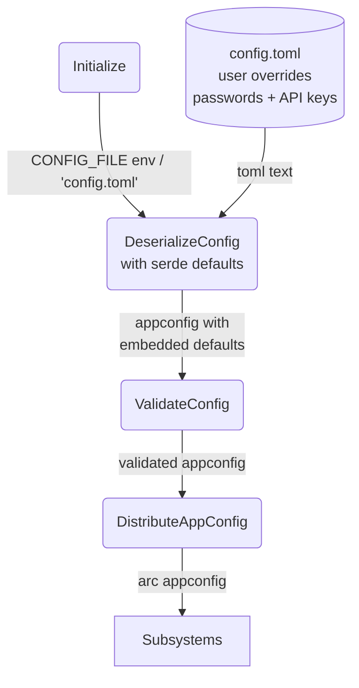
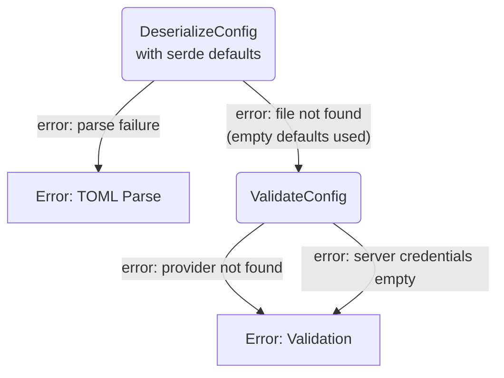

# Configuration Management

## 1. Purpose

Loads the user's `config.toml` (gitignored, holds passwords and API keys) at
startup. All default values are embedded in Rust source via `#[serde(default)]`
attributes and `Default` trait impls — no second file is read at runtime.
The validated `AppConfig` struct is shared read-only across all subsystems.

The messaging platform is selected via `[platform] name = "rocketchat" | "matrix"`.
Only the matching server section (`[rocketchat.server]` or `[matrix.server]`) is
required; the other is ignored. Both platforms produce the same `IncomingMessage`
type consumed by the agent harness.

- Downstream: [WebDAV Tool](../tools/webdav.md) consumes `WebDavConfig` for remote file
  access
- Downstream: [RocketChat Connection](rocketchat.md) or [Matrix Connection](matrix.md) — selected by platform name
- Downstream: [AI Provider](../ai/ai-provider.md),
  [Memory Management](../memory/memory.md) and [Tools](../tools/) each consume their respective
  config slices

## 2. Diagram

### 2a. Happy Flow (Main Success Path)

### 2b. Error Handling & Fallbacks

## 3. Data Structures

#### `AppConfig`

| Field        | Type                         | Notes                                          |
| ------------ | ---------------------------- | ---------------------------------------------- |
| `platform`   | `PlatformConfig`             | Messaging platform selection (`name` field)    |
| `rocketchat` | `RocketChatSection`          | RocketChat server + chat model (required if `platform.name = "rocketchat"`) |
| `matrix`     | `Option<MatrixSection>`      | Matrix server + chat model (required if `platform.name = "matrix"`) |
| `chat_providers` | `Vec<ProviderConfig>`    | Chat AI provider definitions (array-of-tables) |
| `image_providers`| `Vec<ProviderConfig>`    | Image generation provider definitions          |
| `image_model`    | `ImageModelConfig` (always present via default)| Default image provider + model alias           |
| `webdav`     | `Option<WebDavConfig>`       | NextCloud WebDAV endpoint and credentials      |
| `tools`      | `HashMap<String, ToolServiceConfig>`| Tool-specific API keys (generic map)     |
| `search`     | `SearchConfig`               | Web search provider selection + API keys       |

#### `PlatformConfig`

| Field  | Type     | Notes                                                          |
| ------ | -------- | -------------------------------------------------------------- |
| `name` | `String` | `"rocketchat"` or `"matrix"`. Determines which server section is active. Validated non-empty at deserialization; cross-validated against server section presence. |

#### `RocketChatSection`

| Field    | Type           | Notes                                         |
| -------- | -------------- | --------------------------------------------- |
| `server` | `ServerConfig` | RocketChat connection details                 |
| `model`  | `ModelConfig`  | Default provider, model alias, history limits |

#### `ServerConfig` (RocketChat)

| Field      | Type     | Notes                                                               |
| ---------- | -------- | ------------------------------------------------------------------- |
| `url`      | `String` | RocketChat server host (no scheme)                                  |
| `username` | `String` | Bot login username (`""` in defaults, filled in user config)        |
| `password` | `String` | Bot login password (`""` in defaults, filled in user config)        |
| `debug`    | `bool`   | Enable verbose DDP frame logging (default `false`)                  |

> The rocketchat crate has its own `ServerConfig` in `crate-rocketchat/src/config.rs`
> with a `use_tls: bool` field (default `true`) instead of `debug`. The rockbot crate's
> `ServerConfig` is for bot-level connections; the rocketchat crate's is per-client TLS
> configuration.

#### `MatrixSection`

| Field    | Type                  | Notes                                         |
| -------- | --------------------- | --------------------------------------------- |
| `server` | `MatrixServerConfig`  | Matrix homeserver connection details           |
| `model`  | `ModelConfig`         | Default provider, model alias, history limits (shared type with RocketChat) |

#### `MatrixServerConfig`

| Field          | Type     | Notes                                                          |
| -------------- | -------- | -------------------------------------------------------------- |
| `homeserver`   | `String` | Matrix homeserver URL (e.g. `"https://matrix.org"`); non-empty validated |
| `user_id`      | `String` | Matrix user ID (`@bot:example.org`); non-empty validated       |
| `password`     | `String` | Account password (`""` in defaults, filled in user config)     |
| `device_id`    | `Option<String>` | Device identifier for session management. Auto-generated on first login if omitted. |

> **Cross-validation**: `validate_app_config()` checks that `platform.name == "rocketchat"`
> implies `rocketchat.server` has non-empty credentials, and `platform.name == "matrix"`
> implies `matrix` is `Some` with non-empty `homeserver` and `user_id`.

#### `ModelConfig`

| Field                  | Type           | Notes                                                         |
| ---------------------- | -------------- | ------------------------------------------------------------- |
| `default_provider`     | `ProviderName` | Must match a `[[chat_providers]].name`; non-empty validated newtype |
| `default_model`        | `String`       | Model alias key in provider's models map                      |
| `max_iterations`       | `u32`          | Max agent loop iterations (default 28)                         |
| `max_soul_chars`       | `BoundedUsize` | Layer 3 max chars for soul.md content (default 2000); validated 1..=100_000_000 |
| `memory_ttl_secs`      | `u64`          | Room idle timeout — snapshot to WebDAV then evict (default 300)|
| `persist_interval_secs`| `u64`          | Snapshot persist timer interval (default 60)                  |
| `max_context_bytes`    | `BoundedUsize` | Max byte size for context (default 4MB ≈ 1M tokens). Triggers inline trim and image-stripping when exceeded. Validated 1..=100_000_000 |
| `max_attachment_bytes` | `u64`          | Max size of a single attachment in bytes (default 25_000_000) |
| `model_context_length` | `u32`          | Model's max context window in tokens (default 1_000_000). 85% threshold triggers LLM summarization after LLM calls when usage nears limit. |
| `summarization_enabled` | `bool`        | If true, token/byte pressure triggers LLM summarization (default true). If false, falls back to strip-half. |
| `summarization_ratio`  | `f64`          | Portion of oldest messages to summarize (default 0.6 = 60%). Remaining 40% are retained. |
| `summarization_target_tokens` | `usize`  | Target max tokens for the summarization prompt instruction (default 1024). |

#### `ProviderConfig`

| Field        | Type                     | Notes                                                             |
| ------------ | ------------------------ | ----------------------------------------------------------------- |
| `name`       | `ProviderName`           | Provider identifier ("openrouter", etc.); non-empty validated newtype |
| `api_key`    | `String`                 | Provider API key (`""` in defaults, filled in user config)        |
| `base_url`   | `ConfigUrl`              | API endpoint base URL; non-empty validated newtype                |
| `basecf_url` | `Option<String>`         | Cloudflare worker proxy override; used by Fal as storage/CDN upload URL |
| `chat_path`  | `Option<String>`         | Chat completions path (Default: `/chat/completions`)             |
| `draw_path`  | `Option<String>`         | Image generation path (opt.)                                      |
| `models`     | `HashMap<String, String>`| Alias → model-id map                                              |

> **Note:** `basecf_url` is used by `FalAiProvider` as the `storage_url` for CDN uploads. Chat providers use `base_url` + `chat_path` via `ProviderConfig::chat_url()`.

#### `SearchConfig`

| Field      | Type                       | Notes                                           |
| ---------- | -------------------------- | ----------------------------------------------- |
| `provider` | `String`                   | `"exa"` (default) or `"brave"`                   |
| `exa`      | `Option<ExaSearchConfig>`  | Exa API key                                      |
| `brave`    | `Option<BraveSearchConfig>`| Brave Search API key                             |

#### `ExaSearchConfig`

| Field     | Type     | Notes                                         |
| --------- | -------- | --------------------------------------------- |
| `api_key` | `String` | Exa API key (`"https://dashboard.exa.ai/api-keys") |

#### `BraveSearchConfig`

| Field     | Type     | Notes                                               |
| --------- | -------- | --------------------------------------------------- |
| `api_key` | `String` | Brave Search API key (`"https://api.search.brave.com") |

> The `SearchConfig` replaces the legacy `[tools.exa]` key. If `[search.exa].api_key` is empty,
> `AppConfig::search_api_key()` falls back to `[tools.exa].api_key` for backward compatibility.

#### `ToolServiceConfig`

| Field     | Type     | Notes                  |
| --------- | -------- | ---------------------- |
| `api_key` | `String` | Service-specific key   |

#### `ImageModelConfig`

| Field                   | Type     | Notes                                                     |
| ----------------------- | -------- | --------------------------------------------------------- |
| `default_provider`      | `ProviderName` | Must match an `[[image_providers]].name`; non-empty validated newtype |
| `default_text_model`    | `String` | Model alias for text-to-image generation                  |
| `default_edit_model`    | `String` | Model alias for image editing                             |
| `default_quality`       | `String` | Image quality level (default `"medium"`)                  |
| `default_output_format` | `String` | Output image format (default `"png"`)                      |
| `default_num_images`    | `u32`    | Number of images per generation (default 1)                |
| `default_image_size`    | `String` | Target image dimensions (default `"portrait_2_3"`)         |
| `default_image_size_tier` | `String` | Resolution tier `"2K"` or `"4K"` (default `"4K"`)       |
| `default_enable_safety_checker` | `bool` | Fal seedream5 safety checker toggle (default `false`). Sent only for seedream/v5 models. |

#### `WebDavConfig`

| Field      | Type     | Notes                                   |
| ---------- | -------- | --------------------------------------- |
| `url`      | `DavUrl`  | NextCloud WebDAV endpoint URL; non-empty validated newtype |
| `username` | `String`  | NextCloud username                      |
| `password` | `String`  | NextCloud app password                  |
| `root`     | `DavRoot` | Base directory for bot data; non-empty validated newtype |
| `dav_path`      | `String`         | WebDAV/NextCloud API path prefix (default `"/remote.php/dav"`) |

> **Validated newtypes.** `ProviderName`, `ConfigUrl`, `DavUrl`, `DavRoot`, `NonEmptyString`, and `BoundedUsize`
> are hand-written validated wrappers that enforce invariants at deserialization time
> (config boundary) via custom `Serialize`/`Deserialize` implementations. `ProviderName`, `ConfigUrl`,
> `DavUrl`, `DavRoot`, and `NonEmptyString` require
> non-empty strings. `BoundedUsize` enforces the range `1..=100_000_000`. Holding
> an instance of any of these types guarantees the invariant — no downstream runtime
> checks needed.
>
> **Two-layer input protection** follows the pattern in AGENTS.md:
> - [`serde_valid`](https://crates.io/crates/serde_valid) — format/shape constraints at deserialization
>   boundaries (`min_length`, `max_length`, `pattern`, etc.). Used on `ToolServiceConfig`,
>   `KnowledgeIndex`, `IndexEntry`, and `MatrixServerConfig`.
> - [`validator`](https://crates.io/crates/validator) — business-logic cross-field validation.
>   Used on `AppConfig` via a `#[validate(schema)]` function that verifies `default_provider`
>   references exist in `[[chat_providers]]` and `[[image_providers]]`, and that the active
>   platform's server section has non-empty credentials.
>
> Defined in `crate-rockbot/src/validated.rs` (rockbot types) and
> `crate-webdav/src/validated.rs` + `crate-webdav/src/types.rs` (WebDAV types).

## 4. Config Files

| File                  | Git   | Secrets | Purpose                                    |
| --------------------- | ----- | ------- | ------------------------------------------ |
| `default.config.toml` | Tracked | No   | Human-readable reference documentation (not read at runtime) |
| `config.toml`         | Ignored | Yes  | User overrides (passwords, API keys)       |

- All defaults live in Rust source (`#[serde(default)]` attributes + `Default` trait impls on each config struct).
- `config.toml` is the only file read at runtime; its path comes from the `CONFIG_FILE` env var (default `"config.toml"`).
- Missing fields in `config.toml` are filled from embedded Rust defaults.
- If `config.toml` is missing, the bot runs with only default values (all secrets will be empty — startup may fail validation).
