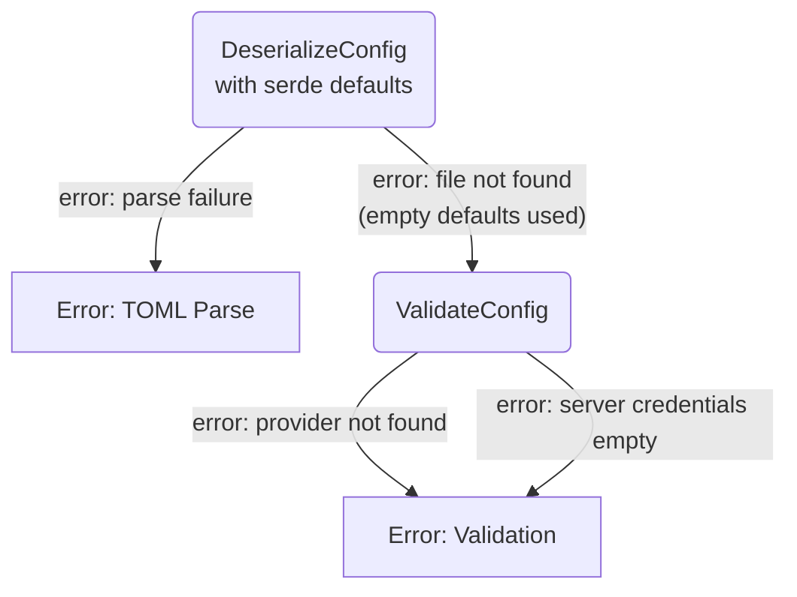

# Error Handling & Fallbacks

## 1. Purpose

Models the error paths of config loading: TOML parse failures surface as hard
errors, while a missing file falls back to empty defaults before validation,
and validation failures report missing providers or empty server credentials.
Complements the happy path in [../main-path.md](../main-path.md).

## 2. Diagram

