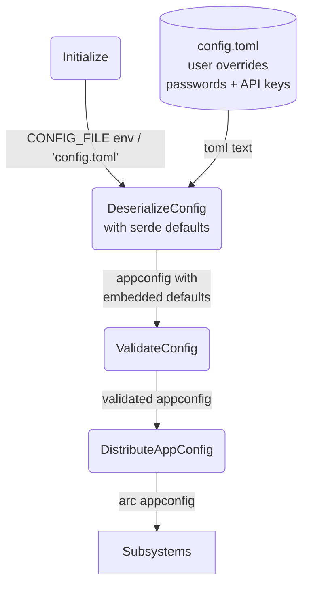

# Happy Flow (Main Success Path)

## 1. Purpose

Loads the user's `config.toml` (gitignored, holds passwords and API keys) at
startup. All default values are embedded in Rust source via `#[serde(default)]`
attributes and `Default` trait impls — no second file is read at runtime.
The validated `AppConfig` struct is shared read-only across all subsystems.

The messaging platform is selected via `[platform] name = "rocketchat" | "matrix"`.
Only the matching server section (`[rocketchat.server]` or `[matrix.server]`) is
required; the other is ignored. Both platforms produce the same `IncomingMessage`
type consumed by the agent harness.

- Downstream: [WebDAV Tool](../../tools/webdav/main-path.md) consumes `WebDavConfig` for remote file
  access
- Downstream: [RocketChat Connection](../rocketchat/main-path.md) or [Matrix Connection](../matrix/main-path.md) — selected by platform name
- Downstream: [AI Provider](../../ai/ai-provider/main-path.md),
  [Memory Management](../../memory/memory/retrieve-two-layers.md) and [Tools](../../tools/) each consume their respective
  config slices

## 2. Diagram

## 3. Data Structures

Shared data structures for these flows are documented in
[`structures.md`](structures.md) — see its `## 1. Overview` for
the subsystem context.
