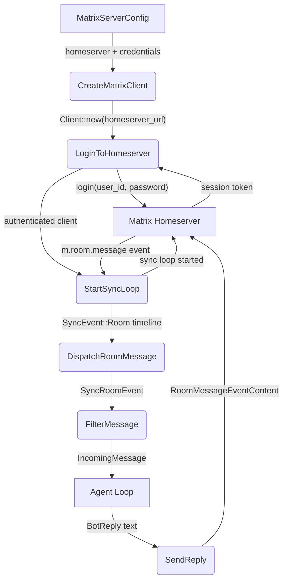
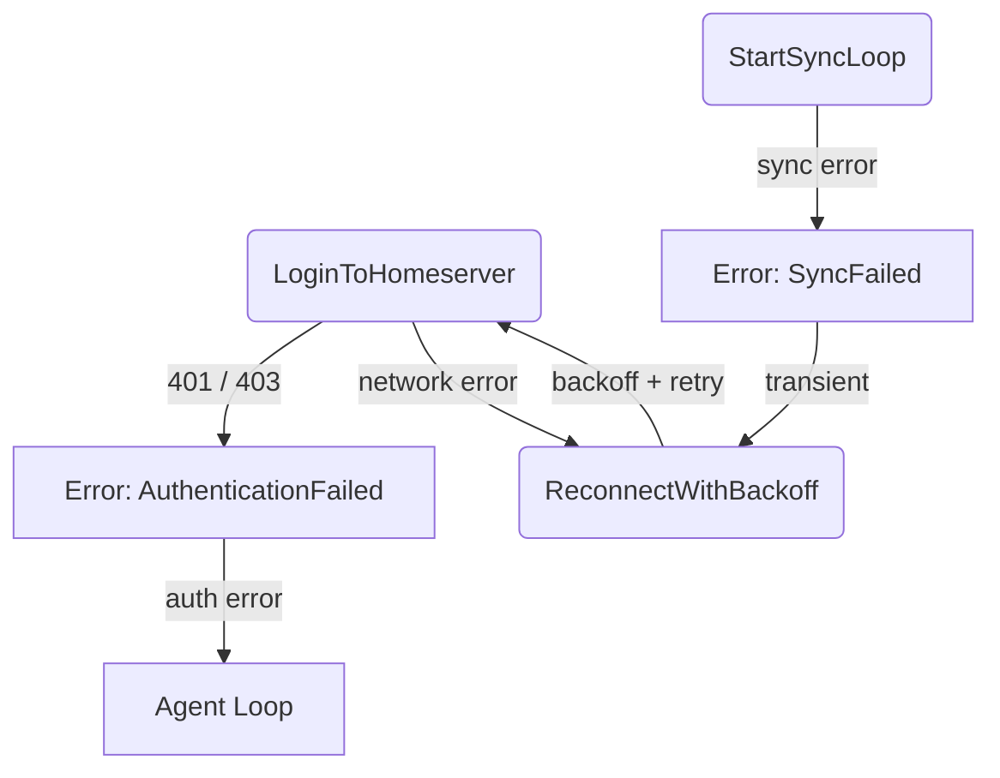
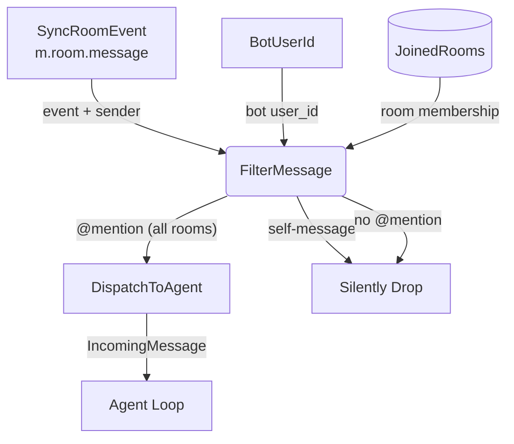
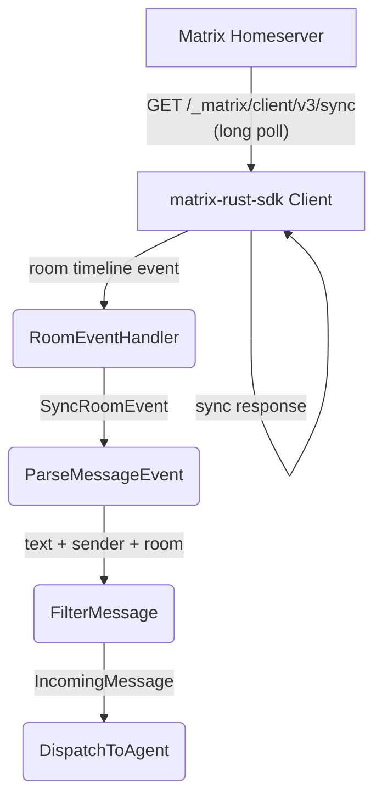
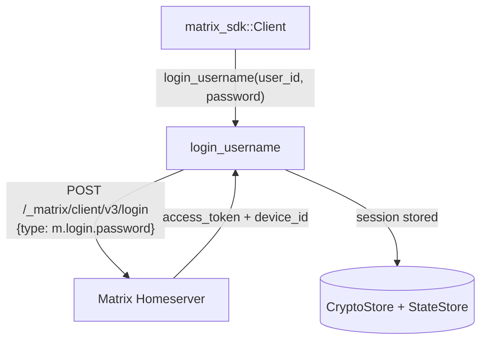
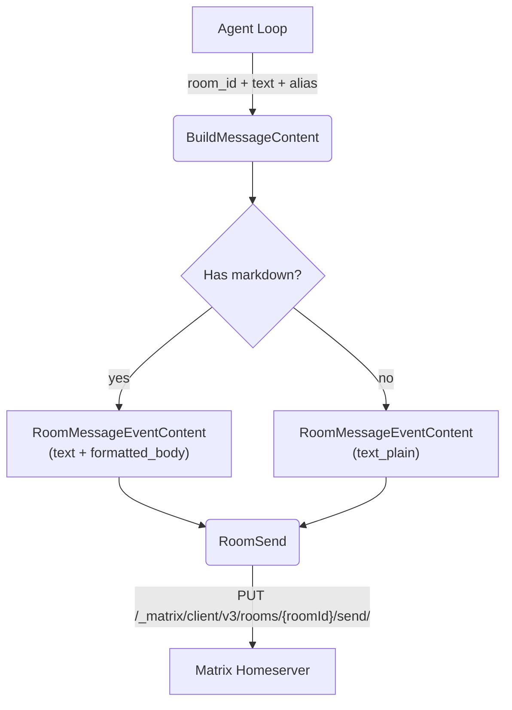
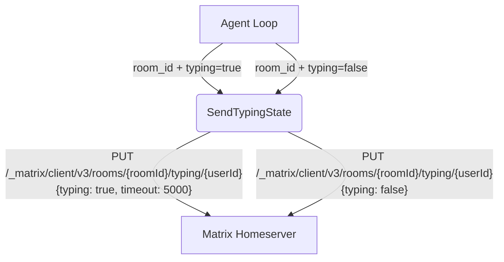
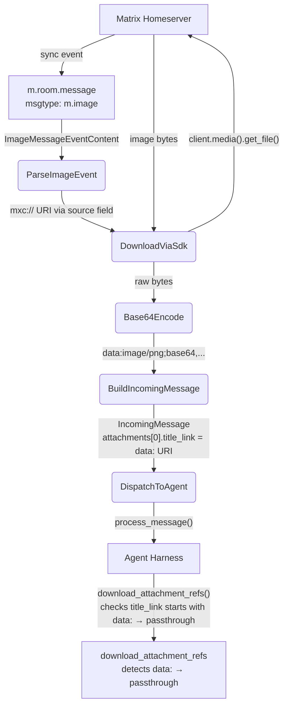
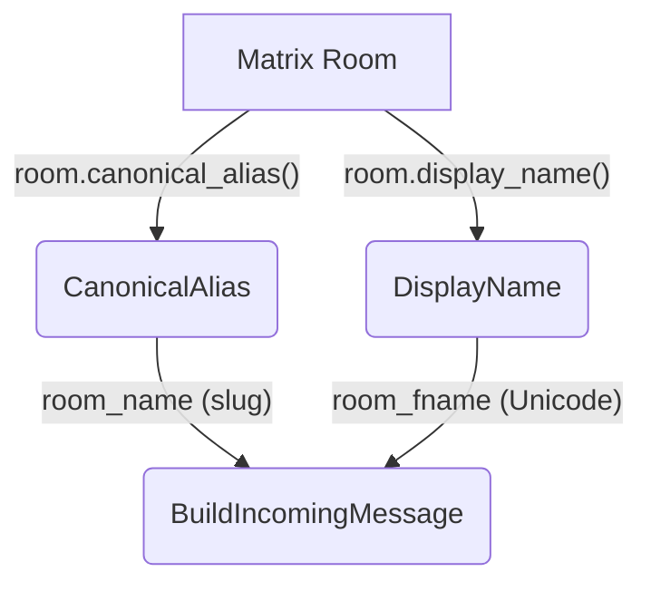

# Matrix Connection

## 1. Purpose

Rust module (`crate-rockbot/src/platform/matrix.rs`) wrapping
[`matrix-rust-sdk`](https://github.com/matrix-org/matrix-rust-sdk) to provide
a Matrix messaging client that implements the `MessagingClient` trait. The
Matrix platform uses the SDK's high-level `Client` API to authenticate with a
homeserver, sync room events via long-polling `/sync`, filter incoming messages,
and send replies.

**E2EE status (2026-06-17):** `matrix-sdk` is compiled with `default-features = false`
and only `["markdown"]`. The `e2e-encryption` feature is **not** enabled. The bot
cannot decrypt `m.room.encrypted` events — they are silently dropped because no
handler is registered. When a client (e.g. Element) creates an encrypted DM, the
bot will not see any messages. Two paths to resolve:
1. Enable `e2e-encryption` feature + crypto store setup (Section 2e notes).
2. Users must create **unencrypted** DMs (disable encryption toggle in their client
   before sending the first message) and manually accept the room invite (bot does
   not auto-join — see Section 2c notes).

With E2EE enabled, the SDK's built-in crypto store would handle Olm/Megolm key
exchange and message decryption transparently.

Messages from joined rooms are parsed into the shared `IncomingMessage` type
(defined in `crate-rocketchat/src/types.rs` — reused as the cross-platform
message contract). The agent harness and tools are unaware of the underlying
platform.

- Upstream: [Configuration Management](config.md) provides `MatrixServerConfig`
  (homeserver URL, user_id, password)
- Upstream: [Agent Loop](../agent/agent-loop.md) calls `connect_and_run()` with a
  message handler callback
- Downstream: [Agent Harness](../agent/agent-harness.md) receives filtered
  `IncomingMessage` structs; sends replies through `MessagingClient::send_reply()`

## 2. Diagram

### 2a. Happy Flow (Main Success Path)

### 2b. Error Handling & Fallbacks

The matrix-rust-sdk handles reconnection internally for transient sync errors
(network timeout, 5xx). The `connect_and_run()` method catches unrecoverable
errors (auth failure, homeserver unreachable after retries) and returns them
to the agent loop, which applies its own exponential backoff reconnect.

### 2c. Message Filter Deep Dive

Matrix rooms deliver all timeline events to the sync handler. The filter
identifies messages that should be forwarded to the agent: only @mentions
are forwarded (in all rooms, including DMs). Self-messages (events from the
bot's own user_id) are silently dropped.

**Filter rules** (evaluated in order):

1. **Skip non-joined rooms**: `room.state() != Joined` → drop
2. **Skip non-original events**: edits, reactions → drop
3. **Skip self**: `event.sender == bot_user_id` → drop
4. **Skip historical**: `origin_server_ts + 600s < startup_ts` → drop (10-min grace window
   allows messages sent shortly before restart to be processed)
5. **Skip non-text/non-image**: `msgtype != "m.text"` and `msgtype != "m.image"` → drop
   (encrypted `m.room.encrypted` events also dropped — no handler registered for them)
6. **Mention check** (all rooms, including DMs): message body must contain
   `@bot_user_id` (full MXID or localpart `@username`) → forward, otherwise drop.
   Logs `user_id`, `localpart`, `body`, and `member_count` at `info!` level on both
   match and mismatch to simplify diagnosis.

**Room invite handling** *(by design)*: The bot never auto-joins rooms.
Only `RoomState::Joined` rooms are processed; `RoomState::Invited` is silently
ignored. Invites must be accepted manually (Element / homeserver admin).

### 2d. Sync Loop Deep Dive

The matrix-rust-sdk sync loop runs as a background task. Events are delivered
to registered event handlers. The `connect_and_run()` method registers a
room message handler before starting sync.

**Sync parameters**: The SDK manages sync state internally. Initial sync uses
`SyncSettings::default()` (no timeout filter — receives all rooms). Subsequent
syncs resume from the stored `since` token (persisted in the SDK state store).

### 2e. Authentication Deep Dive

Authentication uses the Matrix `m.login.password` flow via the SDK's
`Client::login_username()` builder.

**Session persistence**: The SDK stores the access token and device ID in its
state store (SQLite by default, located at `state_dir` from config). On restart,
the SDK restores the session from the store without re-authenticating, unless
the token has expired.

**User ID validation**: After login, `client.user_id()` is validated to ensure it
returns `Some` — if `None` (corrupted session), the connection returns
`AuthFailed` immediately rather than silently using an empty string for mention
matching and self-message filtering.

**E2EE**: The SDK automatically handles Olm/Megolm key exchange and message
decryption **when the `e2e-encryption` feature is enabled**. Currently this feature
is not compiled in (see Section 1 note). Encrypted messages arrive as
`m.room.encrypted` events and are dropped — no handler is registered for them.
To enable E2EE:
1. Add `"e2e-encryption"` to `features` in `crate-rockbot/Cargo.toml` for `matrix-sdk`.
2. The SDK's crypto store will use the `state_dir` path for Olm/Megolm session storage.
3. Device verification will need handling (e.g. auto-accept or a `/verify` command).
When enabled, decrypted messages arrive at the room event handler as plain text.

### 2f. Reply Sending

Replies are sent as plain text `m.room.message` events with `msgtype: "m.text"`.

**Markdown formatting**: If the bot reply contains markdown formatting
(headers, bold, code blocks), the message is sent with `formatted_body`
(org.matrix.custom.html) alongside the plain-text `body`. The Matrix SDK's
`RoomMessageEventContent::text_markdown()` handles this automatically.

**Alias**: Matrix does not support per-message sender alias like RocketChat.
The `alias` parameter in `send_reply()` is ignored for the Matrix platform.
The bot always sends under its own user identity.

### 2g. Typing Indicator

Matrix typing indicators are sent as ephemeral events to the room.

The typing timeout is set to 5000ms per the Matrix spec recommendation. The
heartbeat task in the agent loop refreshes it every 2 seconds, matching the
RocketChat behavior.

### 2h. Image Attachment Reception (Approach A)

When a user sends an image in a Matrix room, the event has `msgtype: "m.image"`
with an `mxc://` URI pointing to the media on the homeserver. The SDK provides
`Client::media()` for downloading media content directly.

Unlike the RocketChat path (which downloads in the harness layer via HTTP),
Matrix images are **downloaded and base64‑encoded in the platform event handler**
(Approach A). The encoded `data:` URI is placed in `attachments[0].title_link`,
and the harness `download_attachment_refs()` detects the `data:` scheme and
passes it through without a redundant HTTP fetch.

**Limitations**:
- Encrypted images (`m.room.encrypted` + `file` field) are not supported — the
  `e2e-encryption` feature is not enabled (see Section 1). Only `MediaSource::Plain`
  (unencrypted `mxc://` URIs) can be downloaded.
- E2EE room images arrive as opaque `m.room.encrypted` events and are dropped
  by the event handler — no handler is registered for them.

**Mapping to `IncomingMessage`**:
- `text` → `body` field from the event content (filename or media caption)
- `attachments[0].title` → `body` field (filename)
- `attachments[0].title_link` → `data:image/{type};base64,...` (pre‑encoded data URI)
- `attachments[0].image_type` → `mimetype` from `info` (if present)
- `attachments[0].image_dimensions` → `{width, height}` from `info` (if present)
- `attachments[0].image_size` → `size` from `info` (if present)
- `file` → `None` (image data travels via `attachments`, not via `file`)

### 2i. Room Name Resolution

Matrix rooms have canonical aliases (e.g. `#room:server`), display names, and
room IDs. The mapping to `IncomingMessage` fields:

- `room_name` → canonical alias localpart without `#` and `:server` suffix
  (e.g. `#general:example.org` → `"general"`). Falls back to room ID localpart
  if no canonical alias.
- `room_fname` → room display name from `m.room.name` state event. Falls back
  to `room_name` if unset.
- `is_dm` → `true` if room has exactly 2 joined members (bot + one other). Informational only — does not affect message filtering (mention check applies to all rooms).

## 3. Data Structures

#### `MatrixPlatform`

| Field          | Type                    | Purpose                                     |
| -------------- | ----------------------- | ------------------------------------------- |
| `homeserver`   | `String`                | Homeserver URL (e.g. `"https://matrix.org"`)|
| `user_id`      | `String`                | Bot's Matrix user ID for login              |
| `password`     | `String`                | Account password                            |
| `device_id`    | `Option<String>`        | Device ID for session management            |

The `matrix_sdk::Client` is created inside `connect_and_run()`, not stored in
the struct. The authenticated user ID is extracted from `client.user_id()`
after login and captured by the event handler closure. If `client.user_id()`
returns `None`, the connection returns `AuthFailed`.

#### Matrix → `IncomingMessage` Field Mapping

| `IncomingMessage` field | Matrix source                                          |
| ----------------------- | ------------------------------------------------------ |
| `msg_id`                | `event.event_id` (e.g. `$abc123`)                      |
| `room_id`               | `room.room_id` (e.g. `!abc:example.org`)               |
| `room_name`             | Canonical alias localpart or room ID localpart          |
| `room_fname`            | Room display name (`m.room.name`)                      |
| `sender_name`           | `event.sender` localpart (e.g. `@alice` from `@alice:example.org`) |
| `text`                  | `event.content.body` (plain text body)                 |
| `is_dm`                 | Room joined member count ≤ 2                           |
| `timestamp`             | `event.origin_server_ts` (milliseconds → seconds)      |
| `sender_id`             | `event.sender` (full MXID, e.g. `@alice:example.org`)  |
| `alias`                 | `None` (Matrix has no per-message alias)               |
| `file`                  | `None` (image data travels via `attachments`)           |
| `files`                 | Empty (Matrix has no file list metadata)                |
| `attachments`           | Populated from `m.image` events with `data:` URI in `title_link` |
| `urls`                  | Extracted from message body URLs (no server-side preview headers) |

#### `MatrixServerConfig`

| Field          | Type             | Notes                                           |
| -------------- | ---------------- | ----------------------------------------------- |
| `homeserver`   | `String`         | Homeserver URL (e.g. `"https://matrix.org"`)    |
| `user_id`      | `String`         | Bot user ID (`@bot:example.org`)                |
| `password`     | `String`         | Account password                                |
| `device_id`    | `Option<String>` | Device ID for session management                |
| `state_dir`    | `String`         | SDK state store path (default `"./tmp/matrix-sdk"`) |

## 4. Non-Functional Requirements

- **SDK state on local disk**: Unlike the "no local files" rule for tools and
  memory, the matrix-rust-sdk requires a local state directory for its SQLite
  stores (crypto keys, sync token, room state). This is configured via
  `state_dir` (default `./tmp/matrix-sdk`) and is considered infrastructure
  state, not bot data.
- **E2EE transparency** (spec target): When the `e2e-encryption` feature is enabled,
  end-to-end encryption is handled entirely by the SDK. The bot sees decrypted plain
  text in event handlers. No manual key management is required. Currently the feature
  is **not** enabled — see Section 1 note.
- **Sync state recovery**: On restart, the SDK resumes sync from the last stored
  `since` token, avoiding re-processing old messages. The first sync after a
  long offline period may be slow (catching up on missed events).
- **No alias support**: Matrix does not support per-message sender name
  override. The `alias` parameter is accepted by `send_reply()` but silently
  ignored.

## 5. Dependencies

| Crate            | Version | Purpose                                         |
| ---------------- | ------- | ----------------------------------------------- |
| `matrix-sdk`     | `0.18`  | High-level Matrix client (sync, rooms, media); built with `default-features = false`, `features = ["markdown"]` only |
| `matrix-sdk-base`| (transitive) | Core types (`OwnedUserId`, `OwnedRoomId`) |
| `ruma` (re-exported via SDK) | (transitive) | Matrix event types (`SyncRoomEvent`, `RoomMessageEventContent`) |

**Note**: `e2e-encryption`, `sqlite`, and `native-tls` features are not enabled.
This means no encrypted message support and no persistent SDK state store.
