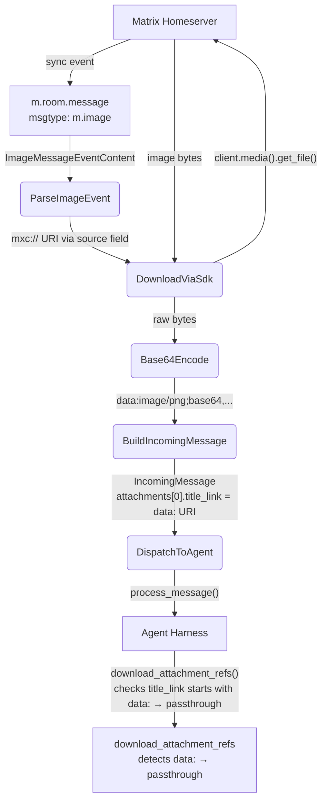

# Image Attachment Reception (Approach A)

## 1. Purpose

When a user sends an image in a Matrix room, the event has `msgtype: "m.image"`
with an `mxc://` URI pointing to the media on the homeserver. The SDK provides
`Client::media()` for downloading media content directly.

Unlike the RocketChat path (which downloads in the harness layer via HTTP),
Matrix images are **downloaded and base64‑encoded in the platform event handler**
(Approach A). The encoded `data:` URI is placed in `attachments[0].title_link`,
and the harness `download_attachment_refs()` detects the `data:` scheme and
passes it through without a redundant HTTP fetch.

## 2. Diagram

**Limitations**:
- Encrypted images (`m.room.encrypted` + `file` field) are not supported — the
  `e2e-encryption` feature is not enabled (see `structures.md` §1 Overview). Only
  `MediaSource::Plain`
  (unencrypted `mxc://` URIs) can be downloaded.
- E2EE room images arrive as opaque `m.room.encrypted` events and are dropped
  by the event handler — no handler is registered for them.

**Mapping to `IncomingMessage`**:
- `text` → `body` field from the event content (filename or media caption)
- `attachments[0].title` → `body` field (filename)
- `attachments[0].title_link` → `data:image/{type};base64,...` (pre‑encoded data URI)
- `attachments[0].image_type` → `mimetype` from `info` (if present)
- `attachments[0].image_dimensions` → `{width, height}` from `info` (if present)
- `attachments[0].image_size` → `size` from `info` (if present)
- `file` → `None` (image data travels via `attachments`, not via `file`)
