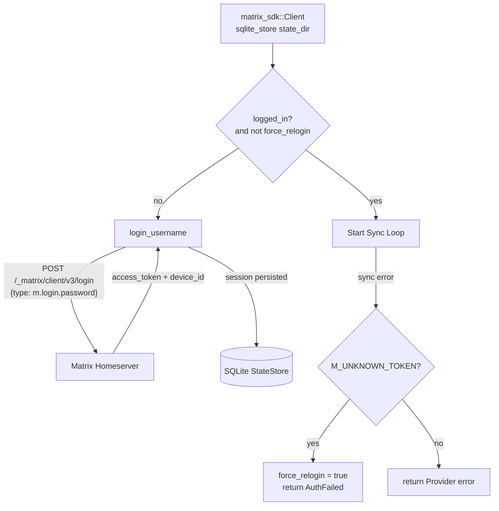

# Authentication Deep Dive

## 1. Purpose

Authentication uses the Matrix `m.login.password` flow via the SDK's
`Client::login_username()` builder. Sessions are persisted in a SQLite state
store at `state_dir`, enabling session restoration on reconnect.

## 2. Diagram

**Session persistence**: The `Client::builder().sqlite_store(state_dir, None)`
call configures a SQLite state store at `state_dir` (default `./tmp/matrix-sdk`).
On reconnect, the SDK restores the access token, device ID, and sync token
from the store. If `client.matrix_auth().logged_in()` returns `true` and
`force_relogin` is `false`, login is skipped — the bot resumes sync with the
restored session, avoiding unnecessary re-authentication that would invalidate
the previous token.

**`force_relogin` flag**: When sync fails with `M_UNKNOWN_TOKEN`
(`ErrorKind::UnknownToken`), the `force_relogin` `AtomicBool` is set to `true`.
On the next `connect_and_run()` call, this forces a fresh login even if the
SQLite store has a cached session. The flag is cleared (swap to `false`) after
the login decision is made.

**User ID validation**: After login, `client.user_id()` is validated to ensure it
returns `Some` — if `None` (corrupted session), the connection returns
`AuthFailed` immediately rather than silently using an empty string for mention
matching and self-message filtering.

**E2EE**: The SDK automatically handles Olm/Megolm key exchange and message
decryption **when the `e2e-encryption` feature is enabled**. Currently this feature
is not compiled in (see `structures.md` §1 Overview). Encrypted messages arrive as
`m.room.encrypted` events and are dropped — no handler is registered for them.
To enable E2EE:
1. Add `"e2e-encryption"` to `features` in `crate-rockbot/Cargo.toml` for `matrix-sdk`.
2. The SDK's crypto store will use the `state_dir` path for Olm/Megolm session storage.
3. Device verification will need handling (e.g. auto-accept or a `/verify` command).
When enabled, decrypted messages arrive at the room event handler as plain text.
