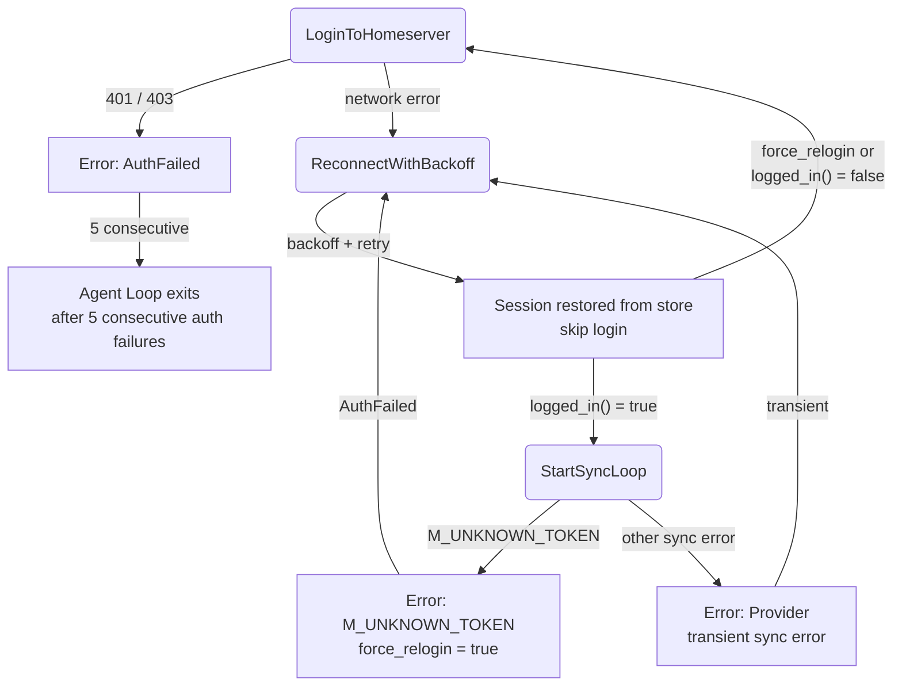

# Error Handling & Fallbacks

## 1. Purpose

How the Matrix platform handles login and sync failures: unknown-token errors
force a relogin, auth failures count toward a 5-consecutive exit threshold,
and transient errors reconnect with exponential backoff, restoring the
existing session when possible.

- References: parent [Main Success Path](../main-path.md)

## 2. Diagram

The matrix-rust-sdk `sync()` returns on the **first** sync error — there is no
internal retry within the SDK. The `connect_and_run()` method inspects the
error: if it is `M_UNKNOWN_TOKEN` (detected via
`client_api_error_kind() → ErrorKind::UnknownToken`), the `force_relogin` flag
is set and the error is returned as `AuthFailed`; all other sync errors are
returned as `Provider` errors. On reconnect, `connect_and_run()` checks
`force_relogin` and `client.matrix_auth().logged_in()`: if the flag is false
and a session exists in the SQLite store, login is skipped (session restored);
otherwise, a fresh login is performed.

The agent loop applies exponential backoff on all errors. After 5 consecutive
`AuthFailed` errors, the bot exits rather than retrying indefinitely.
`retry_count` resets to 0 after a connection lasting >= 60 seconds, so
transient errors always start with a short backoff.
