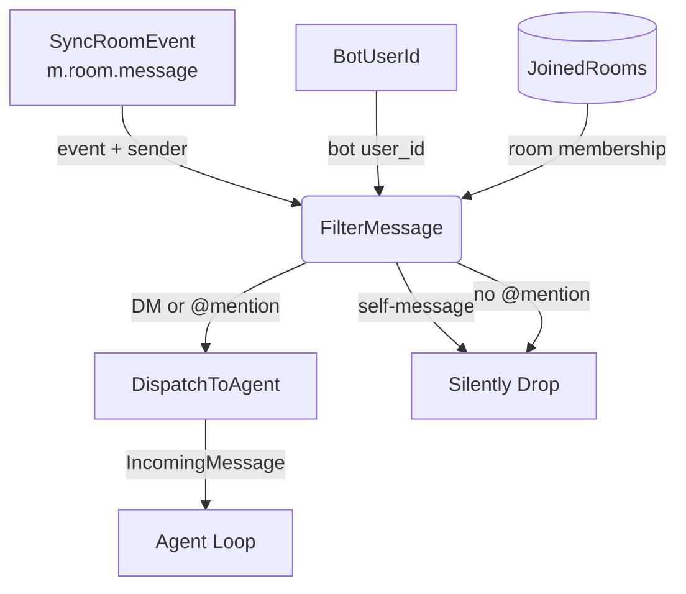

# Message Filter Deep Dive

## 1. Purpose

Matrix rooms deliver all timeline events to the sync handler. The filter
identifies messages that should be forwarded to the agent: DMs (rooms with
≤2 members) always forward; group rooms require @mentions. Self-messages
(events from the bot's own user_id) are silently dropped.

## 2. Diagram

**Filter rules** (evaluated in order):

1. **Skip non-joined rooms**: `room.state() != Joined` → drop
2. **Skip non-original events**: edits, reactions → drop
3. **Skip self**: `event.sender == bot_user_id` → drop (logged at `info!` level)
4. **Skip historical**: `origin_server_ts + 600s < startup_ts` → drop (10-min grace window
   allows messages sent shortly before restart to be processed)
5. **Skip non-text/non-image**: `msgtype != "m.text"` and `msgtype != "m.image"` → drop
   (encrypted `m.room.encrypted` events also dropped — no handler registered for them)
6. **DM check**: room member count ≤ 2 → forward unconditionally (`is_dm = true`)
7. **Mention check** (group rooms only): message body must contain
   `@bot_user_id` (full MXID or localpart `@username`), OR `m.mentions.user_ids`
   must include the bot's MXID. Logs `user_id`, `localpart`, `body`, `mentions`,
   and `member_count` at `info!` level on both match and mismatch.

**Room invite handling** *(by design)*: The bot never auto-joins rooms.
Only `RoomState::Joined` rooms are processed; `RoomState::Invited` is silently
ignored. Invites must be accepted manually (Element / homeserver admin).
