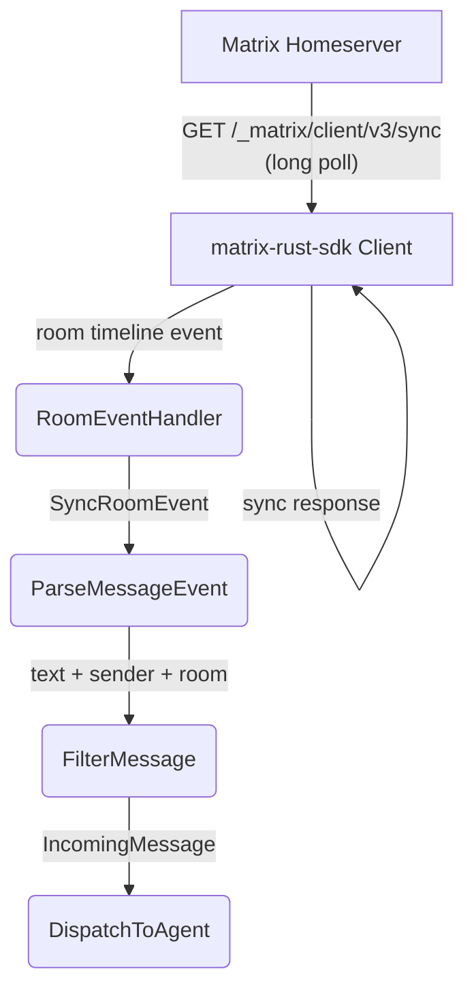

# Sync Loop Deep Dive

## 1. Purpose

The matrix-rust-sdk sync loop runs as a background task. Events are delivered
to registered event handlers. The `connect_and_run()` method registers a
room message handler before starting sync.

## 2. Diagram

**Sync parameters**: `SyncSettings::default()` includes a 30-second long-poll
timeout. Subsequent syncs resume from the stored `since` token, persisted in
the SQLite state store at `state_dir`. On reconnect (without re-login), the SDK
restores the `since` token and resumes incremental sync; on re-login (fresh
session), the first sync is a full initial sync.
