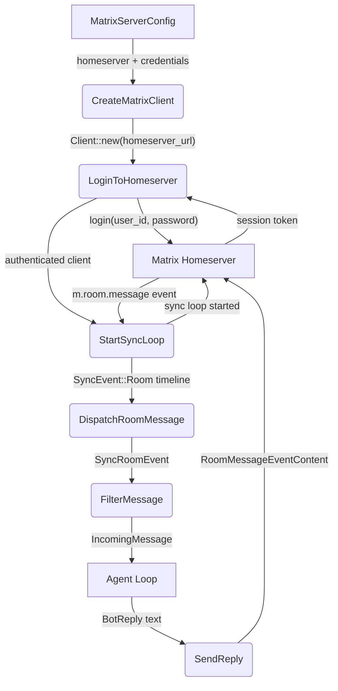

# Main Success Path

## 1. Purpose

Happy flow (main success path) of the Matrix platform: `MatrixServerConfig`
drives client creation and login, the sync loop dispatches incoming
`m.room.message` events to the message filter, which forwards `IncomingMessage`
structs to the agent loop; bot replies are sent back to the homeserver.

- References: [Shared structures](structures.md), [Agent Loop](../../agent/agent-loop/main-path.md)

## 2. Diagram

