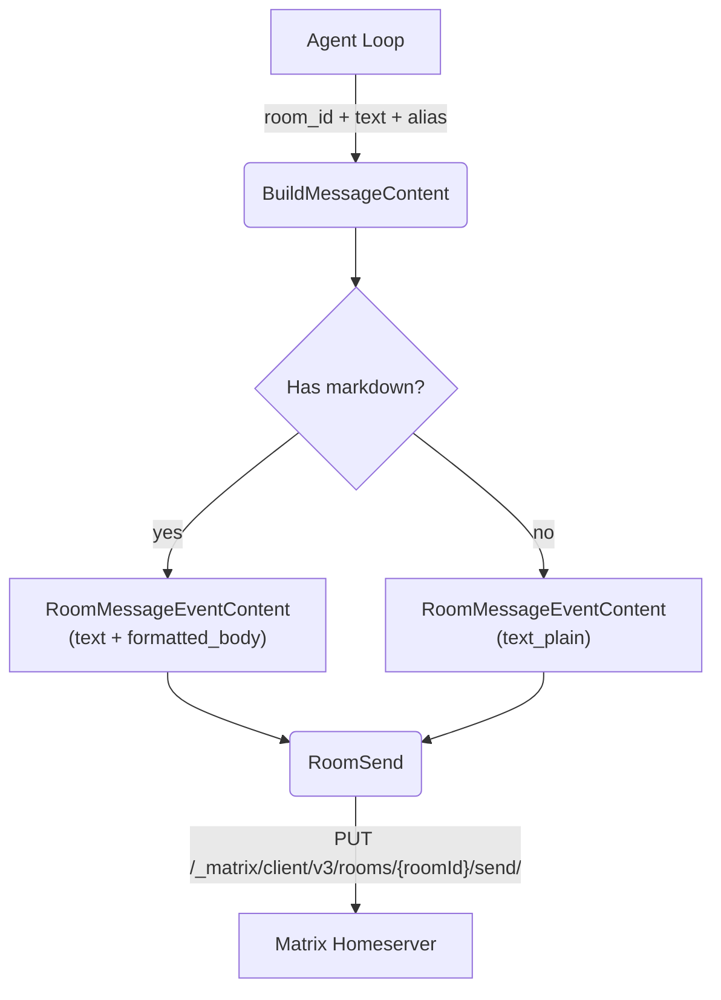

# Reply Sending

## 1. Purpose

Replies are sent as plain text `m.room.message` events with `msgtype: "m.text"`.

## 2. Diagram

**Markdown formatting**: If the bot reply contains markdown formatting
(headers, bold, code blocks), the message is sent with `formatted_body`
(org.matrix.custom.html) alongside the plain-text `body`. The Matrix SDK's
`RoomMessageEventContent::text_markdown()` handles this automatically.

**Alias**: Matrix does not support per-message sender alias like RocketChat.
The `alias` parameter in `send_reply()` is ignored for the Matrix platform.
The bot always sends under its own user identity.
