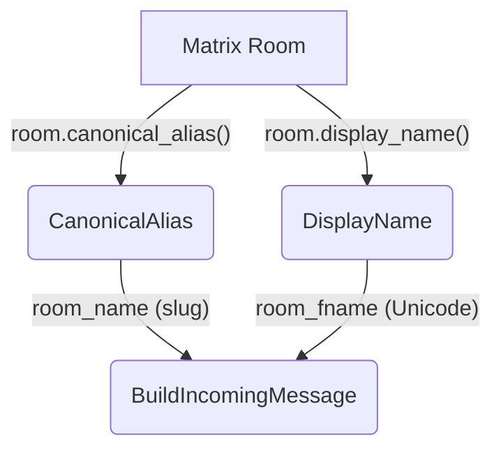

# Room Name Resolution

## 1. Purpose

Matrix rooms have canonical aliases (e.g. `#room:server`), display names, and
room IDs. The mapping to `IncomingMessage` fields:

## 2. Diagram

- `room_name` → canonical alias localpart without `#` and `:server` suffix
  (e.g. `#general:example.org` → `"general"`). Falls back to room ID localpart
  if no canonical alias.
- `room_fname` → room display name from `m.room.name` state event. Falls back
  to `room_name` if unset.
- `is_dm` → `true` if room has exactly 2 joined members (bot + one other). DMs bypass the mention check — all messages are forwarded.
