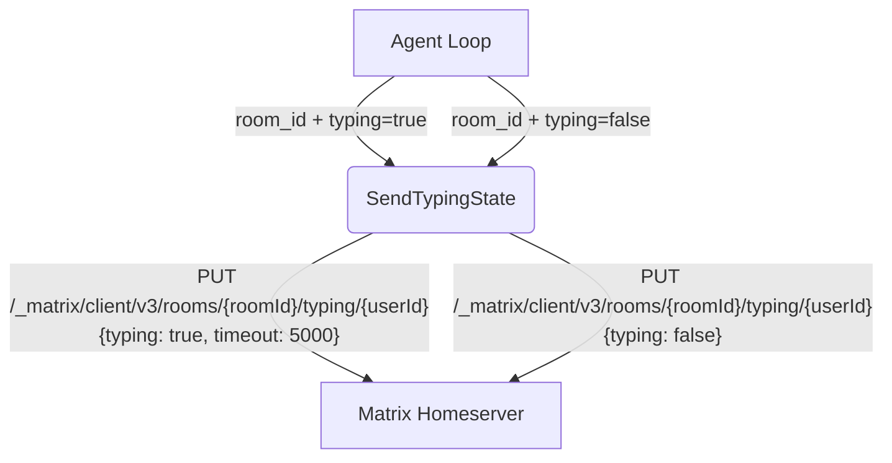

# Typing Indicator

## 1. Purpose

Matrix typing indicators are sent as ephemeral events to the room.

## 2. Diagram

The typing timeout is set to 5000ms per the Matrix spec recommendation. The
heartbeat task in the agent loop refreshes it every 2 seconds, matching the
RocketChat behavior.
