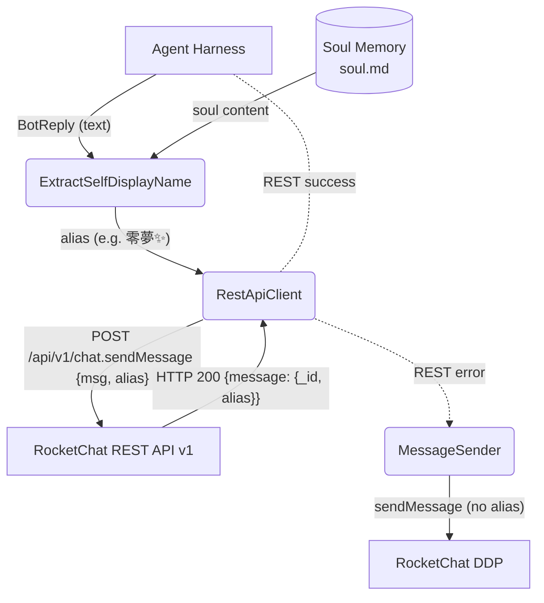
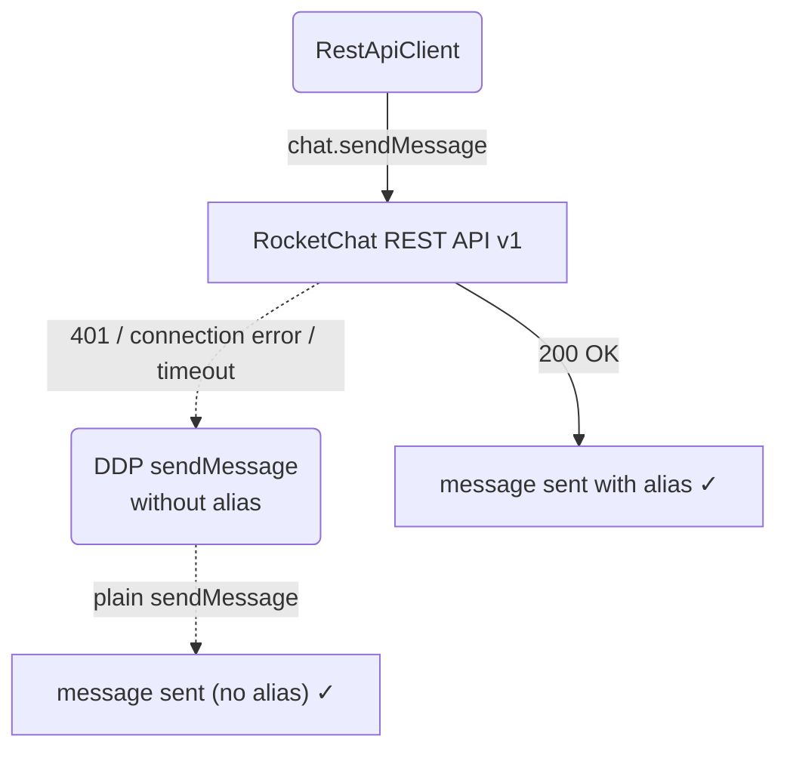
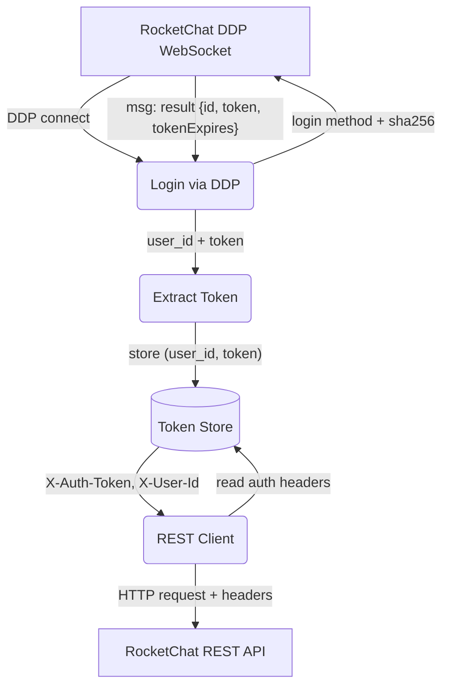
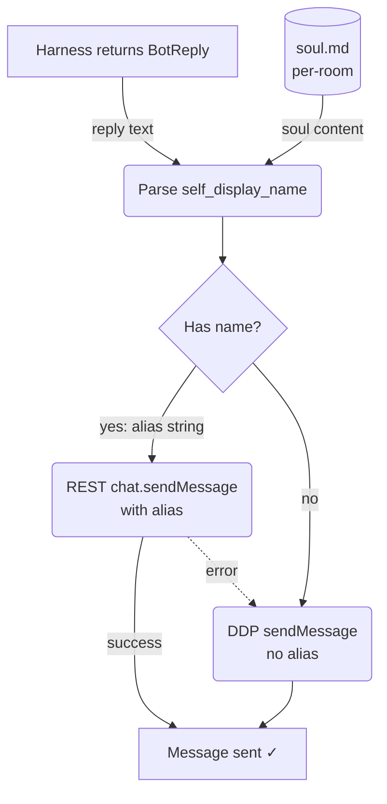
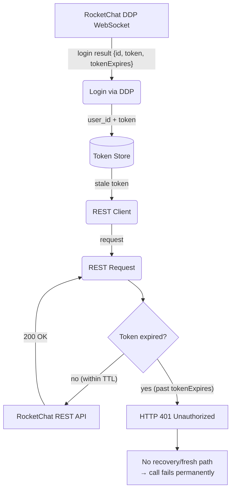

# RocketChat REST API Integration

## 1. Purpose

Extends the RockBot connection layer with **RocketChat REST API v1** calls for
two capabilities the legacy DDP `changed` events cannot reliably provide:
**(1)** lookup of Unicode-friendly room names (`fname`) that may be missing from
DDP events, and **(2)** sending messages with a per-message `alias` field to
override the sender's display name. The alias is sourced from the bot's
per-room soul memory (Layer 3) via `self_display_name()`.

Messages are sent **REST-first with alias**: the agent loop produces a reply
text, the bot's self-display name is extracted from soul memory, and the REST
`chat.sendMessage` endpoint is called with `alias`. If the REST call fails for
any reason, the system falls back to DDP `sendMessage` **without** alias.

- Upstream: [Configuration Management](config.md) provides server hostname and
  TLS settings
- Upstream: [RocketChat Connection](rocketchat.md) provides `user_id` and
  `auth_token` from the DDP `login` response
- Upstream: [Memory Management](memory.md) Layer 3 (soul) stores the bot's
  per-room self-display name, extracted via `self_display_name()`
- Downstream: Agent Loop (`main.rs`) orchestrates the REST-then-DDP send flow

## 2. Diagram

### 2a. Happy Flow — Main Send (REST + Alias)



### 2b. Error Handling — REST → DDP Fallback



The alias is optional from the server's perspective — if the bot user lacks
`message-impersonate` permission, the server silently ignores the alias and
uses the bot's own username. The REST client does not check for this; it
blindly sends regardless of permission state.

### 2c. Auth Token Flow — DDP Login to REST Headers



> **Note**: the DDP login response includes `tokenExpires` (epoch timestamp),
> but the current code extracts only `id` and `token` — the expiry is silently
> dropped. The `RestApiClient` has no refresh mechanism. If the server has
> `Accounts_LoginExpiration` enabled, the token has a finite TTL, and REST
> calls will return `401 Unauthorized` once it expires. The DDP WebSocket
> stays alive independently (pings keep it up), but does not trigger a token
> refresh for REST. See §2f for the failure diagram.

### 2d. Room Name Resolution — REMOVED

⚠️ **This flow was removed.** The REST fallback for room name resolution
was implemented (commit `6d4526e`) but **crashes the bot** due to an `assert!`
in `RestApiClient::new()` that panics when `auth_token` is empty.

See [`_doc/rocketchat/room-name-fields.md`](../../_doc/rocketchat/room-name-fields.md)
for the full rationale. Room names are resolved solely from DDP `args[1].fname`;
when `fname` is absent, the bot panics rather than falling back to the pinyin
slug or REST API.

### 2e. Alias Source — Soul Memory to REST Send

The alias is extracted from per-room soul memory (Layer 3) at send time. The
`self_display_name()` function parses the `soul.md` content using a single
standard regex (`My name is (.+)`) that captures the display name from the
first item of the flat enumeration list (always "My name is ..."). The agent
loop in `main.rs` orchestrates this flow inline.



The REST send is fire-and-forget: the reply is sent and the result logged.
There is no DDP verification step — the server broadcasts the message to all
subscribers via DDP `changed` events, which is handled by the normal event
loop.

### 2f. REST Token Expiration — No Recovery Path

When `Accounts_LoginExpiration` is enabled on the RocketChat server, the DDP
login returns a `tokenExpires` epoch timestamp. The token used for `X-Auth-Token`
is independent of the DDP WebSocket session lifetime — the WS stays alive via
pings, but the REST token can expire silently. No recovery path currently exists
in the codebase.



**Impact**: any REST endpoint (`chat.sendMessage`, `users.setAvatar`,
`rooms.upload`, etc.) becomes permanently unavailable once the token expires.
The DDP path (sending via `sendMessage` without alias) continues to work
because it uses the WebSocket session, not the token. The REST→DDP fallback in
§2b mitigates this for `sendMessage`, but other REST-only operations
(`setAvatar`, `upload`) have no fallback and fail silently.

**Possible future resolution**: detect `401` on REST responses, trigger a DDP
re-login over the existing WebSocket to obtain a fresh token, and update the
`RestApiClient` headers.

## 3. Data Structures

### REST API Endpoints

#### `GET /api/v1/rooms.get`

Returns all rooms the authenticated user has joined.

**Request headers**: `X-Auth-Token`, `X-User-Id`

**Response** (`application/json`):
```json
{
    "update": [{
        "_id": "8g4gQkEAhewkGPkPL",
        "name": "shit",
        "fname": "💩💩💩SHIT屎",
        "t": "p",
        "msgs": 146779,
        "usersCount": 6
    }],
    "success": true
}
```

#### `GET /api/v1/rooms.info`

**Query params**: `roomId` (UUID) or `roomName` (ASCII slug only — Unicode
`fname` cannot be used as a query parameter).

**Response**:
```json
{
    "room": {
        "_id": "8g4gQkEAhewkGPkPL",
        "name": "shit",
        "fname": "💩💩💩SHIT屎",
        "t": "p",
        "msgs": 146779,
        "usersCount": 6
    },
    "success": true
}
```

#### `POST /api/v1/chat.sendMessage`

Sends a message. Supports `alias` (including Chinese/emoji like `"零夢✨"`).

**Request body**:
```json
{
    "message": {
        "rid": "GENERAL",
        "msg": "Hello world",
        "alias": "零夢✨"
    }
}
```

**Response**:
```json
{
    "message": {
        "_id": "Bf8dNR3WWJXaxdMyT",
        "rid": "GENERAL",
        "msg": "Hello world",
        "alias": "零夢✨",
        "u": { "_id": "wEv8J45KntNhDdkeY", "username": "rockai", "name": "香菜" },
        "ts": { "$date": 1781112548565 }
    },
    "success": true
}
```

#### `GET /api/v1/chat.getMessage`

Retrieves a single message by `_id`. Useful for verifying alias propagation.

**Response**: message object with `alias` field preserved.

#### `POST /api/v1/users.setAvatar`

Sets the bot's avatar from a URL. Local file paths are never used.

**Request body**:
```json
{
    "avatarUrl": "https://example.com/avatar.png"
}
```

#### `POST /api/v1/rooms.upload`

Uploads a file to a RocketChat room. Used for sending attachments (e.g. generated images via DDP fallback with `data:` URIs).

**Request**: multipart form with `file`, `room_id`, and optional `msg`, `description`.

### Rust Types

#### `RestApiClient`

Wraps `reqwest::Client` and holds auth headers. Created once per send from the
`MessageSender` which captures `user_id` and `auth_token` during DDP login.

| Field        | Type              | Purpose                           |
| ------------ | ----------------- | --------------------------------- |
| `host`       | `String`          | Server hostname (from config)     |
| `use_tls`    | `bool`            | HTTPS if true                     |
| `user_id`    | `String`          | `X-User-Id` header value          |
| `auth_token` | `String`          | `X-Auth-Token` header value       |
| `http`       | `reqwest::Client` | Reusable HTTP client              |
| `room_name_cache` | `HashMap<String, String>` | Unused for room name resolution — see `room-name-fields.md` |

#### `RoomInfo`

| Field   | Type     | Source                         |
| ------- | -------- | ------------------------------ |
| `id`    | `String` | `rooms.get.update[]._id`       |
| `name`  | `String` | URL slug (ASCII)               |
| `fname` | `String` | Friendly name (Unicode)        |
| `t`     | `String` | Room type: `d`, `p`, `c`       |

### Implementation Map

| Component          | Source File                        |
| ------------------ | ---------------------------------- |
| `RestApiClient`    | `crate-rocketchat/src/rest.rs`     |
| REST endpoints     | `crate-rocketchat/src/rest.rs`     |
| `rest_client()`    | `crate-rocketchat/src/client.rs`   |
| Token capture      | `crate-rocketchat/src/client.rs`   |
| Room name cache    | `crate-rocketchat/src/rest.rs`     |
| Alias send         | `crate-rockbot/src/main.rs`        |
| `self_display_name`| `crate-rockbot/src/memory.rs`      |
