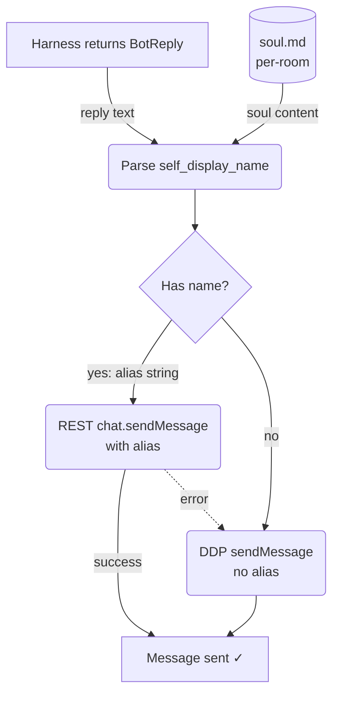

# Alias Source — Soul Memory to REST Send

## 1. Purpose

The alias is extracted from per-room soul memory (Layer 3) at send time. The
`self_display_name()` function parses the `soul.md` content using a single
standard regex (`My name is (.+)`) that captures the display name from the
first item of the flat enumeration list (always "My name is ..."). The agent
loop in `main.rs` orchestrates this flow inline.

- Upstream: [Memory Management](../../memory/memory/soul-editing.md) Layer 3
  (soul) stores the bot's per-room self-display name, extracted via
  `self_display_name()`
- Upstream: [Shared Structures](structures.md) — `chat.sendMessage` request
  shape

## 2. Diagram

The REST send is fire-and-forget: the reply is sent and the result logged.
There is no DDP verification step — the server broadcasts the message to all
subscribers via DDP `changed` events, which is handled by the normal event
loop.
