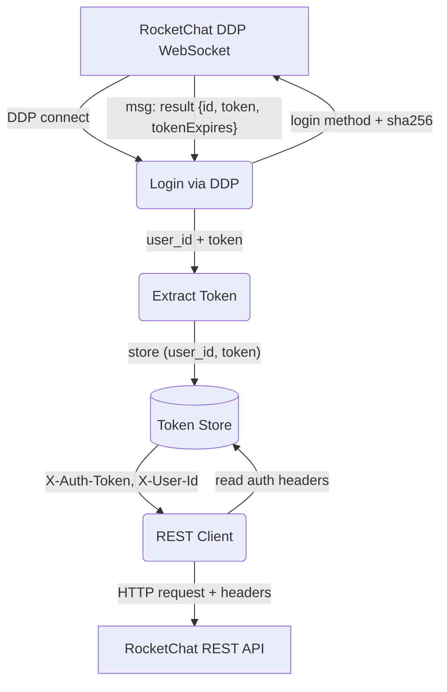

# Auth Token Flow — DDP Login to REST Headers

## 1. Purpose

The DDP `login` method captures `user_id` and `auth_token` from the login
response; the `RestApiClient` reads the stored pair and attaches it to every
REST request as `X-Auth-Token` and `X-User-Id`.

- Upstream: [RocketChat Connection](../rocketchat/main-path.md) provides
  `user_id` and `auth_token` from the DDP `login` response
- Upstream: [Shared Structures](structures.md) — `RestApiClient` auth fields
- Downstream: [REST Token Expiration — No Recovery Path](level-2/token-expiration.md)

## 2. Diagram

> **Note**: the DDP login response includes `tokenExpires` (epoch timestamp),
> but the current code extracts only `id` and `token` — the expiry is silently
> dropped. The `RestApiClient` has no refresh mechanism. If the server has
> `Accounts_LoginExpiration` enabled, the token has a finite TTL, and REST
> calls will return `401 Unauthorized` once it expires. The DDP WebSocket
> stays alive independently (pings keep it up), but does not trigger a token
> refresh for REST. See [REST Token Expiration — No Recovery Path](level-2/token-expiration.md)
> for the failure diagram.
