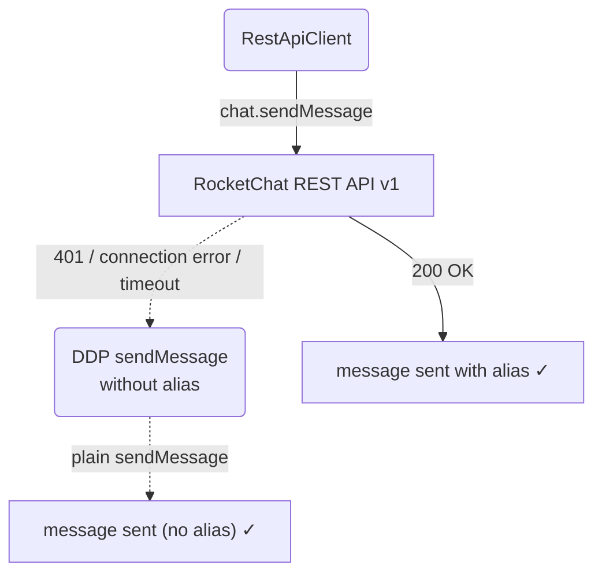

# Error Handling — REST → DDP Fallback

## 1. Purpose

If `chat.sendMessage` fails with `401`, a connection error, or a timeout, the
system falls back to DDP `sendMessage` **without** alias, so the reply is
delivered even when the REST path is down.

- Parent: [Happy Flow — Main Send (REST + Alias)](../rest-alias-send.md)

## 2. Diagram

The alias is optional from the server's perspective — if the bot user lacks
`message-impersonate` permission, the server silently ignores the alias and
uses the bot's own username. The REST client does not check for this; it
blindly sends regardless of permission state.
