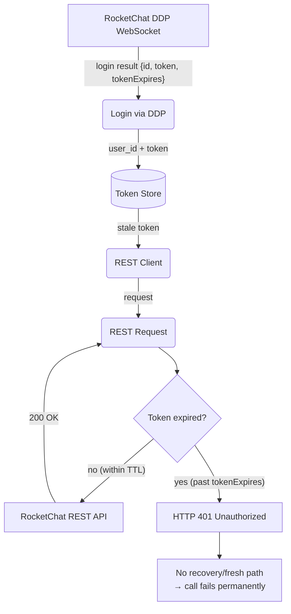

# REST Token Expiration — No Recovery Path

## 1. Purpose

When `Accounts_LoginExpiration` is enabled on the RocketChat server, the DDP
login returns a `tokenExpires` epoch timestamp. The token used for
`X-Auth-Token` is independent of the DDP WebSocket session lifetime — the WS
stays alive via pings, but the REST token can expire silently. No recovery path
currently exists in the codebase.

- Parent: [Auth Token Flow — DDP Login to REST Headers](../auth-token-flow.md)

## 2. Diagram

**Impact**: any REST endpoint (`chat.sendMessage`, `users.setAvatar`,
`rooms.upload`, etc.) becomes permanently unavailable once the token expires.
The DDP path (sending via `sendMessage` without alias) continues to work
because it uses the WebSocket session, not the token. The REST→DDP fallback in
[Error Handling — REST → DDP Fallback](rest-ddp-fallback.md) mitigates this for
`sendMessage`, but other REST-only operations (`setAvatar`, `upload`) have no
fallback and fail silently.

**Possible future resolution**: detect `401` on REST responses, trigger a DDP
re-login over the existing WebSocket to obtain a fresh token, and update the
`RestApiClient` headers.
