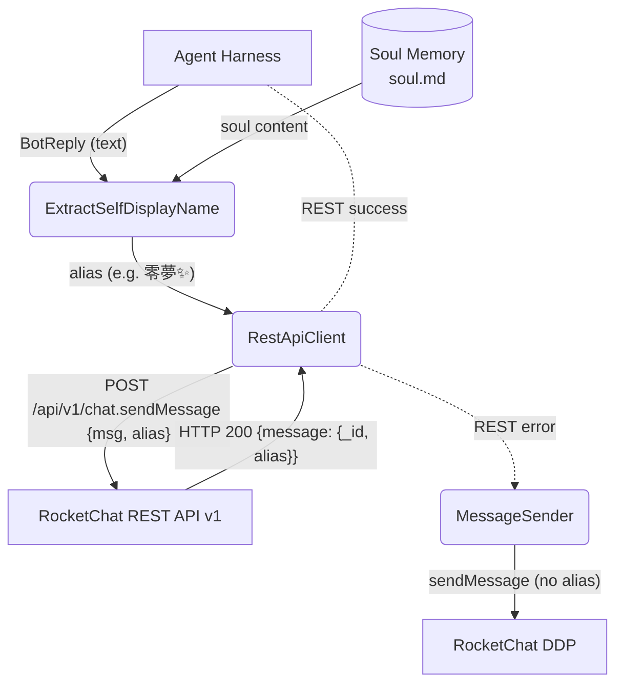

# Happy Flow — Main Send (REST + Alias)

## 1. Purpose

Messages are sent **REST-first with alias**: the agent loop produces a reply
text, the bot's self-display name is extracted from soul memory, and the REST
`chat.sendMessage` endpoint is called with `alias`. If the REST call fails for
any reason, the system falls back to DDP `sendMessage` **without** alias.

- Upstream: [Configuration Management](../config/main-path.md) provides server
  hostname and TLS settings
- Upstream: [RocketChat Connection](../rocketchat/main-path.md) provides
  `user_id` and `auth_token` from the DDP `login` response
- Upstream: [Memory Management](../../memory/memory/soul-editing.md) Layer 3
  (soul) stores the bot's per-room self-display name, extracted via
  `self_display_name()`
- Upstream: [Shared Structures](structures.md) — endpoints, `RestApiClient`,
  `RoomInfo`
- Downstream: [Error Handling — REST → DDP Fallback](level-2/rest-ddp-fallback.md)

## 2. Diagram

