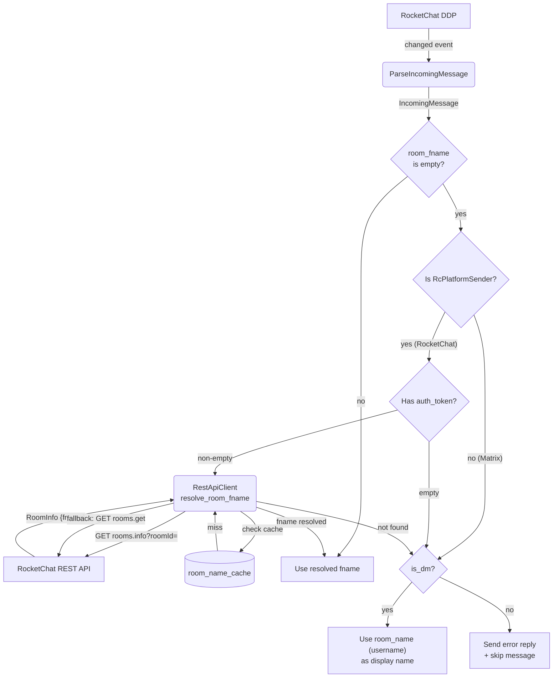

# Room Name Resolution — REST Fallback

## 1. Purpose

When the DDP `stream-room-messages` subscription delivers a `"changed"` event
without `fname` in `args[1]`, the message handler in `main.rs` falls back to
REST API room name resolution via `resolve_room_fname()`. The flow is gated by
a non-empty `auth_token` check to avoid the `assert!` panic that broke the
earlier attempt.

- Upstream: [RocketChat Connection](../rocketchat/main-path.md) — DDP
  `changed` events and `auth_token`
- Upstream: [Shared Structures](structures.md) — `rooms.get` / `rooms.info`
  endpoints, `RoomInfo`

## 2. Diagram

See [`_doc/rocketchat/room-name-fields.md`](../../../_doc/rocketchat/room-name-fields.md)
for the full rationale. If REST resolution fails and the room is **not** a DM
(`is_dm == false`), the bot sends an error reply and skips message processing.
For **DM rooms** (`is_dm == true`), the bot falls back to `room_name` (the
sender's username) as the display name instead of erroring. This is because
DMs in RocketChat never have an `fname` — they only have a `username` on the
other participant. The bot never panics from missing room names.
