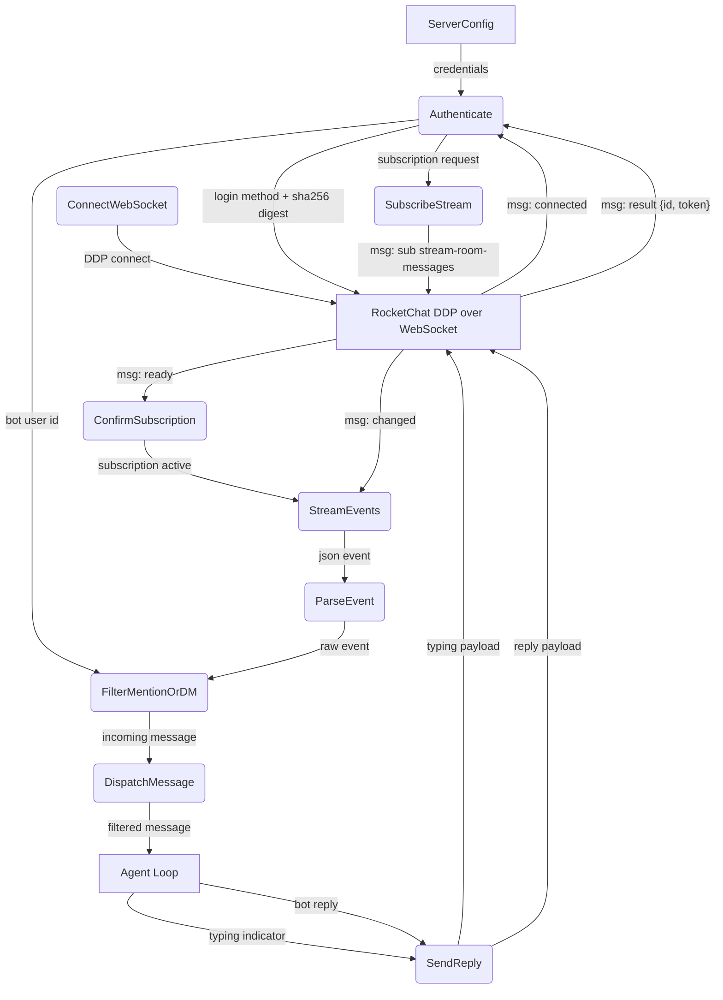
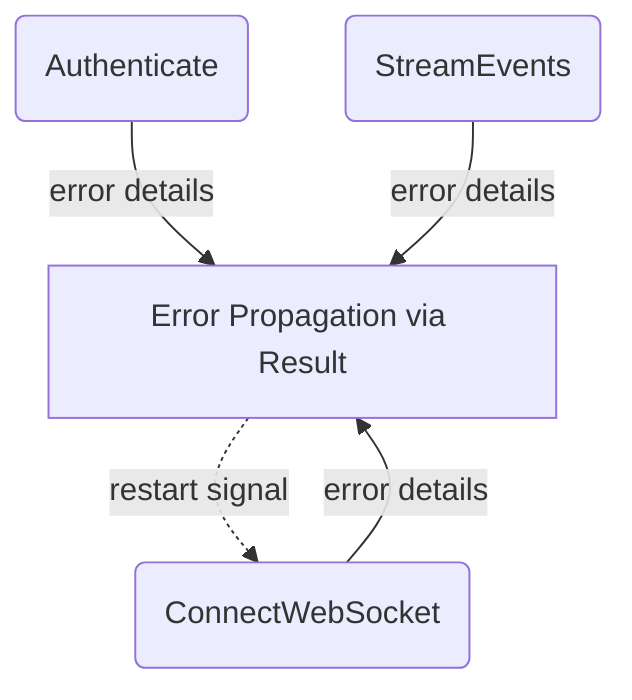
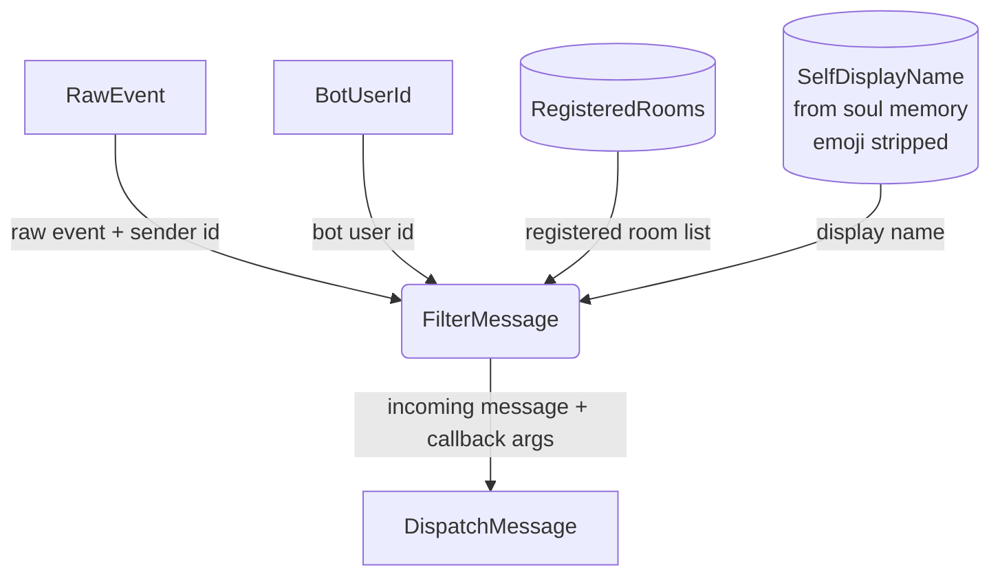
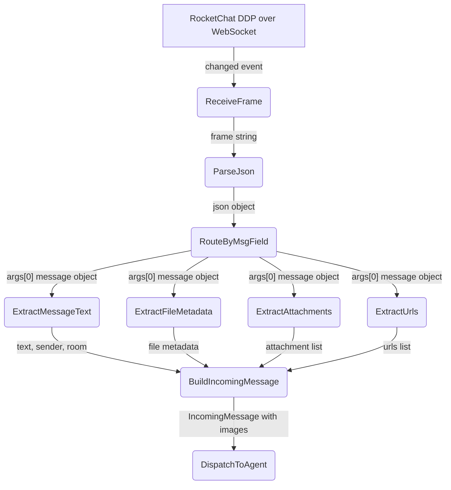
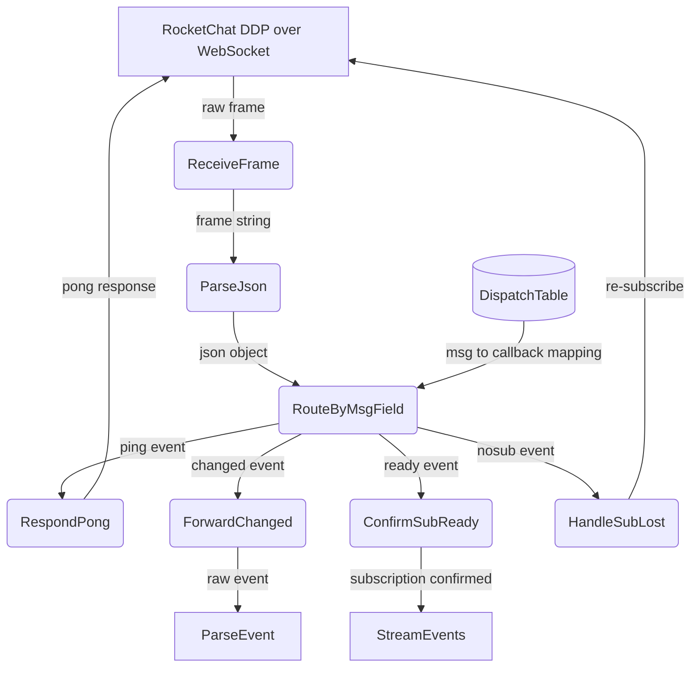
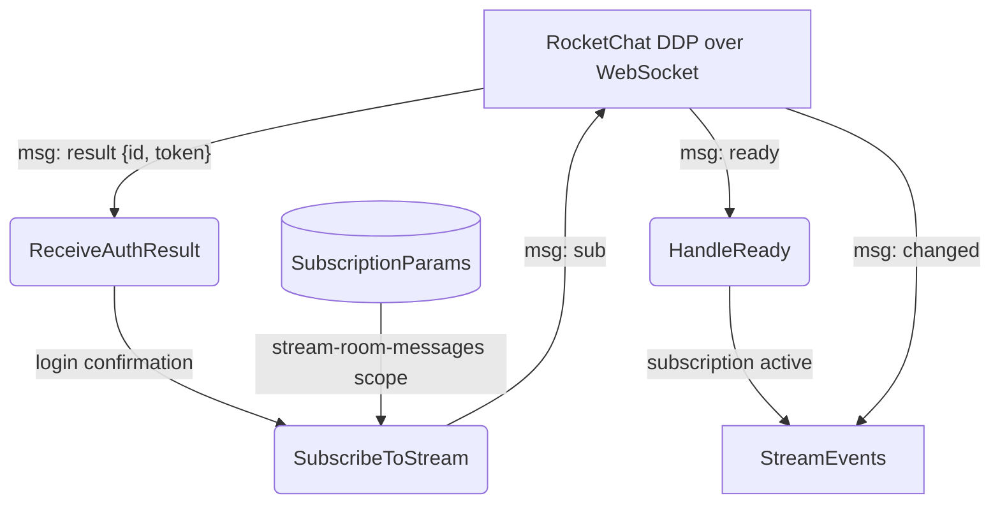
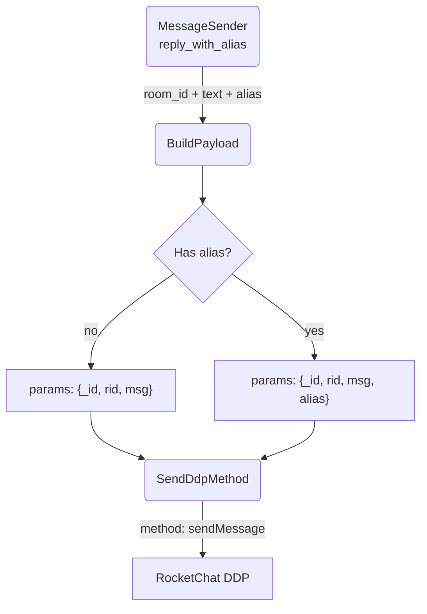

# RocketChat Connection

## 1. Purpose

Rust crate (`crate-rocketchat`) that manages the full lifecycle of a
RocketChat connection over **DDP (Distributed Data Protocol)** via WebSocket:
authentication, subscription to message stream, event dispatch, message
parsing/filtering, and reply delivery. DMs, messages that start with or contain `@botname` or the bot's
self-display name (emoji stripped), and room-specific registered callbacks
are forwarded to the agent.

> **Deprecation note**: Rocket.Chat's official documentation marks the raw
> DDP/bots approach as **deprecated** (2025). The recommended replacement is
> [`@rocket.chat/ddp-client`](https://www.npmjs.com/package/@rocket.chat/ddp-client)
> or the [Apps-Engine](https://developer.rocket.chat/docs/rocketchat-apps-engine).

- Upstream: [Configuration Management](config.md) provides configuration
  (typed `RocketChatConfig` deserialized from TOML via `serde`)
- Downstream: [Agent Harness](../agent/agent-harness.md) receives filtered `IncomingMessage`
  structs via async callback; sends replies through `MessageSender::reply()`

## 2. Diagram

### 2a. Happy Flow (Main Success Path)



### 2b. Error Handling & Fallbacks

The Rust implementation uses a typed `RocketChatError` enum (`thiserror`) that
classifies WebSocket, protocol, auth, TLS, JSON, and config errors. `Result<T>`
patterns propagate errors from `connect_async`, `read.next()`, and JSON parsing.
The `"nosub"` DDP event triggers automatic re-subscription. No external restart
wrapper is needed — errors bubble up through the `Result` chain to the caller.



### 2c. Message Filter Deep Dive

The `MessageFilter::filter()` method (`crate-rocketchat/src/types.rs:64`)
implements a five-stage decision chain. Messages from the bot itself are
silently dropped. The bot responds to: (1) `@botname` at the start of or
contained in a channel message, (2) the bot's self-display name from soul
memory (with emoji stripped) appearing anywhere in the text, (3) a specific
registered room, or (4) a direct message with no room name.



The filter process internally:
1. Skips events where `sender_id == bot_user_id` (self-messages)
2. Checks `is_dm` flag from the parsed event
3. Matches messages starting with or containing `@botname` in channels
4. Matches messages containing the bot's self-display name (emoji stripped)
5. Falls back to checking a registered-room list

All other cases are silently dropped.

### 2g. Image Attachment Reception

When a user sends a message with an image/file upload, the DDP `"changed"` event
carries the full file metadata and attachment data in `args[0]`. The parser must
extract these fields and populate `IncomingMessage` so the agent can "see" images.



**File metadata** (`args[0]["file"]` and `args[0]["files"]`):

| Field | Type | Description |
|-------|------|-------------|
| `_id` | `String` | File ID on the RocketChat server |
| `name` | `String` | Original filename |
| `type` | `String` | MIME type (e.g. `image/png`) |
| `size` | `u64` | File size in bytes |
| `format` | `String` | File extension (e.g. `png`) |
| `typeGroup` | `String` | `"image"`, `"video"`, `"audio"`, `"document"`, `"thumb"` |

**Attachment metadata** (`args[0]["attachments"]` array):

| Field | Type | Description |
|-------|------|-------------|
| `title` | `String` | Attachment display title (filename) |
| `title_link` | `String` | Relative path to **original file**: `/file-upload/{file_id}/{name}` |
| `title_link_download` | `bool` | `true` for file uploads |
| `image_url` | `String` | Relative path to **thumbnail**: `/file-upload/{thumb_id}/{name}` |
| `image_type` | `String` | MIME type of the image |
| `image_size` | `u64` | Original file size in bytes |
| `image_dimensions` | `{width, height}` | Pixel dimensions |
| `image_preview` | `String` | Base64-encoded small inline preview |
| `type` | `String` | `"file"` for uploads |
| `fileId` | `String` | Back-reference to the original `file._id` |

**Download URL construction**: `{server_base_url}{title_link}` for the original,
`{server_base_url}{image_url}` for the thumbnail. `title_link` and `image_url`
are URL-encoded relative paths — they must be joined with the server base URL
scheme/host before use.

**URL preview metadata** (`args[0]["urls"]` array):

| Field | Type | Description |
|-------|------|-------------|
| `url` | `String` | The URL shared in the message |
| `meta` | `Option<Value>` | RocketChat server JSON metadata for the URL |
| `headers` | `Option<UrlHeaders>` | HTTP response headers (`contentType`, `contentLength`) |

Images are detected by `headers.contentType` starting with `"image/"` — the harness uses this to auto-inject image URLs into `image_gen` calls without requiring vision.

### 2d. Ping/Pong Keepalive Deep Dive

The RocketChat server periodically sends `{"msg": "ping"}` to keep the
WebSocket alive. The bot responds immediately with `{"msg": "pong"}`. This
diagram decomposes the `StreamEvents` (STREAM) process from Level 1, showing
the internal dispatch that routes frames by `msg` field.



**Dispatch table** — the `msg` field routes to inline handling in the event loop:

| `msg` value    | Handler                         | Action                              |
| -------------- | ------------------------------- | ----------------------------------- |
| `"ping"`       | `ddp::pong_message()`           | Send `{"msg": "pong"}`              |
| `"connected"`  | `connect_and_run` setup         | Send login method (see 2f)          |
| `"result"`     | `ddp::extract_login_result()`   | Extract userId, confirm login       |
| `"changed"`    | `MessageFilter::filter()`       | Parse + filter + dispatch to agent  |
| `"ready"`      | `expect_msg("ready")`           | Confirm subscription active         |
| `"nosub"`      | re-subscribe inline             | Re-subscribe on subscription loss   |

All six message types are handled. The event loop waits for `"ready"` after
subscription and re-subscribes on `"nosub"`.

> **Note**: `"connected"`, `"result"`, and `"ready"` are consumed during connection
> setup (via `expect_msg()` in `client.rs:183,190,200`), **not** in the runtime
> event loop. The event loop (`client.rs:151-207`) only handles `"ping"`,
> `"changed"`, and `"nosub"`.

Note: the bot does **not** proactively send pings or monitor ping intervals —
it only responds to server-initiated pings. A missing server ping will not be
detected; a WebSocket read returning `None` or `Err` terminates the loop.

### 2e. Subscription Deep Dive

After authentication succeeds (`ddp::extract_login_result()` parses the
`result` with `id` and `token`), `RocketChatClient::connect_and_run()` sends
the subscription via `ddp::subscribe_message()`. Once the server responds with
`"ready"`, the event loop begins delivering `"changed"` events for all messages
visible to the bot user.



**Subscription payload** sent to the WebSocket:

```json
{
    "msg": "sub",
    "id": "ABCROCK",
    "name": "stream-room-messages",
    "params": ["__my_messages__", false]
}
```

The `params` array controls which messages are received: `"__my_messages__"`
scopes to the authenticated user, and `false` (the DDP backward-compatibility
flag) means only `"changed"` events are delivered. Setting it to `true` would
also emit `"added"` events for each existing message, which is unnecessary
for a bot that only needs new incoming messages.

### 2f. Authentication Deep Dive

The login flow uses DDP method calls over the WebSocket (`ddp::login_message()`
in `crate-rocketchat/src/ddp.rs:36`). The Rocket.Chat `login` method requires
the password to be pre-hashed with **SHA-256**, sent as a lowercase hex digest
alongside the algorithm name. The Rust implementation uses `sha2::Digest` to
hash the password before constructing the payload.

All DDP method calls (`login`, `stream-notify-room`, `sendMessage`) use a shared
`AtomicU64` counter (`MSG_ID`) that generates sequential, unique IDs per call.
This ensures the server can match each `"result"` response to its originating
`"method"` call — required by the DDP protocol to prevent "Match failed" errors
on duplicate IDs.

**Implementation** (`ddp::login_message()`):

```json
{
    "msg": "method",
    "method": "login",
    "id": "<next_id()>",
    "params": [
        {
            "user": { "username": "rockbot" },
            "password": {
                "digest": "2cf24dba5fb0a30e26e83b2ac5b9e29e1b161e5c1fa7425e73043362938b9824",
                "algorithm": "sha-256"
            }
        }
    ]
}
```

**sendMessage implementation** (`ddp::send_message_payload()`):

The `sendMessage` method requires a client-generated `_id` string field inside
the `params` message object — RocketChat validates this on the server side and
rejects messages without it. message `_id` uses `unique_msg_id()` (timestamp-seq format), method `id` uses `next_id()` (sequential).

An optional `alias` field in `params[0]` overrides the displayed sender name for
this message — the server substitutes the alias in place of the bot's real username.
Requires the `message-impersonate` permission on the RocketChat user role.

```json
{
    "msg": "method",
    "method": "sendMessage",
    "id": "<next_id()>",
    "params": [{
        "_id": "<next_id()>",
        "rid": "room-uuid",
        "msg": "reply text",
        "alias": "TotallyRealHuman"
    }]
}
```

The `alias` field is optional. When omitted or when the user lacks
`message-impersonate`, the message is sent under the bot's own username
with no error.

**Server response** on success:

```json
{
    "msg": "result",
    "id": "<next_id()>",
    "result": {
        "id": "user-id",
        "token": "auth-token",
        "tokenExpires": { "$date": 1480377601 }
    }
}
```

The `tokenExpires` field is **not consumed** by the current implementation.

### 2g. Alias Impersonation

Messages can be sent with an optional `alias` field that overrides the displayed
sender name. Two paths support this:

1. **DDP `sendMessage`** — the `alias` field is injected into `params[0]`
   alongside `rid` and `msg`. Requires `message-impersonate` permission. The
   rocketchat crate exposes `send_message_payload_with_alias()` for tests,
   but the production flow does not use DDP alias.



2. **REST `chat.sendMessage`** — the production path. The alias is sourced from
   soul memory (Layer 3) via `self_display_name()`, then sent via
   `POST /api/v1/chat.sendMessage {message: {rid, msg, alias}}`. Falls back to
   DDP `sendMessage` without alias on REST failure. Diagram and full spec in
   [RocketChat REST API](rocketchat-rest.md).

The alias is a plain string (supports Chinese/emoji like `"零夢✨"`). When set,
the RocketChat server replaces the bot's display name with the alias value in
the message UI and event broadcasts. Self-messages (where `sender_id ==
bot_user_id`) are still filtered out regardless of alias.

## 3. Data Structures

The Rust crate defines formal typed structs with `serde` (Serialize/Deserialize)
in `crate-rocketchat/src/types.rs`. Tables below map each field to its struct
definition and how it is populated.

#### `IncomingMessage` (fields defined in `types.rs`)

| Field         | Type              | Source / Notes                                      |
| ------------- | ----------------- | --------------------------------------------------- |
| `msg_id`      | `Option<String>`  | `raw["id"]` — DDP message ID                        |
| `room_id`     | `String`          | `args[0]["rid"]` — RocketChat room ID               |
| `room_name`   | `String`          | `args[1]["roomName"]` — URL slug (ASCII, e.g. `sen1-lin2-sheng1-tai4`). `""` or `"DIRECT_MESSAGES"` for DMs |
| `room_fname`  | `String`          | Per-event `args[1]["fname"]`. Empty when absent from the DDP event or for rooms without a custom fname |
| `sender_name` | `String`          | `args[0]["u"]["username"]` — sender's RocketChat username |
| `text`        | `String`          | `args[0]["msg"]` — message body text                |
| `is_dm`       | `bool`            | `true` if `room_name` is empty or `"DIRECT_MESSAGES"` |
| `timestamp`   | `Option<i64>`     | `args[0]["ts"]` — message timestamp (`$date`)       |
| `sender_id`   | `String`          | `args[0]["u"]["_id"]` — sender's RocketChat user ID |
| `alias`       | `Option<String>`  | `args[0]["alias"]` — sender alias                   |
| `file`        | `Option<FileInfo>` | `args[0]["file"]` — primary file metadata (present when message has an attachment) |
| `files`       | `Vec<FileInfo>`   | `args[0]["files"]` — all file variants (original + thumbnails) |
| `attachments` | `Vec<AttachmentInfo>` | `args[0]["attachments"]` — attachment objects with download URLs |
| `urls`        | `Vec<MessageUrl>`    | `args[0]["urls"]` — URL preview metadata (content type, content length). Used by harness to detect image URLs for auto-injection into image_gen. |

Room name precedence:
- **Matching/registration**: use `room_name` (slug) — always ASCII, deterministic
- **Display/log messages**: prefer `room_fname` when non-empty, fall back to `room_name`
- **WebDAV directory naming**: prefer `room_fname` when non-empty, fall back to `room_name` (slug) for safe filesystem paths

The agent harness computes `webdav_dir` using the friendly name when available:
- **Channel** (e.g. `#森林生態` with slug `sen1-lin2-sheng1-tai4`): DDP supplies `roomName: "sen1-lin2-sheng1-tai4"` + `fname: "森林生態"` → `webdav_dir: "r-森林生態"`
- **Channel without fname** (e.g. `#general`): DDP supplies `roomName: "general"` + `fname: ""` → `webdav_dir: "r-general"`
- **Direct message** (e.g. from `saru`): DDP `roomName` empty, `fname` empty → falls back to `sender_name: "saru"` → `webdav_dir: "d-saru"`

The flat `r-`/`d-` prefixes prevent collisions. When per-event `args[1].fname`
is available, the display name is used; otherwise the URL slug is the fallback.

> **Important distinction**: `room_id` (the RocketChat UUID from DDP `args[0].rid`)
> and `webdav_dir` (the `r-`/`d-`-prefixed path key) are **separate values**.
> `room_id` is used as a stable in-memory lookup key. `webdav_dir` is used for
> WebDAV path construction. Tool calls receive both via `inject_room_context`.

#### `BotReply`

| Field       | Type              | Constructor                          |
| ----------- | ----------------- | ------------------------------------ |
| `room_id`   | `String`          | `MessageSender::room_id()`           |
| `text`      | `String`          | `MessageSender::reply(text)`         |
| `alias`     | `Option<String>`  | `BotReply::new()` defaults to `None` |
| `thread_id` | `Option<String>`  | Reserved for threaded replies (`tmid`) |

`MessageSender` also provides `reply_code(text)` (code-block format),
`reply_with_alias(text, alias)` (DDP aliased reply — used in tests, not
production), and `typing(state, username)` (typing indicator).

**Production alias flow**: the alias is not part of `BotReply`. Instead,
`main.rs` extracts the bot's self-display name from soul memory via
`MemoryManager::self_display_name(room_id)`, then sends via REST
`chat.sendMessage` with alias. On REST failure, falls back to DDP
`sendMessage` without alias. See [RocketChat REST API](rocketchat-rest.md).

No `DdpEvent` struct exists. Raw DDP frames are handled as `serde_json::Value`
with the `"msg"` field extracted via helper functions: `msg_field()`, `is_ping()`,
`is_changed()`, etc. (`ddp.rs:68-101`).

#### `FileInfo`

| Field      | Type     | Source                                   |
| ---------- | -------- | ---------------------------------------- |
| `_id`      | `String` | `args[0]["file"]["_id"]`                 |
| `name`     | `String` | `args[0]["file"]["name"]`                |
| `type`     | `String` | MIME type (e.g. `image/png`)             |
| `size`     | `u64`    | File size in bytes                       |
| `format`     | `Option<String>` | File extension (e.g. `png`)              |
| `type_group` | `Option<String>` | `"image"`, `"video"`, `"thumb"`, etc.  |

#### `AttachmentInfo`

| Field             | Type                | Source                                       |
| ----------------- | ------------------- | -------------------------------------------- |
| `title`           | `Option<String>`    | Display title (filename)                     |
| `title_link`      | `Option<String>`    | Relative path to **original file** download  |
| `title_link_download` | `Option<bool>`  | True for file uploads                        |
| `image_url`       | `Option<String>`    | Relative path to **thumbnail** image         |
| `image_type`      | `Option<String>`    | MIME type                                    |
| `image_size`      | `Option<u64>`       | Original file size in bytes                  |
| `image_dimensions`| `Option<ImageDim>`  | `{width, height}` pixel dimensions           |
| `image_preview`   | `Option<String>`    | Base64-encoded inline preview                |
| `type`            | `Option<String>`    | `"file"` for uploads                         |
| `file_id`         | `Option<String>`    | Back-reference to original `file._id`        |

To construct the full download URL: join `{server_config.host()}{attachment.title_link}`. The `image_url` field points to a thumbnail variant — use `title_link` for the original, full-quality image.

#### `MessageUrl`

| Field     | Type                | Source                              |
|-----------|---------------------|-------------------------------------|
| `url`     | `String`            | The URL string                      |
| `meta`    | `Option<Value>`     | RocketChat server metadata (JSON)   |
| `headers` | `Option<UrlHeaders>`| HTTP response headers for the URL   |

#### `UrlHeaders`

| Field             | Type            | Source                         |
|-------------------|-----------------|--------------------------------|
| `content_length`  | `Option<String>`| `contentLength` header value   |
| `content_type`    | `Option<String>`| `contentType` header value     |

Image URLs are detected by `headers.contentType` matching `image/*` — the harness populates `current_image_urls` from these and auto-injects them into `image_gen` calls, bypassing vision for text-only models.

#### `MessageFilter`

| Field         | Type      | Purpose                            |
| ------------- | --------- | ---------------------------------- |
| `bot_user_id` | `&str`    | User ID to filter out self-messages|

Method `filter(&self, raw: &Value) -> Option<IncomingMessage>` parses and
filters a raw DDP event, returning `None` for self-messages and `Some` for
valid incoming messages. The dispatch decision (DM, mention, display name,
registered rooms) is implemented inline in `client.rs:226-235` at the
`connect_and_run` event loop level. `room_fname` is parsed directly from the
per-event `args[1].fname` field; there is no secondary cache lookup.

#### `RocketChatClient`

| Field          | Type              | Purpose                            |
| -------------- | ----------------- | ---------------------------------- |
| `bot_name`       | `String`              | `@username` for mention matching            |
| `display_name`   | `Option<String>`     | Self-display name from soul.md (emoji stripped) for content matching |
| `config`         | `RocketChatConfig`   | Server connection configuration             |
| `username`       | `String`             | Bot login username                          |
| `user_id`        | `Option<String>`     | User ID received after authentication       |
| `auth_token`     | `Option<String>`     | Auth token received after login             |
| `registered_rooms` | `HashMap<String, bool>` | Rooms the bot should listen in regardless of mentions |

The `display_name` is set via `set_display_name()` before `connect_and_run()`.
It is sourced from the rocketbot harness's soul memory (`any_display_name()`)
and run through `utils::strip_emoji()` to remove emoji codepoints (e.g. "零夢 ✨"
→ "零夢"). When set, the event loop also dispatches messages whose text
contains the display name, even without an `@username` mention.

*(Room name cache removed — see `room-name-fields.md` for the rationale.)*
