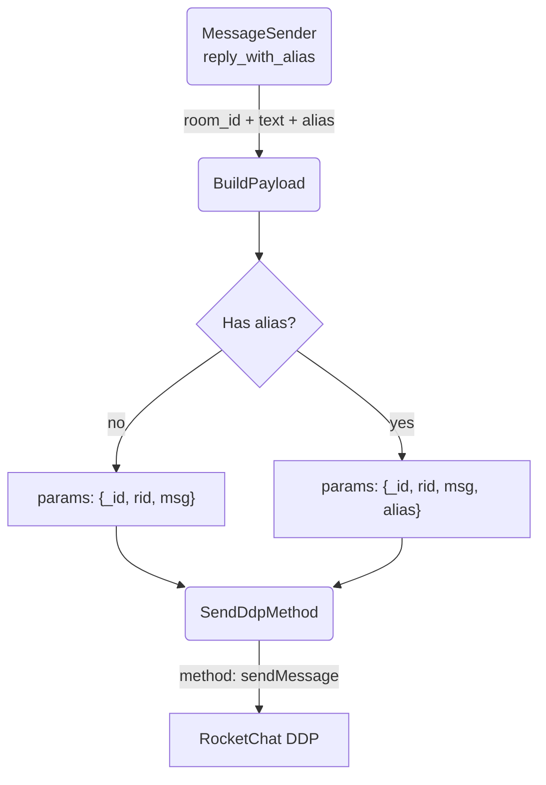

# Alias Impersonation

## 1. Purpose

Messages can be sent with an optional `alias` field that overrides the displayed
sender name. Two paths support this:

1. **DDP `sendMessage`** — the `alias` field is injected into `params[0]`
   alongside `rid` and `msg`. Requires `message-impersonate` permission. The
   rocketchat crate exposes `send_message_payload_with_alias()` for tests,
   but the production flow does not use DDP alias.

2. **REST `chat.sendMessage`** — the production path. The alias is sourced from
   soul memory (Layer 3) via `self_display_name()`, then sent via
   `POST /api/v1/chat.sendMessage {message: {rid, msg, alias}}`. Falls back to
   DDP `sendMessage` without alias on REST failure. Diagram and full spec in
   [RocketChat REST API](../rocketchat-rest/rest-alias-send.md).

## 2. Diagram

The alias is a plain string (supports Chinese/emoji like `"零夢✨"`). When set,
the RocketChat server replaces the bot's display name with the alias value in
the message UI and event broadcasts. Self-messages (where `sender_id ==
bot_user_id`) are still filtered out regardless of alias.

## 3. Data Structures

Shared data structures for these flows are documented in
[`structures.md`](structures.md) — see its `## 1. Overview` for
the subsystem context.
