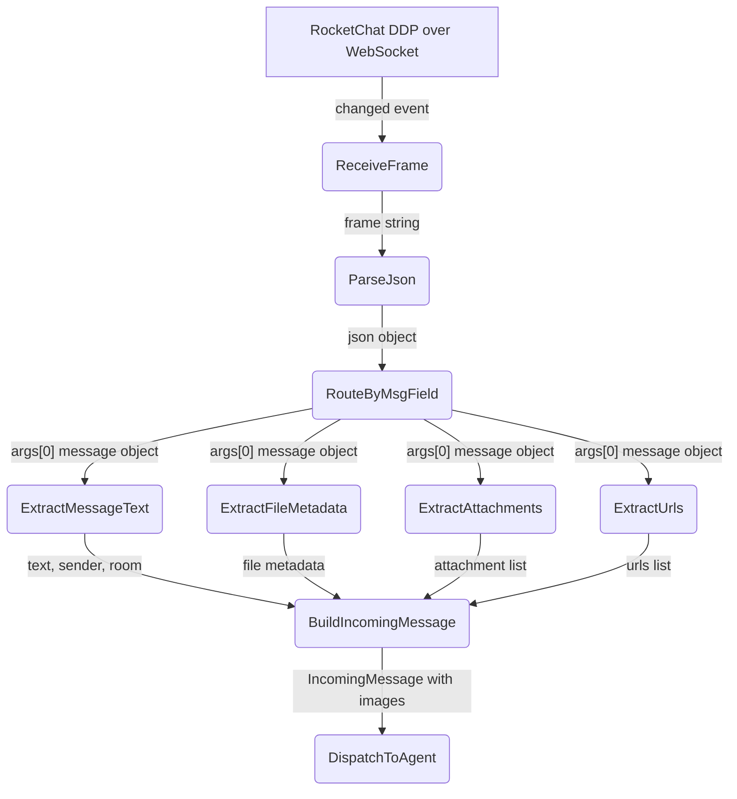

# Image Attachment Reception

## 1. Purpose

When a user sends a message with an image/file upload, the DDP `"changed"` event
carries the full file metadata and attachment data in `args[0]`. The parser must
extract these fields and populate `IncomingMessage` so the agent can "see" images.

## 2. Diagram

**File metadata** (`args[0]["file"]` and `args[0]["files"]`):

| Field | Type | Description |
|-------|------|-------------|
| `_id` | `String` | File ID on the RocketChat server |
| `name` | `String` | Original filename |
| `type` | `String` | MIME type (e.g. `image/png`) |
| `size` | `u64` | File size in bytes |
| `format` | `String` | File extension (e.g. `png`) |
| `typeGroup` | `String` | `"image"`, `"video"`, `"audio"`, `"document"`, `"thumb"` |

**Attachment metadata** (`args[0]["attachments"]` array):

| Field | Type | Description |
|-------|------|-------------|
| `title` | `String` | Attachment display title (filename) |
| `title_link` | `String` | Relative path to **original file**: `/file-upload/{file_id}/{name}` |
| `title_link_download` | `bool` | `true` for file uploads |
| `image_url` | `String` | Relative path to **thumbnail**: `/file-upload/{thumb_id}/{name}` |
| `image_type` | `String` | MIME type of the image |
| `image_size` | `u64` | Original file size in bytes |
| `image_dimensions` | `{width, height}` | Pixel dimensions |
| `image_preview` | `String` | Base64-encoded small inline preview |
| `type` | `String` | `"file"` for uploads |
| `fileId` | `String` | Back-reference to the original `file._id` |

**Download URL construction**: `{server_base_url}{title_link}` for the original,
`{server_base_url}{image_url}` for the thumbnail. `title_link` and `image_url`
are URL-encoded relative paths — they must be joined with the server base URL
scheme/host before use.

**URL preview metadata** (`args[0]["urls"]` array):

| Field | Type | Description |
|-------|------|-------------|
| `url` | `String` | The URL shared in the message |
| `meta` | `Option<Value>` | RocketChat server JSON metadata for the URL |
| `headers` | `Option<UrlHeaders>` | HTTP response headers (`contentType`, `contentLength`) |

Images are detected by `headers.contentType` starting with `"image/"` — the harness uses this to auto-inject image URLs into `image_gen` calls without requiring vision.

## 3. Data Structures

Shared data structures for these flows are documented in
[`structures.md`](structures.md) — see its `## 1. Overview` for
the subsystem context.
