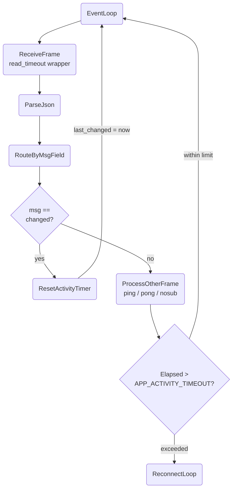

# Application Activity Timeout

## 1. Purpose

The event loop tracks the timestamp of the last `changed` event. After
processing each non-`changed` frame (ping, pong, nosub, etc.), it checks
whether the elapsed time since the last `changed` exceeds
`APP_ACTIVITY_TIMEOUT_SECS` (default 1800s). If exceeded, the event loop
returns `RocketChatError::AppActivityTimeout`, which triggers the reconnect
loop in `main.rs`.

This mechanism is independent of the read timeout — WebSocket Ping/Pong
frames and DDP-level `{"msg":"ping"}` frames continue to reset the read
timeout but do **not** reset the application activity timer. Only a genuine
`changed` event (an incoming chat message) resets it.

References: [Happy Flow (Main Success Path)](../main-path.md), [Ping/Pong Keepalive Deep Dive](pingpong-keepalive.md)

## 2. Diagram

**Timer semantics**:

| Timer | Reset by | Detects |
|-------|----------|---------|
| `READ_TIMEOUT_SECS` (300s) | Any WebSocket frame (Text, Ping, Pong, Binary) | Dead transport — no bytes at all |
| `APP_ACTIVITY_TIMEOUT_SECS` (1800s) | Only `changed` frames (incoming messages) | Dead subscription — transport alive, no content |

If the timer fires, the event loop returns
`RocketChatError::AppActivityTimeout(APP_ACTIVITY_TIMEOUT_SECS)`. The ping
task is aborted, and the error propagates up to `main.rs` which enters the
reconnect loop with exponential backoff.
