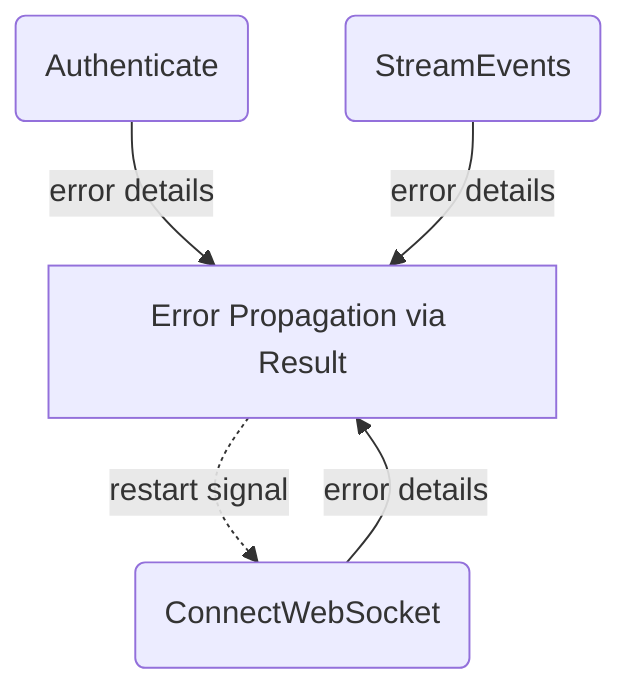

# Error Handling & Fallbacks

## 1. Purpose

The Rust implementation uses a typed `RocketChatError` enum (`thiserror`) that
classifies WebSocket, protocol, auth, TLS, JSON, and config errors. `Result<T>`
patterns propagate errors from `connect_async`, `read.next()`, and JSON parsing.
The `"nosub"` DDP event triggers automatic re-subscription. No external restart
wrapper is needed — errors bubble up through the `Result` chain to the caller.

References: [Happy Flow (Main Success Path)](../main-path.md)

## 2. Diagram

