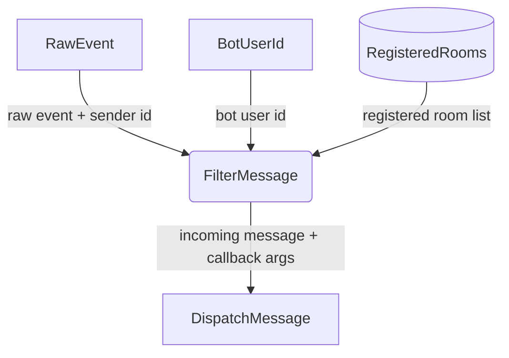

# Message Filter Deep Dive

## 1. Purpose

The `MessageFilter::filter()` method (`crate-rocketchat/src/types.rs:64`)
implements a four-stage decision chain. Messages from the bot itself are
silently dropped. The bot responds to: (1) `@botname` at the start of or
contained in a channel message, (2) a specific
registered room, or (3) a direct message with no room name.

References: [Happy Flow (Main Success Path)](../main-path.md)

## 2. Diagram

The filter process internally:
1. Skips events where `sender_id == bot_user_id` (self-messages)
2. Checks `is_dm` flag from the parsed event
3. Matches messages starting with or containing `@botname` in channels
4. Falls back to checking a registered-room list

All other cases are silently dropped.
