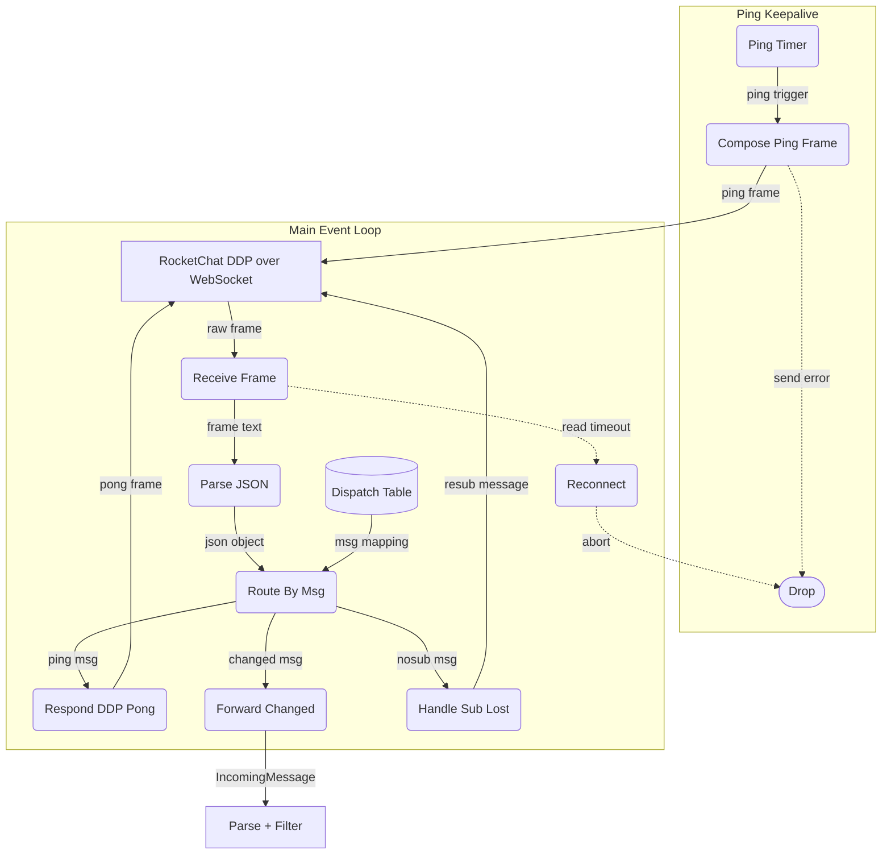

# Ping/Pong Keepalive Deep Dive

## 1. Purpose

The keepalive architecture uses **two concurrent processes** sharing the same
WebSocket connection:

1. **Ping keepalive** — a dedicated, independent process that proactively sends
   WebSocket Ping frames every `ping_interval_secs` (default 30s). On send
   failure the process exits (silent dropout — the main event loop detects the
   dead connection via read timeout).

2. **Main event loop** — reads all incoming DDP frames.  Responds to
   server-initiated DDP `{"msg": "ping"}` with `{"msg": "pong"}`.  Each
   `read.next()` is wrapped in a `read_timeout_secs` (default 300s) — if no
   frame arrives, the connection is treated as dead.

TCP keepalive (`SO_KEEPALIVE`) is also enabled on the underlying
`socket2`-configured `TcpStream` with `tcp_keepalive` parameters (default:
`TCP_KEEPIDLE=60s`, `TCP_KEEPINTVL=10s`, `TCP_KEEPCNT=5`).

References: [Happy Flow (Main Success Path)](../main-path.md)

## 2. Diagram

**Dispatch table** — the `msg` field routes to inline handling in the event loop:

| `msg` value    | Handler                         | Action                              |
| -------------- | ------------------------------- | ----------------------------------- |
| `"ping"`       | `ddp::pong_message()`           | Send `{"msg": "pong"}`              |
| `"connected"`  | `connect_and_run` setup         | Send login method (see 2f)          |
| `"result"`     | `ddp::extract_login_result()`   | Extract userId, confirm login       |
| `"changed"`    | `MessageFilter::filter()`       | Parse + filter + dispatch to agent  |
| `"ready"`      | `expect_msg("ready")`           | Confirm subscription active         |
| `"nosub"`      | re-subscribe inline             | Re-subscribe on subscription loss   |

All six message types are handled. The event loop waits for `"ready"` after
subscription and re-subscribes on `"nosub"`.

> **Note**: `"connected"`, `"result"`, and `"ready"` are consumed during connection
> setup (via `expect_msg()` in `client.rs:183,190,200`), **not** in the runtime
> event loop. The event loop (`client.rs:151-207`) only handles `"ping"`,
> `"changed"`, and `"nosub"`.

The bot now **proactively sends pings** on its own timer and monitors the
connection health via three independent mechanisms:

| Mechanism | Configuration | Default | Detects |
|-----------|---------------|---------|---------|
| TCP keepalive | `tcp_keepalive` params (idle/intvl/cnt) | 60s/10s/5 | Kernel-level dead connections |
| Client WebSocket ping | `ping_interval_secs` | 30s | Dead connections via send failure |
| Read timeout | `read_timeout_secs` on `read.next()` | 300s | Silent stream stall (no frames at all) |
| Application activity timeout | `app_activity_timeout_secs` on last `changed` event | 1800s (30 min) | Silent DDP subscription drop (WebSocket alive, no messages) |

The read timeout only detects "no frames at all". WebSocket Ping/Pong frames
(transparently handled by the WebSocket library) and DDP `{"msg":"ping"}`
frames both reset this timer, so a dead DDP subscription with a healthy
WebSocket transport can persist indefinitely. The **application activity
timeout** (see [Application Activity Timeout](app-activity-timeout.md)) closes this gap by
tracking the time since the last `changed` event independently of transport
frames.
