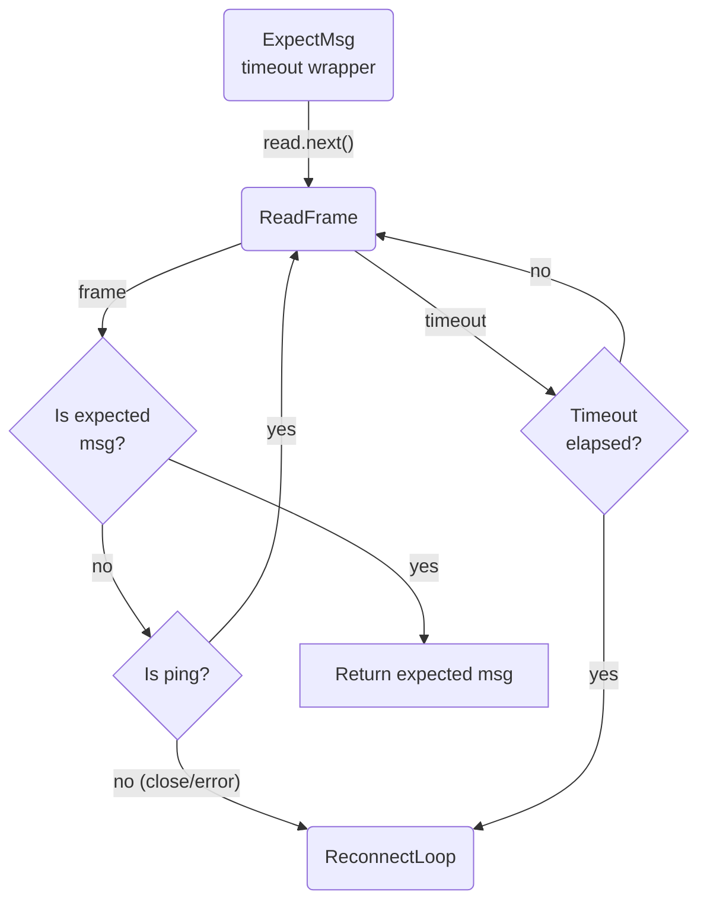

# Setup Phase Timeout

## 1. Purpose

During connection establishment, `expect_msg()` calls `read.next()` in a loop
to wait for specific DDP messages (`connected`, login `result`, subscription
`ready`). Each `expect_msg()` call is now wrapped in a per-call timeout
(default 60s). If the expected message does not arrive within the timeout,
`expect_msg()` returns `RocketChatError::SetupTimeout`, which triggers the
reconnect loop.

References: [Happy Flow (Main Success Path)](../main-path.md)

## 2. Diagram

The setup timeout prevents indefinite hangs during the DDP handshake phase
(connect, authenticate, subscribe). Previously only the outer
`connection_timeout_secs` (600s) protected this phase; now each protocol step
has its own deadline.
