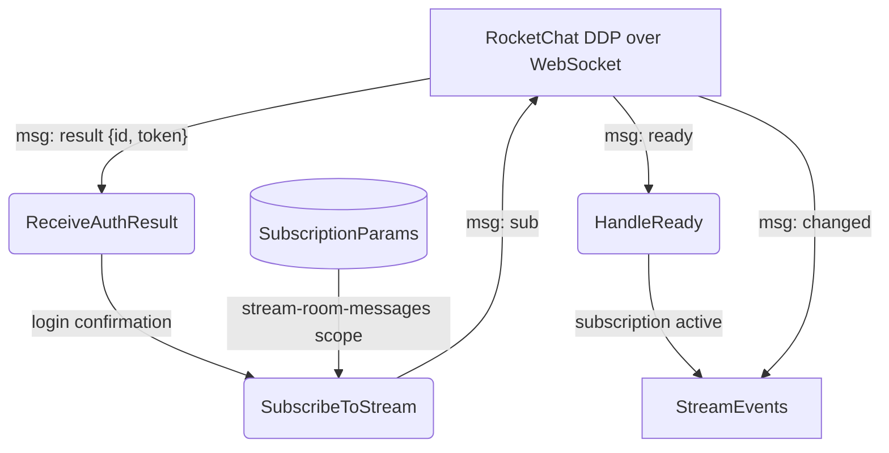

# Subscription Deep Dive

## 1. Purpose

After authentication succeeds (`ddp::extract_login_result()` parses the
`result` with `id` and `token`), `RocketChatClient::connect_and_run()` sends
the subscription via `ddp::subscribe_message()`. Once the server responds with
`"ready"`, the event loop begins delivering `"changed"` events for all messages
visible to the bot user.

References: [Happy Flow (Main Success Path)](../main-path.md)

## 2. Diagram



**Subscription payload** sent to the WebSocket:

```json
{
    "msg": "sub",
    "id": "ABCROCK",
    "name": "stream-room-messages",
    "params": ["__my_messages__", false]
}
```

The `params` array controls which messages are received: `"__my_messages__"`
scopes to the authenticated user, and `false` (the DDP backward-compatibility
flag) means only `"changed"` events are delivered. Setting it to `true` would
also emit `"added"` events for each existing message, which is unnecessary
for a bot that only needs new incoming messages.
