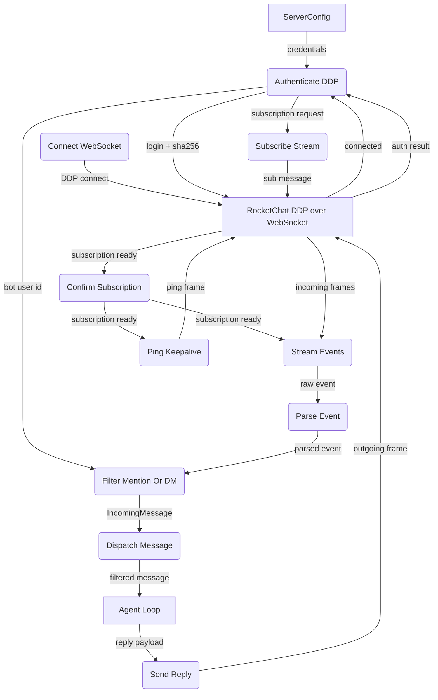

# Happy Flow (Main Success Path)

## 1. Purpose

The connection lifecycle has two phases.  **Setup** (authenticate, subscribe) is
a single sequential path.  Once the subscription is confirmed, the runtime
splits into **two concurrent data paths** — the event stream (incoming messages)
and the ping keepalive — both sharing the same WebSocket.

## 2. Diagram

## 3. Data Structures

Shared data structures for these flows are documented in
[`structures.md`](structures.md) — see its `## 1. Overview` for
the subsystem context.
