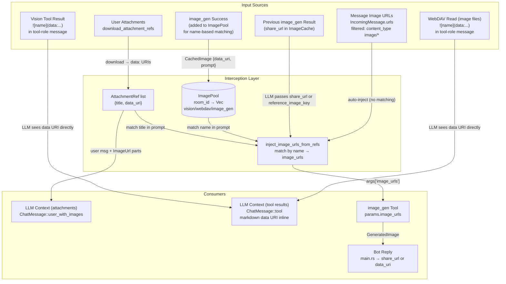
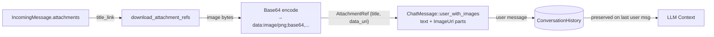
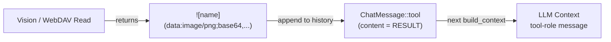
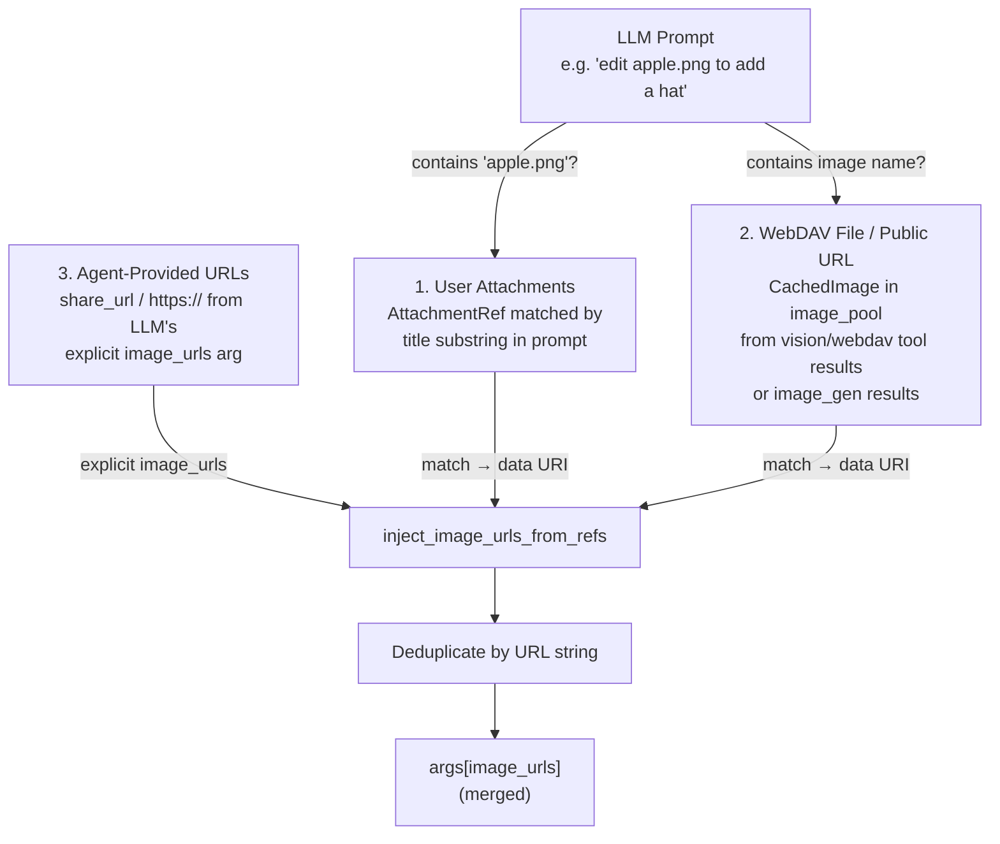
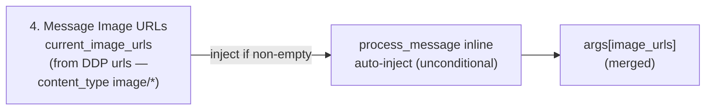
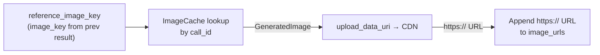
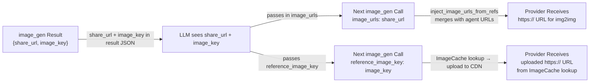

# Image Interception

## 1. Purpose

The harness transparently intercepts image data at multiple points in the agent
loop, bridging the gap between text-only tool results and multimodal AI
providers. Four interception points enable the LLM to see, generate, edit, and
share images without handling raw bytes directly.

- Upstream: [Configuration Management](base/config.md) provides RocketChat
  server URL for attachment downloads
- Upstream: [Agent Harness](agent-harness.md) runs the interception logic
  inside `process_message()` — image injection happens once, before the first
  LLM call, when the user sends an attachment
- Downstream: [AI Provider](base/ai-provider.md) receives `ChatMessage` with
  `ContentPart::ImageUrl` parts containing `data:` URIs
- Downstream: [Vision Tool](tools/vision.md) returns markdown
  `` directly in the tool result — the LLM consumes it in the
  tool-role message; no harness re-injection
- Downstream: [Image Gen Tool](tools/image-gen.md) receives `image_urls` in
  its parameters, injected by the harness from attachments + image_pool + agent
  URLs
- Downstream: [WebDAV Tool](tools/webdav.md) — reading image files returns
  markdown `` that the LLM sees directly
- Downstream: [WebDAV Directory](tools/webdav.md#1a-transparent-path-isolation)
  stores generated images and provides share URLs

## 2. Diagram

### 2a. Complete Interception Pipeline

### 2b. Attachment → Context Flow

When a user sends an image in RocketChat, the harness downloads it, encodes it
as a `data:` URI, and embeds it directly in the user's `ChatMessage`:

The message text contains a reference label like `Attached: `.
The actual pixels are embedded as `ContentPart::ImageUrl { url: "data:..." }` in
the same message.

**Provider-level handling** (see [ai-provider.md §2c](../ai/ai-provider.md#2c-vision-payload-deep-dive)):
- **Vision-capable providers** (OpenRouter): multipart messages with `ImageUrl`
  parts pass through unchanged — the LLM sees the actual image pixels.
- **Text-only providers** (DeepSeek): `ImageUrl` parts are stripped from every
  message and replaced with `[image]` text placeholders via
  `strip_message_images()`. The LLM cannot see image content but can still call
  `image_gen` to edit images via `current_image_urls` auto-injection.

### 2c. Vision/WebDAV → LLM Direct Consumption

When the LLM fetches an image from a public URL or WebDAV via the `vision` or
`webdav` tool, the tool returns a markdown image tag. The tag is delivered to
the LLM as a `ChatMessage::tool` result — no harness caching or re-injection.

The vision tool's purpose is to retrieve image data from external sources
(WebDAV storage, public URLs). The LLM consumes the data URI directly from the
tool result on the next iteration.

### 2d. Image Editing — Four Converging Sources

When the LLM calls `image_gen` with an edit prompt, image URLs converge from
four sources at two injection points:

**Injection point A — `inject_image_urls_from_refs()`** (`harness.rs`):
merges 3 sources via name/prompt matching + deduplication:

**Injection point B — `process_message` inline**: `current_image_urls`
auto-injected unconditionally (no prompt matching) from the DDP `urls`
field filtered by `content_type: image/*`:

**Injection point C — `ImageGenTool::execute()`**: `reference_image_key`
resolved at the tool level (not in the harness). The LLM passes the
`image_key` from a prior `image_gen` result; the tool looks it up in
`ImageCache`, uploads the data URI to the provider's CDN, and appends
the resulting `https://` URL to `image_urls`:

**Summary — image_urls at provider dispatch**:

| Source | Injection point | Matching | Data format |
|--------|----------------|----------|-------------|
| User Attachments | `inject_image_urls_from_refs` | Title substring in prompt | `data:` URI |
| WebDAV File / Public URL | `inject_image_urls_from_refs` | Name in prompt | `data:` URI (from `image_pool`) |
| Agent-Provided URLs | `inject_image_urls_from_refs` | Explicit (LLM passes in `image_urls`) | `https://` or `data:` URL |
| Message Image URLs | `process_message` inline | None — unconditional | NextCloud share link |
| reference_image_key | `ImageGenTool::execute` | None — lookup by key | `https://` URL (CDN upload) |

All data URIs are uploaded to the provider's CDN (Fal) via `upload_data_uri`
before the generation request is dispatched. Existing `https://` URLs pass
through directly.

### 2e. Generated Image Loopback

Generated images can be reused for editing via two paths:

1. **Share URL**: the `image_gen` tool exposes the NextCloud `share_url` in its
   result JSON, which the LLM can pass back in `image_urls` on a subsequent call.
2. **Reference Key**: the LLM passes `reference_image_key` (the `image_key` from
   a prior `image_gen` result), and the tool looks up the cached image bytes in
   `ImageCache` and uploads them to the provider's CDN.

The loopback path: `image_gen` → `ImageCache` + tool result → LLM includes
`share_url` in next call → `inject_image_urls_from_refs` merges it →
provider receives `https://` URL (no re-upload needed).

## 3. Data Structures

### `AttachmentRef`
| Field     | Type   | Notes                                          |
| --------- | ------ | ---------------------------------------------- |
| `title`   | String | Original filename (e.g. `"apple.png"`)          |
| `data_uri`| String | `"data:image/png;base64,..."`                   |

### `CachedImage` (image_pool entry)
| Field     | Type   | Notes                                          |
| --------- | ------ | ---------------------------------------------- |
| `name`    | String | Prompt-derived name (truncated to 80 chars)     |
| `data_uri`| String | `"data:image/png;base64,..."`                   |

### `ImagePool`
`HashMap<String, Vec<CachedImage>>` keyed by `room_id`. Populated by the
harness from three sources: `image_gen` success (prompt-derived name, truncated
to 80 chars), `vision` tool results (filename from markdown tag), and `webdav`
tool results (filename from markdown tag). Enables name-based matching in
subsequent edit calls. Never drained as a whole — entries persist for the
lifetime of the room.

### `ImageCache`
`Arc<Mutex<HashMap<String, GeneratedImage>>>` keyed by tool `call_id`. Stores
generated images for the reply pipeline. Entries are consumed by `take_image()`.

### `GeneratedImage`
| Field         | Type           | Notes                                   |
| ------------- | -------------- | --------------------------------------- |
| `webdav_path` | String         | WebDAV path where image was persisted   |
| `image_bytes` | `Vec<u8>`      | Raw bytes for fallback data URI         |
| `mime_type`   | String         | `"image/png"`, `"image/jpeg"`, etc.     |
| `share_url`   | Option\<String\>| NextCloud public share link (7-day expiry) |

## 4. Key Functions

| Function | Location | Role |
|----------|----------|------|
| `download_attachment_refs` | `harness.rs` | Downloads RocketChat attachments → `AttachmentRef` list |
| `download_and_encode_single` | `harness.rs` | Single attachment → `data:` URI |
| `inject_image_urls_from_refs` | `harness.rs` | Injects image URLs from attachments + image_pool + agent URLs |
| `current_image_urls injection` | `harness.rs` (inline in `process_message`) | Auto-injects message image URLs into image_gen args (no prompt matching) |
| `create_nextcloud_share_link` | `crate-webdav/src/client.rs` | Creates 7-day public share for generated images |
| `upload_data_uri` | `tools/image_gen.rs` | Uploads `data:` URI to Fal CDN → returns `https://` URL |
| `strip_markdown_image_id` | `utils.rs` | Removes `` from reply text |
| `take_last_image_ids` | `harness.rs` | Returns and drains `last_image_ids` |
| `take_image` | `harness.rs` | Removes `GeneratedImage` from `ImageCache` by call_id |
