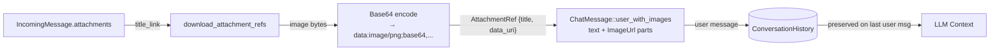

# Attachment → Context Flow

## 1. Purpose

When a user sends an image in RocketChat, the harness downloads it, encodes it
as a `data:` URI, and embeds it directly in the user's `ChatMessage`:

## 2. Diagram

The message text contains a reference label like `Attached: `.
The actual pixels are embedded as `ContentPart::ImageUrl { url: "data:..." }` in
the same message.

**Provider-level handling** (see [ai-provider.md §2c](../../ai/ai-provider/level-2/vision-payload.md)):
- **Vision-capable providers** (OpenRouter, llama.cpp with a multimodal GGUF,
  DeepSeek `deepseek-v4-flash-vision-exp`): multipart messages with `ImageUrl`
  parts pass through unchanged — the LLM sees the actual image pixels. llama.cpp
  servers running a text-only GGUF silently ignore or reject image parts.
  DeepSeek keeps images only in **user** messages (system/assistant images are
  rejected with HTTP 400).
- **Text-only DeepSeek models** (`deepseek-v4-pro`): `ImageUrl` parts are
  stripped from every message and replaced with `[image]` text placeholders via
  `DeepSeekProvider::strip_message_images()`. The LLM cannot see image content
  but can still call `image_gen` to edit images via `current_image_urls`
  auto-injection.
