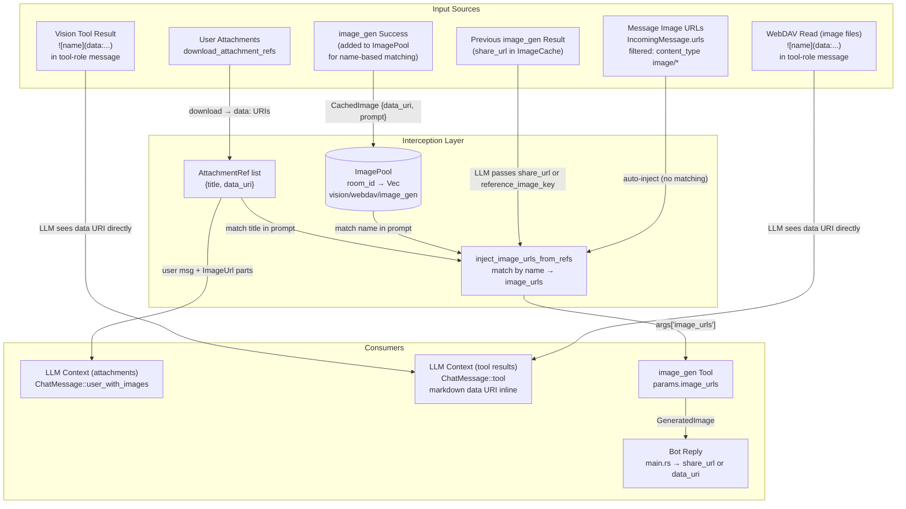

# Complete Interception Pipeline

## 1. Purpose

The harness transparently intercepts image data from every input source —
user attachments, vision tool results, WebDAV reads, previous `image_gen`
results, and message image URLs — and delivers it to consumers: the LLM context
(`ChatMessage::user_with_images` for attachments, `ChatMessage::tool` with
inline markdown images for tool results), the `image_gen` tool's `image_urls`
parameter, and the bot reply.

## 2. Diagram

