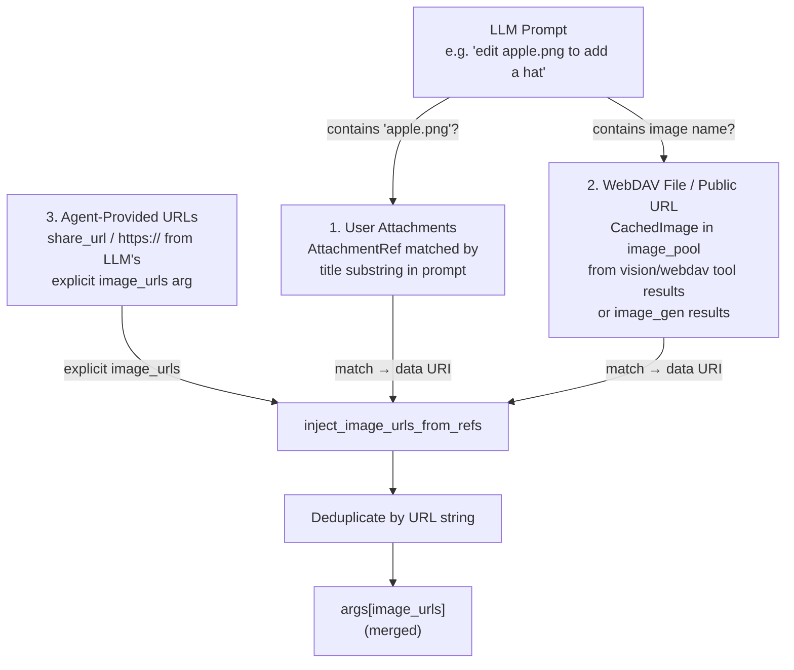

# Image Editing — Four Converging Sources

## 1. Purpose

When the LLM calls `image_gen` with an edit prompt, image URLs converge from
four sources at two injection points:

## 2. Diagram

**Injection point A — `inject_image_urls_from_refs()`** (`harness.rs`):
merges 3 sources via name/prompt matching + deduplication:

**Summary — image_urls at provider dispatch**:

| Source | Injection point | Matching | Data format |
|--------|----------------|----------|-------------|
| User Attachments | `inject_image_urls_from_refs` | Title substring in prompt | `data:` URI |
| WebDAV File / Public URL | `inject_image_urls_from_refs` | Name in prompt | `data:` URI (from `image_pool`) |
| Agent-Provided URLs | `inject_image_urls_from_refs` | Explicit (LLM passes in `image_urls`) | `https://` or `data:` URL |
| Message Image URLs | `process_message` inline | None — unconditional | NextCloud share link |
| reference_image_key | `ImageGenTool::execute` | None — lookup by key | `https://` URL (CDN upload) |

All data URIs are uploaded to the provider's CDN (Fal) via `upload_data_uri`
before the generation request is dispatched. Existing `https://` URLs pass
through directly.
