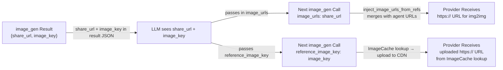

# Generated Image Loopback

## 1. Purpose

Generated images can be reused for editing via two paths:

1. **Share URL**: the `image_gen` tool exposes the NextCloud `share_url` in its
   result JSON, which the LLM can pass back in `image_urls` on a subsequent call.
2. **Reference Key**: the LLM passes `reference_image_key` (the `image_key` from
   a prior `image_gen` result), and the tool looks up the cached image bytes in
   `ImageCache` and uploads them to the provider's CDN.

## 2. Diagram

The loopback path: `image_gen` → `ImageCache` + tool result → LLM includes
`share_url` in next call → `inject_image_urls_from_refs` merges it →
provider receives `https://` URL (no re-upload needed).
