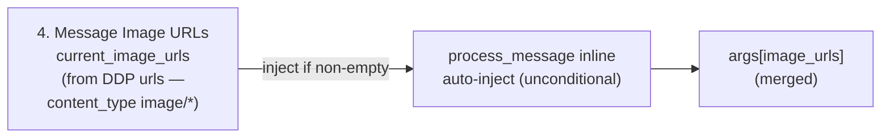

# Injection Point B — process_message Inline

## 1. Purpose

`current_image_urls` auto-injected unconditionally (no prompt matching) from
the DDP `urls` field filtered by `content_type: image/*`:

## 2. Diagram

