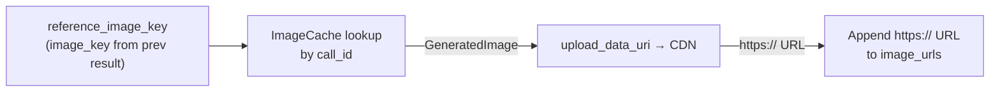

# Injection Point C — ImageGenTool::execute()

## 1. Purpose

`reference_image_key` resolved at the tool level (not in the harness). The LLM
passes the `image_key` from a prior `image_gen` result; the tool looks it up in
`ImageCache`, uploads the data URI to the provider's CDN, and appends
the resulting `https://` URL to `image_urls`:

## 2. Diagram

