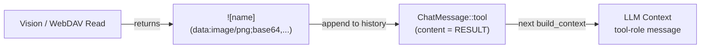

# Vision/WebDAV → LLM Direct Consumption

## 1. Purpose

When the LLM fetches an image from a public URL or WebDAV via the `vision` or
`webdav` tool, the tool returns a markdown image tag. The tag is delivered to
the LLM as a `ChatMessage::tool` result — no harness caching or re-injection.

## 2. Diagram

The vision tool's purpose is to retrieve image data from external sources
(WebDAV storage, public URLs). The LLM consumes the data URI directly from the
tool result on the next iteration.
