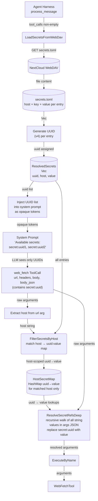
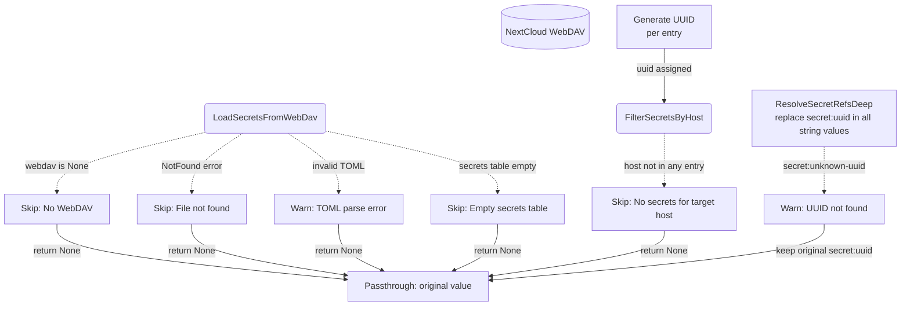
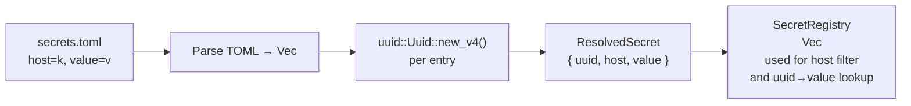
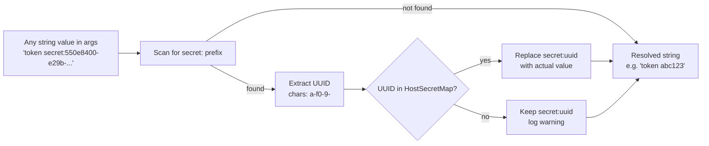
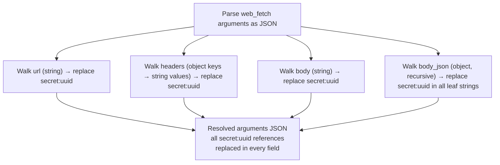
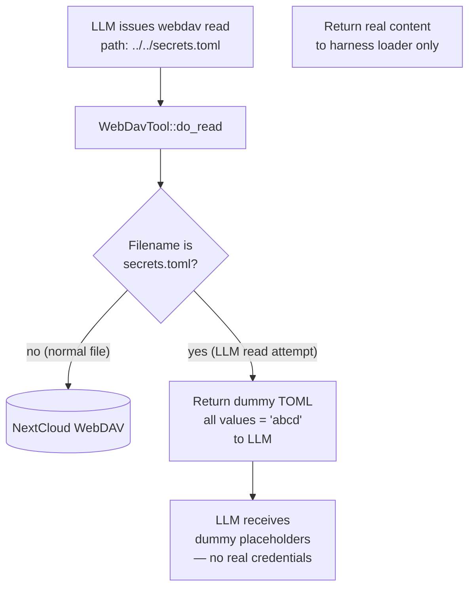

# Secret Interception

## 1. Purpose

The harness loads `secrets.toml` from WebDAV, generates a unique **UUID**
for each entry, and builds an internal `UUID → (host, value)` mapping.
The LLM **never** sees host names, key names, or real values — it only
sees opaque UUID references (`secret:<uuid>`). When a `web_fetch` tool
call is dispatched, the harness intercepts every UUID in the arguments
(URL, headers, body, body_json), matches host scope, and replaces the
UUID with the actual secret value.

This enables the LLM to authenticate against external APIs (Gitea, GitHub,
etc.) without exposing API tokens **or semantically meaningful identifiers**
in the conversation history or LLM context. Even if a conversation log is
exfiltrated, the `secret:<uuid>` references are worthless without the
internal mapping.

- Upstream: [Agent Harness](../agent/agent-harness.md) runs the interception inside
  `process_message()` — secrets are loaded once per tool-call batch, UUIDs
  are generated, and replacement happens before `execute_by_name()` dispatch
- Upstream: [WebDAV Tool](../tools/webdav.md) provides the `read_file_to_string`
  transport for loading `secrets.toml`
- Downstream: [Web Fetch](../tools/web-fetch.md) receives the modified arguments with
  all `secret:<uuid>` references resolved — the tool is unaware of the interception
- Downstream: [AI Provider](../ai/ai-provider.md) never observes real secret
  values — only the opaque `secret:<uuid>` references appear in the conversation
  history

### Non-Functional Requirements

- **UUID opacity**: At load time, every `SecretEntry` is assigned a v4 UUID.
  The LLM references secrets by UUID only — key names, host names, and values
  are stripped from the LLM-visible context. Even if the LLM enumerates all
  known secrets, it learns nothing about what they are for.
- **Host-scoped secrets**: Each UUID is bound to a host. When `web_fetch`
  targets `https://site-a.com`, only UUIDs scoped to that host are resolved.
  A UUID for `https://site-b.com` passed in a request to `https://site-a.com`
  is left unreplaced (passthrough).
- **Dummy data defense**: If the LLM manages to read `secrets.toml` through
  the WebDAV tool (e.g. via path traversal), the file content returned contains
  only dummy placeholder values (`abcd`), never real credentials. This is
  enforced at the WebDAV-tool boundary.
- **Graceful degradation**: When WebDAV is not configured, `secrets.toml` does
  not exist, or the file fails to parse, the tool arguments pass through
  unchanged. Secret interception is never a hard dependency.
- **No caching across batches**: Secrets are loaded once per tool-call batch
  within `process_message()`, not cached across agent turns. UUIDs are
  regenerated on every load — they are not persisted to disk.
- **Single-pass replacement**: Resolved secret values are not re-scanned for
  `secret:` references — no recursive expansion.

## 2. Diagram

### 2a. Happy Flow — UUID Generation + Host-Scoped Injection



### 2b. Error Handling & Graceful Degradation



### 2c. UUID Generation on Load



### 2d. Secret Reference Replacement (Per-String, UUID-Based)



### 2e. Deep Argument Traversal — All Injection Points



### 2f. Dummy Data Gate — WebDAV Tool LLM Read Interception



## 3. Data Structures

### `SecretsToml` (on-disk TOML root)

Stored at WebDAV root path `secrets.toml`. The `key` field is a
human-readable admin label — the LLM **never** sees it.

| Field     | Type               | Notes                                    |
|-----------|--------------------|------------------------------------------|
| `secrets` | `Vec<SecretEntry>` | Array of host-scoped entries. `#[serde(default)]` handles absent or empty table. |

### `SecretEntry` (one on-disk row — admin-visible only)

| Field   | Type     | Notes                                          |
|---------|----------|------------------------------------------------|
| `host`  | `String` | Target host the secret is bound to (e.g. `https://gitea.example.com`) |
| `key`   | `String` | Admin label — LLM never observes this field    |
| `value` | `String` | The actual secret value (token, API key, etc.)  |

### `ResolvedSecret` (in-memory, after UUID generation)

Built at load time. The `uuid` is a fresh v4 UUID generated on every
`load_secrets_from_webdav` call — never persisted.

| Field   | Type     | Notes                                          |
|---------|----------|------------------------------------------------|
| `uuid`  | `uuid::Uuid` | Opaque reference — the only identifier the LLM sees |
| `host`  | `String` | Target host the secret is bound to              |
| `key`   | `String` | Admin label (internal only, for log messages)    |
| `value` | `String` | The actual secret value                          |

### `HostSecretMap`

| Type | Notes |
|------|-------|
| `HashMap<String, String>` (uuid_string → value) | Produced by `filter_secrets_by_host`. Only entries whose `host` matches the target URL are included. Keys are UUID hex strings (e.g. `"550e8400-e29b-41d4-a716-446655440000"`). |

### Secrets TOML File Format (On-Disk)

```toml
[[secrets]]
host = "https://gitea.example.com"
key = "gitea_token"
value = "abc123"

[[secrets]]
host = "https://api.github.com"
key = "github_api_key"
value = "sk-xyz789"
```

The `key` and `host` fields are **never exposed to the LLM**. The LLM
only sees `secret:<uuid>` in system prompt and tool arguments.

### System Prompt Injection (LLM-Visible)

The harness injects available UUIDs into the system prompt as opaque tokens.
The LLM sees only the UUID references — no host or key names:

```
Available API secrets:
- secret:550e8400-e29b-41d4-a716-446655440000
- secret:6ba7b810-9dad-11d1-80b4-00c04fd430c8
```

### Secret Reference Format (LLM-Visible)

Any string value in the `web_fetch` arguments JSON — URL, query parameters,
headers, raw `body`, and nested `body_json` values — may contain
`secret:<uuid>` where `<uuid>` is a standard v4 UUID hex string
(`xxxxxxxx-xxxx-xxxx-xxxx-xxxxxxxxxxxx`). The `secret:<uuid>` token is
replaced in-place, preserving surrounding text.

### Injection Points (All Fields Subject to Replacement)

| Argument field   | JSON type          | Walk strategy                                |
|------------------|--------------------|----------------------------------------------|
| `url`            | string             | Direct string replacement                    |
| `headers`        | object (str→str)   | Each value string replaced                   |
| `body`           | string             | Direct string replacement                    |
| `body_json`      | object (recursive) | All leaf string values replaced recursively  |

### Replacement Examples

| Field     | Input                                                     | HostSecretMap (host-matched)   | Output                                |
|-----------|-----------------------------------------------------------|--------------------------------|---------------------------------------|
| url       | `"https://api.example.com/v1?token=secret:550e8400-..."`  | `{"550e8400-...": "sk-xyz"}`   | `"https://api.example.com/v1?token=sk-xyz"` |
| headers   | `"Bearer secret:550e8400-e29b-41d4-a716-446655440000"`   | `{"550e8400-...": "real"}`     | `"Bearer real"`                       |
| body      | `"{\"auth\":\"secret:6ba7b810-...\"}"`                   | `{"6ba7b810-...": "abc123"}`   | `"{\"auth\":\"abc123\"}"`             |
| body_json | `{"pat": "secret:6ba7b810-9dad-11d1-80b4-00c04fd430c8"}` | `{"6ba7b810-...": "ghp-xyz"}`  | `{"pat": "ghp-xyz"}`                  |
| (any)     | `"secret:00000000-0000-0000-0000-000000000000"`          | (no match)                     | `"secret:00000000-..."` (passthrough)  |

### Host Matching Rules

The target host is extracted from the `url` field in the `web_fetch` arguments.
Only `ResolvedSecret` entries whose `host` field matches the URL host
(scheme + host + port) have their UUIDs included in the `HostSecretMap`.

| URL in web_fetch args           | Extracted host           | UUIDs available for injection |
| ------------------------------- | ------------------------ | ----------------------------- |
| `https://gitea.example.com/api` | `https://gitea.example.com` | UUIDs with `host=gitea.example.com` |
| `https://api.github.com/v3`     | `https://api.github.com` | UUIDs with `host=api.github.com` |
| `http://localhost:3000`         | `http://localhost:3000`   | UUIDs with `host=localhost:3000` |

If the URL cannot be parsed (malformed), no UUIDs are resolved — the
arguments pass through unchanged.

## 4. Key Functions

| Function | Location | Role |
|----------|----------|------|
| `load_secrets_from_webdav` | `harness.rs` | Async: reads `secrets.toml` from WebDAV root, parses TOML, generates a v4 `uuid::Uuid` for each entry, returns `Option<Vec<ResolvedSecret>>` |
| `build_secret_uuids_prompt` | `harness.rs` | Sync: takes `&[ResolvedSecret]`, formats `secret:<uuid>` tokens for system prompt injection. Key and host names are **not** included. |
| `filter_secrets_by_host` | `harness.rs` | Sync: extracts host from web_fetch URL arg, filters `Vec<ResolvedSecret>` by matching `host` field, returns `Option<HashMap<String, String>>` (uuid_string → value) |
| `resolve_secret_refs_deep` | `harness.rs` | Sync: parses arguments JSON, walks all string values recursively (url, headers, body, body_json leaf strings), replaces `secret:<uuid>` in each using the host-filtered map |
| `replace_secret_refs` | `harness.rs` | Sync: single-pass string replacement of `secret:<uuid>` tokens against the host-filtered map. Called by `resolve_secret_refs_deep` for each string value. UUID format: `xxxxxxxx-xxxx-xxxx-xxxx-xxxxxxxxxxxx` (hex chars + hyphens). |
| `sanitize_secrets_for_llm` | `tools/webdav.rs` | Sync: if a webdav tool `read` resolves to the root `secrets.toml`, returns a TOML string with all `value` fields replaced by `"abcd"`; real file content is never returned to the LLM |
