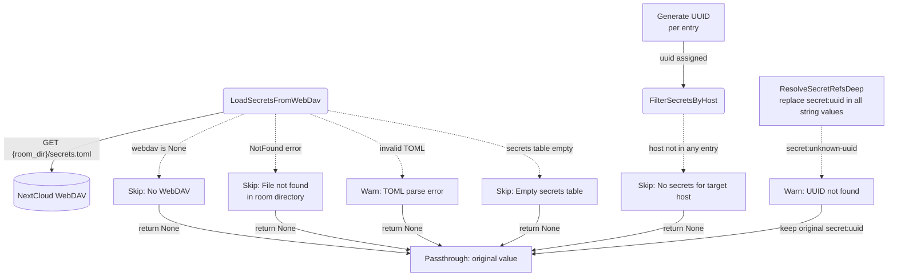
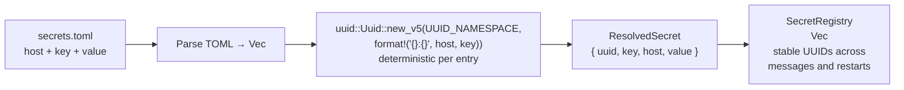
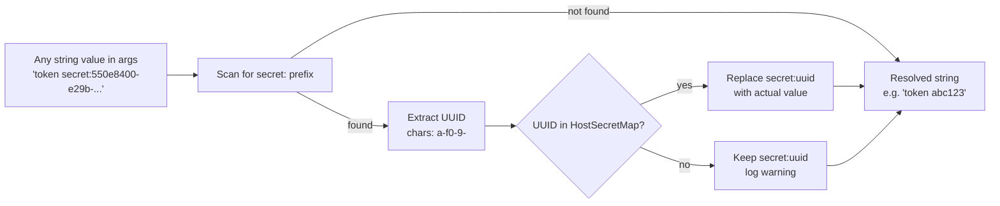
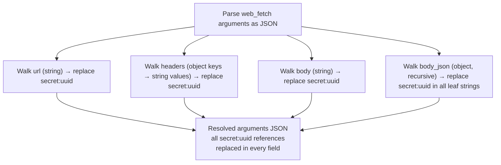
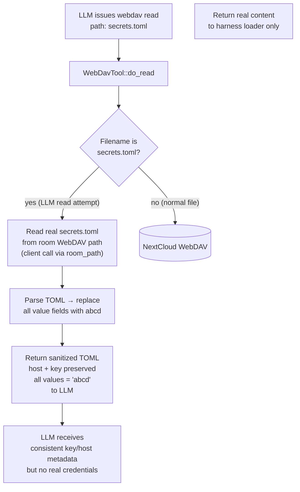

# Secret Interception

## 1. Purpose

The harness loads `secrets.toml` from the **room-level** WebDAV directory, generates a unique **UUID**
for each entry, and builds an internal `UUID → (host, value)` mapping.
The LLM **never** sees host names, key names, or real values — it only
sees opaque UUID references (`secret:<uuid>`). When a `web_fetch` tool
call is dispatched, the harness intercepts every UUID in the arguments
(URL, headers, body, body_json), matches host scope, and replaces the
UUID with the actual secret value.

This enables the LLM to authenticate against external APIs (Gitea, GitHub,
etc.) without exposing API tokens **or semantically meaningful identifiers**
in the conversation history or LLM context. Even if a conversation log is
exfiltrated, the `secret:<uuid>` references are worthless without the
internal mapping.

- Upstream: [Agent Harness](../agent/agent-harness.md) runs the interception inside
  `process_message()` — secrets are loaded once per tool-call batch, UUIDs
  are generated, and replacement happens before `execute_by_name()` dispatch
- Upstream: [WebDAV Tool](../tools/webdav.md) provides the `read_file_to_string`
  transport for loading `secrets.toml`
- Downstream: [Web Fetch](../tools/web-fetch.md) receives the modified arguments with
  all `secret:<uuid>` references resolved — the tool is unaware of the interception
- Downstream: [AI Provider](../ai/ai-provider.md) never observes real secret
  values — only the opaque `secret:<uuid>` references appear in the conversation
  history

### Non-Functional Requirements

- **UUID opacity**: At load time, every `SecretEntry` is assigned a
  **deterministic** UUIDv5 derived from `{host}:{key}`. The same secret
  always produces the same UUID across messages and restarts — no
  regeneration churn. The LLM references secrets by UUID only; host
  names and values are **never** present in LLM-visible context. Key
  labels are shown alongside UUIDs for disambiguation (e.g., same-host
  token vs. webhook secret) but do not reveal the target host.
- **Host-scoped secrets**: Each UUID is bound to a host. When `web_fetch`
  targets `https://site-a.com`, only UUIDs scoped to that host are resolved.
  A UUID for `https://site-b.com` passed in a request to `https://site-a.com`
  is left unreplaced (passthrough).
- **Dummy data defense**: If the LLM manages to read `secrets.toml` through
  the WebDAV tool (e.g. via path traversal), the file content returned contains
  only dummy placeholder values (`abcd`), never real credentials. This is
  enforced at the WebDAV-tool boundary.
- **Graceful degradation**: When WebDAV is not configured, `secrets.toml` does
  not exist, or the file fails to parse, the tool arguments pass through
  unchanged. Secret interception is never a hard dependency.
- **No caching across batches**: Secrets are loaded once per tool-call batch
  within `process_message()`, not cached across agent turns. This ensures
  updated secrets (added/removed in `secrets.toml`) take effect on the next
  message without restart. UUIDs are deterministic (UUIDv5) so stable
  across loads — no UUID churn in conversation history.
- **Single-pass replacement**: Resolved secret values are not re-scanned for
  `secret:` references — no recursive expansion.

## 2. Diagram

### 2a. Happy Flow — UUIDv5 Generation + Host-Scoped Injection

```mermaid
flowchart TD
    AGENT[Agent Harness<br/>process_message]
    LOAD(LoadSecretsFromWebDav)
    DAV[(NextCloud WebDAV)]
    TOML[(secrets.toml<br/>host + key + value per entry)]
    GEN["Generate UUIDv5<br/>(host:key) per entry<br/>deterministic → stable<br/>across messages"]
    ENTRIES[(ResolvedSecrets<br/>Vec<ResolvedSecret><br/>uuid, key, host, value)]
    INJECT["Inject UUID + key labels<br/>into system prompt<br/>'secret:uuid (key_label)'"]
    PROMPT[System Prompt<br/>'Available secrets:<br/>secret:uuid1 (gitea_token)<br/>secret:uuid2 (github_pat)']
    CALL["web_fetch ToolCall<br/>url, headers, body, body_json<br/>(contains secret:uuid)"]
    EXTRACT_HOST[Extract host from url arg]
    FILTER(FilterSecretsByHost<br/>match host → uuid:value map)
    MAP[(HostSecretMap<br/>HashMap uuid→value<br/>for matched host only)]
    RESOLVE["ResolveSecretRefsDeep<br/>recursive walk of all string<br/>values in args JSON<br/>replace secret:uuid with value"]
    EXEC(ExecuteByName)
    FETCH[WebFetchTool]

    AGENT -->|"tool_calls non-empty"| LOAD
    LOAD -->|"GET secrets.toml"| DAV
    DAV -->|"file content"| TOML
    TOML -->|"Vec<SecretEntry>"| GEN
    GEN -->|"uuid assigned"| ENTRIES
    ENTRIES -->|"uuid + key array"| INJECT
    INJECT -->|"labeled tokens"| PROMPT
    PROMPT -->|"LLM sees: UUID + purpose label"| CALL
    CALL -->|"raw arguments"| EXTRACT_HOST
    EXTRACT_HOST -->|"host string"| FILTER
    ENTRIES -->|"all entries"| FILTER
    FILTER -->|"host-scoped uuid→value"| MAP
    MAP -->|"uuid → value lookups"| RESOLVE
    CALL -->|"raw arguments"| RESOLVE
    RESOLVE -->|"resolved arguments"| EXEC
    EXEC -->|"arguments"| FETCH
```

### 2b. Error Handling & Graceful Degradation



### 2c. UUIDv5 Generation on Load (Deterministic)



### 2d. Secret Reference Replacement (Per-String, UUID-Based)



### 2e. Deep Argument Traversal — All Injection Points



### 2f. Dummy Data Gate — WebDAV Tool LLM Read Interception



## 3. Data Structures

### `SecretsToml` (on-disk TOML root)

Stored at the room's WebDAV directory as `{room_dir}/secrets.toml`. The `key` field is a
human-readable admin label — the LLM **never** sees it.

| Field     | Type               | Notes                                    |
|-----------|--------------------|------------------------------------------|
| `secrets` | `Vec<SecretEntry>` | Array of host-scoped entries. `#[serde(default)]` handles absent or empty table. |

### `SecretEntry` (one on-disk row — admin-visible only)

| Field   | Type     | Notes                                          |
|---------|----------|------------------------------------------------|
| `host`  | `String` | Target host the secret is bound to (e.g. `https://gitea.example.com`) |
| `key`   | `String` | Admin label — LLM never observes this field    |
| `value` | `String` | The actual secret value (token, API key, etc.)  |

### `ResolvedSecret` (in-memory, after UUIDv5 generation)

Built at load time. The `uuid` is deterministic — UUIDv5 of
`"{host}:{key}"` — so the same secret always receives the same
opaque reference across messages, rooms, and bot restarts.

| Field   | Type     | Notes                                          |
|---------|----------|------------------------------------------------|
| `uuid`  | `uuid::Uuid` | Deterministic UUIDv5 of `host:key` — stable across sessions |
| `host`  | `String` | Target host the secret is bound to              |
| `key`   | `String` | Admin label — shown alongside UUID in system prompt for disambiguation. Not usable as a secret reference. |
| `value` | `String` | The actual secret value                          |

### `HostSecretMap`

| Type | Notes |
|------|-------|
| `HashMap<String, String>` (uuid_string → value) | Produced by `filter_secrets_by_host`. Only entries whose `host` matches the target URL are included. Keys are UUID hex strings (e.g. `"550e8400-e29b-41d4-a716-446655440000"`). |

### Secrets TOML File Format (On-Disk)

```toml
[[secrets]]
host = "https://gitea.example.com"
key = "gitea_token"
value = "abc123"

[[secrets]]
host = "https://api.github.com"
key = "github_api_key"
value = "sk-xyz789"
```

The `key` and `host` fields are **never exposed to the LLM**. The LLM
only sees `secret:<uuid>` in system prompt and tool arguments.

### System Prompt Injection (LLM-Visible)

The harness injects available secret references into the system prompt.
Each line shows the UUID (the only valid reference token) plus the `key`
label for disambiguation. Host names and values are **never** included:

```
Available API secrets (use secret:<UUID> to authenticate):
- secret:a1b2c3d4-e5f6-4789-a0b1-c2d3e4f56789 (gitea_token)
- secret:e5f6a7b8-c9d0-41e1-f2a3-b4c5d6e7f890 (github_pat)
- secret:c9d0e1f2-a3b4-45c5-d6e7-f8a9b0c1d2e3 (gitea_webhook_secret)
```

The LLM uses the UUID in `web_fetch` arguments; the key label is
informational only and not a valid reference token.

### Secret Reference Format (LLM-Visible)

Any string value in the `web_fetch` arguments JSON — URL, query parameters,
headers, raw `body`, and nested `body_json` values — may contain
`secret:<uuid>` where `<uuid>` is a standard UUID hex string
(`xxxxxxxx-xxxx-xxxx-xxxx-xxxxxxxxxxxx`). The `secret:<uuid>` token is
replaced in-place, preserving surrounding text.

**Note:** The `key` label is not a valid reference — `secret:gitea_token`
will NOT be resolved. Only `secret:<uuid>` tokens are recognized.

### Injection Points (All Fields Subject to Replacement)

| Argument field   | JSON type          | Walk strategy                                |
|------------------|--------------------|----------------------------------------------|
| `url`            | string             | Direct string replacement                    |
| `headers`        | object (str→str)   | Each value string replaced                   |
| `body`           | string             | Direct string replacement                    |
| `body_json`      | object (recursive) | All leaf string values replaced recursively  |

### Replacement Examples

| Field     | Input                                                     | HostSecretMap (host-matched)   | Output                                |
|-----------|-----------------------------------------------------------|--------------------------------|---------------------------------------|
| url       | `"https://api.example.com/v1?token=secret:a1b2c3d4-..."`  | `{"a1b2c3d4-...": "sk-xyz"}`  | `"https://api.example.com/v1?token=sk-xyz"` |
| headers   | `"Bearer secret:a1b2c3d4-e5f6-4789-a0b1-c2d3e4f56789"`  | `{"a1b2c3d4-...": "real"}`    | `"Bearer real"`                       |
| body      | `"{\"auth\":\"secret:e5f6a7b8-...\"}"`                   | `{"e5f6a7b8-...": "abc123"}`  | `"{\"auth\":\"abc123\"}"`             |
| body_json | `{"pat": "secret:c9d0e1f2-a3b4-45c5-d6e7-f8a9b0c1d2e3"}`| `{"c9d0e1f2-...": "ghp-xyz"}` | `{"pat": "ghp-xyz"}`                  |
| (any)     | `"secret:gitea_token"`                                   | (key labels not resolved)      | `"secret:gitea_token"` (passthrough)   |
| (any)     | `"secret:00000000-0000-0000-0000-000000000000"`          | (no match)                     | `"secret:00000000-..."` (passthrough)  |

### Host Matching Rules

The target host is extracted from the `url` field in the `web_fetch` arguments.
Only `ResolvedSecret` entries whose `host` field matches the URL host
(scheme + host + port) have their UUIDs included in the `HostSecretMap`.

| URL in web_fetch args           | Extracted host           | UUIDs available for injection |
| ------------------------------- | ------------------------ | ----------------------------- |
| `https://gitea.example.com/api` | `https://gitea.example.com` | UUIDs with `host=gitea.example.com` |
| `https://api.github.com/v3`     | `https://api.github.com` | UUIDs with `host=api.github.com` |
| `http://localhost:3000`         | `http://localhost:3000`   | UUIDs with `host=localhost:3000` |

If the URL cannot be parsed (malformed), no UUIDs are resolved — the
arguments pass through unchanged.

## 4. Key Functions

| Function | Location | Role |
|----------|----------|------|
| `load_secrets_from_webdav` | `harness.rs` | Async: reads `{room_dir}/secrets.toml` from WebDAV, parses TOML, generates a deterministic UUIDv5 (`namespace + host:key`) for each entry, returns `Option<Vec<ResolvedSecret>>` |
| `build_secret_uuids_prompt` | `harness.rs` | Sync: takes `&[ResolvedSecret]`, formats `secret:<uuid> (key_label)` lines for system prompt injection. Host and value are **not** included. |
| `filter_secrets_by_host` | `harness.rs` | Sync: extracts host from web_fetch URL arg, filters `Vec<ResolvedSecret>` by matching `host` field, returns `Option<HashMap<String, String>>` (uuid_string → value) |
| `resolve_secret_refs_deep` | `harness.rs` | Sync: parses arguments JSON, walks all string values recursively (url, headers, body, body_json leaf strings), replaces `secret:<uuid>` in each using the host-filtered map. Key labels (`secret:gitea_token`) are NOT resolved — only UUIDs. |
| `replace_secret_refs` | `harness.rs` | Sync: single-pass string replacement of `secret:<uuid>` tokens against the host-filtered map. Called by `resolve_secret_refs_deep` for each string value. UUID format: `xxxxxxxx-xxxx-xxxx-xxxx-xxxxxxxxxxxx` (hex chars + hyphens). |
| `sanitize_secrets_for_llm` | `tools/webdav.rs` | Sync: if a webdav tool `read` resolves to the root `secrets.toml`, returns a TOML string with all `value` fields replaced by `"abcd"`; real file content is never returned to the LLM |
