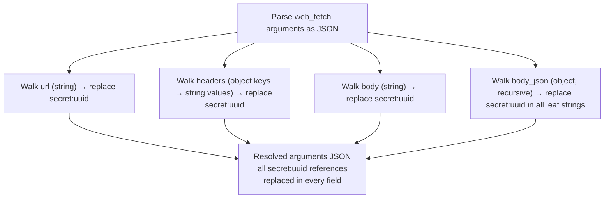

# Deep Argument Traversal — All Injection Points

## 1. Purpose

Shows how the `web_fetch` argument JSON is walked field-by-field so every
string value — `url`, `headers`, `body`, and nested `body_json` leaves — goes
through secret-reference replacement. Referenced from
[Happy Flow — UUIDv5 Generation + Host-Scoped Injection](uuidv5-scoped-injection.md)
and detailed in [Secret Reference Replacement (Per-String, UUID-Based)](level-2/reference-replacement.md).

## 2. Diagram

