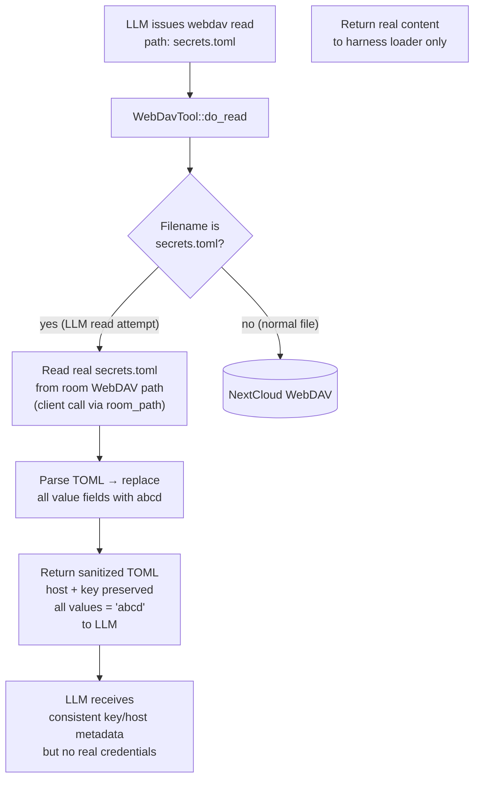

# Dummy Data Gate — WebDAV Tool LLM Read Interception

## 1. Purpose

If the LLM reads `secrets.toml` through the WebDAV read tool (e.g. via path
traversal), only sanitized values (`abcd`) are returned — host and key
metadata are preserved, real credentials never reach the LLM. Referenced from
[Happy Flow — UUIDv5 Generation + Host-Scoped Injection](uuidv5-scoped-injection.md).

## 2. Diagram

