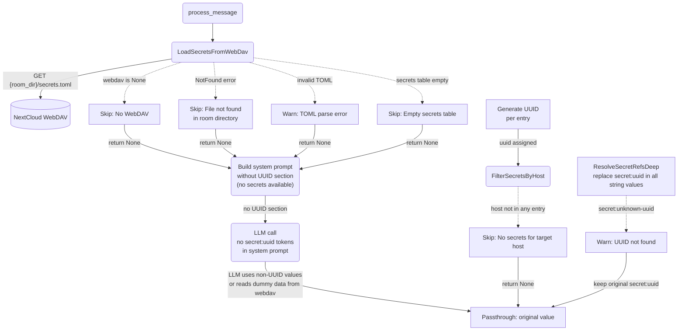

# Error Handling & Graceful Degradation

## 1. Purpose

Covers the failure branches of secret loading: WebDAV not configured, file
missing, TOML parse error, empty secrets table, no secrets for the target
host, and unknown UUIDs — interception degrades gracefully instead of failing
the message. Embedded in the main flow:
[Happy Flow — UUIDv5 Generation + Host-Scoped Injection](../uuidv5-scoped-injection.md).

## 2. Diagram

