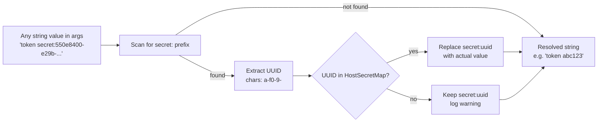

# Secret Reference Replacement (Per-String, UUID-Based)

## 1. Purpose

Shows the single-pass, string-level replacement of `secret:<uuid>` tokens
against the host-scoped map; unknown UUIDs and key labels pass through
unresolved. Called from the main flow's [ResolveSecretRefsDeep](../uuidv5-scoped-injection.md) —
see [Deep Argument Traversal — All Injection Points](../deep-traversal.md) for the full walk of
argument fields.

## 2. Diagram

