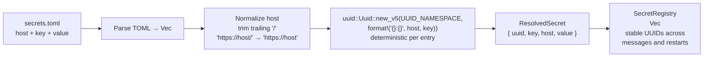

# UUIDv5 Generation on Load (Deterministic)

## 1. Purpose

Details how each `secrets.toml` entry becomes a deterministic UUIDv5 —
`uuid::Uuid::new_v5(UUID_NAMESPACE, format!("{}:{}", host, key))` — after host
normalization, so UUIDs are stable across messages, rooms, and bot restarts.
Linked from the main flow:
[Happy Flow — UUIDv5 Generation + Host-Scoped Injection](../uuidv5-scoped-injection.md).

## 2. Diagram

