# Happy Flow — UUIDv5 Generation + Host-Scoped Injection

## 1. Purpose

Secrets are loaded **once per message**, before the first LLM call, and
injected into the system prompt so the LLM sees `secret:<UUID>` references
from the start.

Shared data structures and key functions: [Structures & Functions](structures.md).

- Upstream: [Agent Harness](../../agent/agent-harness/tool-dispatch.md) runs the interception inside
  `process_message()` — secrets are loaded upfront before the first LLM call,
  UUIDs are injected into the system prompt, and replacement happens before
  `execute_by_name()` dispatch
- Upstream: [WebDAV Tool](../../tools/webdav/main-path.md) provides the `read_file_to_string`
  transport for loading `secrets.toml`
- Downstream: [Web Fetch](../../tools/web-fetch/main-path.md) receives the modified arguments with
  all `secret:<uuid>` references resolved — the tool is unaware of the interception
- Downstream: [AI Provider](../../ai/ai-provider/main-path.md) never observes real secret
  values — only the opaque `secret:<uuid>` references appear in the conversation
  history

## 2. Diagram

```mermaid
flowchart TD
    AGENT[Agent Harness<br/>process_message]
    WDIR["Compute room WebDAV dir<br/>r-{room_name}"]
    LOAD(LoadSecretsFromWebDav)
    DAV[(NextCloud WebDAV)]
    TOML[(secrets.toml<br/>host + key + value per entry)]
    GEN["Generate UUIDv5<br/>(host:key) per entry<br/>deterministic → stable<br/>across messages"]
    ENTRIES[(ResolvedSecrets<br/>Vec<ResolvedSecret><br/>uuid, key, host, value)]
    INJECT["Append UUID + key labels<br/>to system prompt<br/>'secret:uuid (key_label)'"]
    BUILD["Build system prompt<br/>DEFAULT_SYSTEM_PROMPT<br/>+ UUID references"]
    PROMPT["System Prompt (LLM-visible)<br/>Available API secrets<br/>secret:uuid1 (gitea_token)<br/>secret:uuid2 (github_pat)"]
    LLM[LLM call<br/>model sees UUID references<br/>in system prompt + history]
    CALL["web_fetch ToolCall<br/>url, headers, body, body_json<br/>(contains secret:uuid)"]
    EXTRACT_HOST[Extract host from url arg]
    FILTER(FilterSecretsByHost<br/>match host → uuid:value map)
    MAP[(HostSecretMap<br/>HashMap uuid→value<br/>for matched host only)]
    RESOLVE["ResolveSecretRefsDeep<br/>recursive walk of all string<br/>values in args JSON<br/>replace secret:uuid with value"]
    EXEC(ExecuteByName)
    FETCH[WebFetchTool]

    AGENT --> WDIR
    WDIR -->|"{room_dir}"| LOAD
    LOAD -->|"GET {room_dir}/secrets.toml"| DAV
    DAV -->|"file content"| TOML
    TOML -->|"Vec<SecretEntry>"| GEN
    GEN -->|"uuid assigned"| ENTRIES
    ENTRIES -->|"uuid + key array"| INJECT
    INJECT -->|"labeled tokens"| BUILD
    BUILD -->|"system prompt"| PROMPT
    PROMPT -->|"LLM sees: UUID + purpose label"| LLM
    LLM -->|"tool_calls with secret:uuid"| CALL
    CALL -->|"raw arguments"| EXTRACT_HOST
    EXTRACT_HOST -->|"host string"| FILTER
    ENTRIES -->|"all entries"| FILTER
    FILTER -->|"host-scoped uuid→value"| MAP
    MAP -->|"uuid → value lookups"| RESOLVE
    CALL -->|"raw arguments"| RESOLVE
    RESOLVE -->|"resolved arguments"| EXEC
    EXEC -->|"arguments"| FETCH
```

