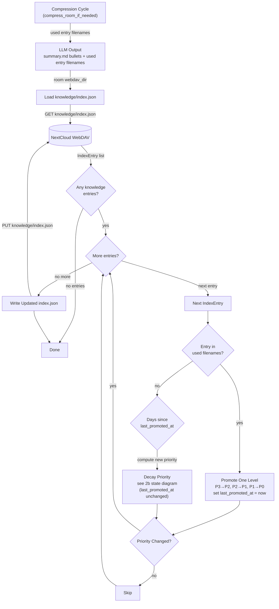
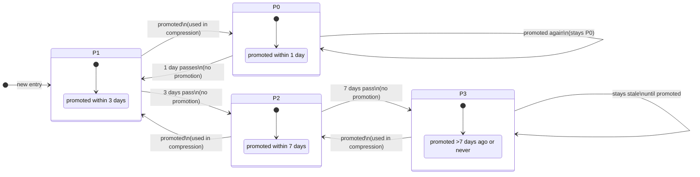
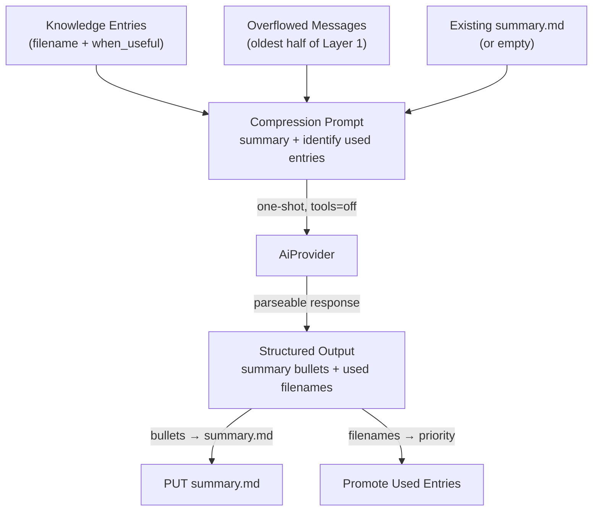
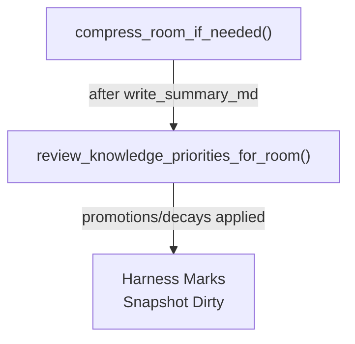
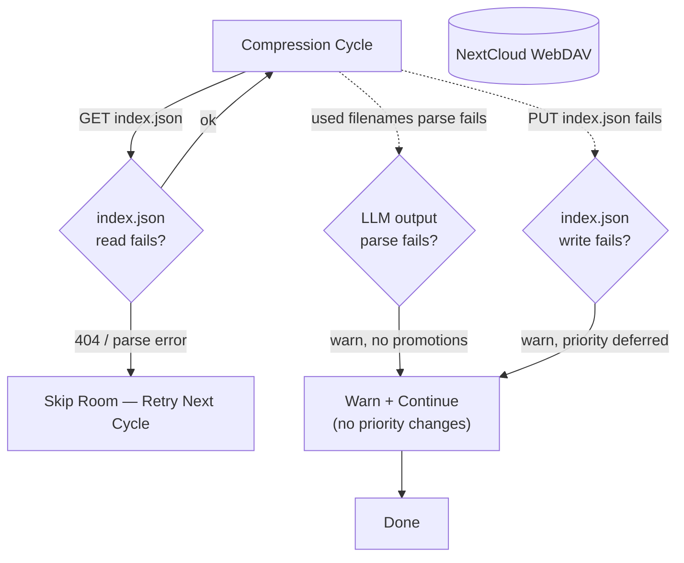

# Knowledge Priority Algorithm

## 1. Purpose

Defines the **LLM-driven priority promotion algorithm** that runs during memory
compression. When the LLM compresses overflowed Layer 1 messages into
`summary.md`, it simultaneously identifies which knowledge entries were relevant
to the compressed conversation. Used entries are promoted; unused entries decay
based on recency of their last promotion.

No periodic timer. Priority changes only happen during compression cycles —
when the LLM generates `summary.md` it simultaneously identifies used entries.

- Upstream: [Memory Management](memory.md) — compression cycles feed used
  entry filenames to this algorithm
- Upstream: [Knowledge Management](knowledge.md) — defines `IndexEntry`
  and `KnowledgePriority` enum
- Upstream: [Agent Harness](../agent/agent-harness.md) — triggers
  `review_knowledge_priorities_for_room()` after each compression cycle (when
  `summary.md` is generated)
- Downstream: WebDAV crate — reads/writes `index.json` with updated priority
  and `last_promoted_at` fields

## 2. Diagram

### 2a. Priority Promotion Flow — Compression Cycle

During memory compression, the LLM identifies which knowledge entries were
relevant to the conversation being compressed. These entries get promoted.
All other entries in the same room are checked for decay (promotion recency).



### 2b. Priority State Diagram — Recency-Based Decay

Priority is determined solely by the time since `last_promoted_at`. By default,
new entries start at P1.



**Transition table** (one step per cycle — decay uses cumulative days since last promotion):

| Current | Promoted (used now) | Not promoted, days since last promotion ≥ threshold |
| ------- | ------------------- | --------------------------------------------------- |
| **P0**  | → P0                | → P1  (if ≥ 1 day)                                  |
| **P1**  | → P0                | → P2  (if ≥ 3 days)                                 |
| **P2**  | → P1                | → P3  (if ≥ 7 days)                                 |
| **P3**  | → P2                | stays P3 (floor)                                    |

No multi-step jumps. Each compression cycle advances at most one level in
either direction. Never-promoted entries (`last_promoted_at = None`) do not
decay.

**Rules**:
- **P0** = promoted within the last day — always recalled in context
- **P1** = promoted within 3 days — default for new entries — strong recall
- **P2** = promoted within 7 days — moderate recall
- **P3** = promoted >7 days ago or never — baseline
- **Promotion is one step up per compression cycle** — P3→P2, P2→P1, P1→P0. P0 stays P0 if used again. No instant jumps.
- **Decay is one step per cycle** — evaluated against cumulative days since `last_promoted_at`. P0 decays to P1 if ≥1 day since promotion, P1 decays to P2 if ≥3 days, P2 decays to P3 if ≥7 days.
- **`last_promoted_at` is only updated on promotion**, not on decay. Decay time is always measured from the most recent promotion, not from the most recent priority change.
- **No rate limiting**
- **New entries default to P1** — they haven't been promoted but aren't stale

### 2d. LLM Identification of Used Entries (Compression)

During compression, the LLM is given the list of knowledge entries
(filenames + when_useful descriptions) alongside the overflowed messages.
The prompt instructs the LLM to:
1. Produce a `summary.md` with ≤10 bullet points
2. List filenames of knowledge entries that were relevant to the conversation



The LLM response is parsed to extract:
- **Summary bullets**: lines starting with `- ` after a `# Memory Summary` header
- **Used entries**: a JSON array or comma-separated list of filenames in a
  designated section (e.g. `## Used Knowledge`)

### 2e. Trigger — Compression Cycle Only



## 3. Data Structures

### IndexEntry Priority Fields

| Field             | Type               | Notes                                                       |
| ----------------- | ------------------ | ----------------------------------------------------------- |
| `priority`        | `KnowledgePriority` | Updated by this algorithm; **default for new entries is P1** |
| `last_promoted_at`| `Option<String>` (ISO 8601) | Timestamp of last promotion; `None` means never promoted |

### KnowledgePriority

```rust
enum KnowledgePriority {
    P0, // promoted within last 1 day — always recalled
    P1, // promoted within 3 days — default for new entries — strong recall (+5)
    P2, // promoted within 7 days — moderate recall (+2)
    P3, // promoted >7 days ago or never — baseline (+0)
}
```

**Recall behavior** (unchanged from [Knowledge Management](knowledge.md)):
P0 entries are always selected regardless of keyword overlap. P1-P3 add
progressively weaker score bonuses.

| Priority | Score bonus | Always selected? |
|----------|------------|-------------------|
| P0       | +8         | Yes               |
| P1       | +5         | No                |
| P2       | +2         | No                |
| P3       | +0         | No                |

## 4. Configuration

No dedicated config keys. The algorithm relies on timestamps (system clock)
to compute days since last promotion. No `summary_days` dependency since the
algorithm no longer reads daily summaries.

| Key            | Source                 | Used for                                  |
| -------------- | ---------------------- | ----------------------------------------- |
| *(none)*       | System clock           | Computing days since `last_promoted_at`   |

## 5. Integration with Other Subsystems

### With Agent Harness

The harness calls priority functions at one point:
1. **Post-compression**: after `write_summary_md()` completes

### With Knowledge Management

- Reads `index.json` for current entry metadata and priority
- Writes updated `index.json` with recalculated priorities
- New entries default to **P1**
- Priority affects retrieval: P0 always loaded, P1-3 get score bonuses

### With Memory Management

- The compression cycle provides the used entry filenames via LLM output
- Marks snapshots dirty when `index.json` is rewritten

### Error Handling



If the LLM fails to produce parseable used-entry filenames, no entries are
promoted for that cycle. The summary.md write is independent — it proceeds
regardless of the knowledge identification outcome. If `index.json` is missing,
the room is skipped (no entries to evaluate).
